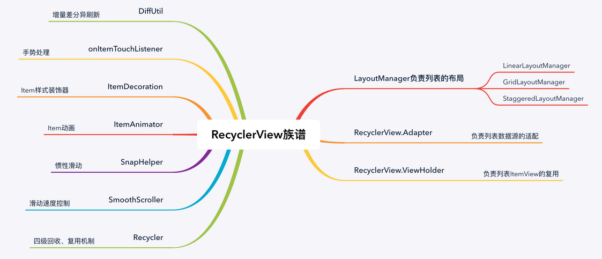

### 编译快捷键

```java
alt +shift +up  ：整行上移
ctrl +alt +L	:格式化代码
ctrl +alt + ←	：返回刚刚的代码页面
ctrl +alt + U	：切换大小写
```

# UI控件

## 常用布局

### 线性布局（LinearLayout）

| 属性名         | 说明       |
| -------------- | ---------- |
| layout_width   | 设置宽度   |
| layout_height  | 设置高度   |
| layout_padding | 设置内边距 |
| layout_margin  | 设置外边距 |
| horientation   | 方向       |
| wrap_parent    | 自适应     |
| match_parent   | 填充父控件 |

### 相对布局（RelativeLayout）

| 属性名                           | 说明                 |
| -------------------------------- | -------------------- |
| layout_below                     | 设置在哪个控件下方   |
| layout_toLeftOf                  | 设置在哪个控件的左边 |
| layout_alignBottom               | 距离底部             |
| layout_alignParentBottom         | 居于父控件的底部     |
| android:layout_centerHrizontal   | 水平居中             |
| android:layout_centerVertical    | 垂直居中             |
| android:layout_centerInparent    | 相对于父元素完全居中 |
| android:layout_alignParentBottom | 贴紧父元素的下边缘   |
| android:layout_alignParentLeft   | 贴紧父元素的左边缘   |
| android:layout_alignParentRight  | 贴紧父元素的右边缘   |
| android:layout_alignParentTop    | 贴紧父元素的上边缘   |

### FrameLayout（帧布局）

| 属性名                    | 说明         |
| ------------------------- | ------------ |
| android:foreground        | 设置前景     |
| android:foregroundGravity | 设置前景位置 |

### TableLayout（表格布局）

#### 

### GridLayout（网格布局）

### ConstrainLayout(约束布局)

***优点：***减少嵌套，优化布局，直接拖拽的方式布局。
***缺点：***修改时容易错乱，代码可读性差。


## 常用控件

### TextView（文本）

***常用属性：***

| 属性名          | 说明                                               |
| --------------- | -------------------------------------------------- |
| id              | 设置id名                                           |
| text            | 设置控件显示文本                                   |
| textsize        | 设置文本大小                                       |
| textcolor       | 设置文本颜色                                       |
| texttype        | 设置文本样式  （normal正常  bold粗体  italic斜体） |
| background      | 设置背景                                           |
| gravity         | 控件中内容对齐方向                                 |
| maxLines="1"    | 最大行数为1                                        |
| ellipsize="end" | 一行中多出的文字用...表示                          |

***阴影效果：***

| 属性名       | 说明                             |
| ------------ | -------------------------------- |
| shadowcolor  | 阴影颜色，与shadowradius配合使用 |
| shadowradius | 阴影的模糊程度                   |
| shadowDx     | 阴影水平方向的偏移               |
| shadowDy     | 阴影垂直方向的偏移               |

***跑马灯效果：***

| 属性名               | 说明                                 |
| -------------------- | ------------------------------------ |
| singleline           | 内容单行显示                         |
| focusable            | 是否可以获取焦点                     |
| focusableInTouchMode | 用于控制视图在触摸模式下是否可以聚焦 |
| ellipsize            | 在哪里省略文本                       |
| marqueeRepeatLimit   | 字幕动画重复的次数                   |

***自启动跑马灯三种方法***：

1.在xml里添加clickable="true"属性
2.自定义TextView，返回true然后在xml里使用自定义控件
3.在xml里添加<requestFocus/>，需以</TextView>结尾

***自动调整TextView的大小***

**注意**：如果您在 XML 文件中设置自动调整大小，则不建议对 `TextView` 的 `layout_width` 或 `layout_height` 属性使用值`wrap_content`，否则可能会产生意外结果。

| 属性名                  | 说明                                        |
| ----------------------- | ------------------------------------------- |
| minTextSize             | 最小文本尺寸                                |
| maxTextSize             | 最大文本尺寸                                |
| autoSizeStepGranularity | 每次缩放的尺寸                              |
| autoSizeTextType        | none：默认，uniform：水平和垂直轴上均匀缩放 |


### EditText（输入框）

```java
【常用属性】
hint="用户名"					//输入提示
textcolorhint	  			   //输入提示文本的颜色
inputType		  		       //输入类型
drawableLeft(right,bottom,top)    	//在输入框左侧显示用户icon
drawablePadding					//设置icon与输入内容的间距
padding						   //设置内容与控件边框的间距
background				        //背景色
android:gravity="top"			//让hint的内容在最顶端
edit.requestFocus(); //请求获取焦点
edit.clearFocus(); //清除焦点

//稍微高一点的版本则需要我们手动地去弹键盘：
【第一种】
InputMethodManager imm = (InputMethodManager)
getSystemService(Context.INPUT_METHOD_SERVICE);
imm.toggleSoftInput(0, InputMethodManager.HIDE_NOT_ALWAYS);
【第二种】
InputMethodManager imm = (InputMethodManager)
getSystemService(Context.INPUT_METHOD_SERVICE);
imm.showSoftInput(view,InputMethodManager.SHOW_FORCED);

imm.hideSoftInputFromWindow(view.getWindowToken(), 0); //强制隐藏键盘

edit.setSelection();//一个参数的是设置光标位置的，两个参数的是设置起始位置与结束位置的中间括的部分，即部分选中
```

### SeekBar（拖动条）

```java
android:max="100" //滑动条的最大值
android:progress="60" //滑动条的当前值
android:secondaryProgress="70" //二级滑动条的进度
android:thumb = "@mipmap/sb_icon" //滑块的drawable
    
接着要说下SeekBar的事件了，SeekBar.OnSeekBarChangeListener 我们只需重写三个对应的方法：   
onProgressChanged：进度发生改变时会触发
onStartTrackingTouch：按住SeekBar时会触发
onStopTrackingTouch：放开SeekBar时触发

隐藏滑块:android:scrollbars="none"
    
设置滚动速度:继承ScrollView，然后重写一个 public void fling (int velocityY)的方法：
@Override
public void fling(int velocityY) {
	super.fling(velocityY / 2); //速度变为原来的一半
}
tips: ScrollView控件中只能包含一个View或一个ViewGroup
```

#### ImageView（图像）

```java
【常用属性】
src						//导入图片资源 
scaleType				//设置图片缩放类型
maxheight				//最大高度
maxwidth				//最大宽度
adjustViewBounds		//调整view的界限

【scaleType常用缩放类型】
1.fitStart		//保持宽高比缩放图片
2.fitCenter		//默认值，同上，缩放后放于中间
3.fitEnd		//同上，缩放后放于右下角
4.fitXY			//对图片进行横纵方向进行独立缩放
5.center		//保持原图大小，显示在imageview中间，超出部分裁剪
6.centerCorp	//保持宽高比缩放图片，直到完全覆盖imageview，可能会显示不完全
7.centerinside	//保持宽高比缩放图片，直到imageview完全显示地图片
8.matrix		//不改变原图的大小，聪imageview的左上角开始绘制原图，超出部分裁剪

//在AndroidManifest里添加下面代码
<uses-permission android:name="android.permission.INTERNET"/>	//申请网络权限


【Java】
设置图片：setIamgeResource(R.drawable.)
		setIamgeDrawable()
		setIamge()
```

#### ProgressBar(进度条)

```java
【常用属性】
android:max：			//进度条的最大值
android:progress：		//进度条已完成进度值
android:progressDrawable：//设置轨道对应的Drawable对象
android:indeterminate：//如果设置成true，则进度条不精确显示进度
android:indeterminateDrawable：//设置不显示进度的进度条的Drawable对象
android:indeterminateDuration：//设置不精确显示进度的持续时间
android:secondaryProgress：//二级进度条，类似于视频播放的一条是当前播放进度，一条是缓冲进度，前者通过progress属性进行设置！
style="?android:attr/progressBarStyleHorizontal"		//水平进度条

【java代码的方法】
getMax()：返回这个进度条的范围的上限
getProgress()：返回进度
getSecondaryProgress()：返回次要进度
incrementProgressBy(int diff)：指定增加的进度
isIndeterminate()：指示进度条是否在不确定模式下
setIndeterminate(boolean indeterminate)：设置不确定模式下
    
设置ProgressBar的样式，不同的样式会有不同的形状和模式：
Widget.ProgressBar.Horizontal
横向进度条（精确模式或模糊模式，这取决于Android:indeterminate）。
Widget.ProgressBar
中号的圆形进度条（模糊模式）。
Widget.ProgressBar.Small
小号的圆形进度条（模糊模式）。
Widget.ProgressBar.Large
大号的圆形进度条（模糊模式）。
Widget.ProgressBar.Inverse
中号的圆形进度条（模糊模式），该样式适用于亮色背景（例如白色）。
Widget.ProgressBar.Small.Inverse
小号的圆形进度条（模糊模式），该样式适用于亮色背景（例如白色）。
Widget.ProgressBar.Large.Inverse
```

#### ScrollView(滚动条)

```java
垂直滚动：ScrollView
水平滚动：HorizontalScrollView

*** SCrollView与orizontalScrollView只能有一个子元素 ***
```

#### Button（按钮）

```java
【StateListDrawable基本属性】
drawable		//引用的drawable位图
state_focused	//是否获得焦点
staate_pressed	//控件是否被按下
state_enable	//控件是否可用
state_selected   //控件是否被选择，针对有滚轮的情况
state_checked	 //控件是否被勾选
<solid  android:color="color"/>		    //指定内部填充色 
		
【shape基本属性】
<stroke android:width="1dp"/>		//描边属性，设置粗度为1个dp
<corners android:radius="5dp"/>		//圆角属性，设置圆角度为5dp

android:textAllCaps="false"			//控件字体改为正常，不是全大写
```

#### ToggleButton（开关按钮）

```java
android:disabledAlpha 			//设置按钮在禁用时的透明度
android:textOff 				//按钮没有被选中时显示的文字
android:textOn				   //按钮被选中时显示的文字 另外，除了这个我们还可以自己写个selector，然后设置下Background属性即可
```

#### RadioButton(单选按钮)

```java
需要把RadioButton放到RadioGroup按钮组中，从而实现 单选功能！另外我们可以为外层RadioGroup设置orientation属性然后设置RadioButton的排列方式，是竖直还是水平
    
【获取选择的值】
【方式1】
RadioGroup radgroup = (RadioGroup) findViewById(R.id.radioGroup);
//第一种获得单选按钮值的方法
//为radioGroup设置一个监听器:setOnCheckedChanged()
radgroup.setOnCheckedChangeListener(new OnCheckedChangeListener() {
	@Override
	public void onCheckedChanged(RadioGroup group, int checkedId) {
		RadioButton radbtn = (RadioButton) findViewById(checkedId);
		Toast.makeText(getApplicationContext(), "按钮组值发生改变,你选
		了" + radbtn.getText(), Toast.LENGTH_LONG).show();
	}
});

【方式2】
Button btnchange = (Button) findViewById(R.id.btnpost);
RadioGroup radgroup = (RadioGroup) findViewById(R.id.radioGroup);
//为radioGroup设置一个监听器:setOnCheckedChanged()
btnchange.setOnClickListener(new OnClickListener() {
	@Override
	public void onClick(View v) {
		for (int i = 0; i < radgroup.getChildCount(); i++) {
			RadioButton rd = (RadioButton) radgroup.getChildAt(i);
			if (rd.isChecked()) {
				Toast.makeText(getApplicationContext(), "点击提交按
				钮,获取你选择的是:" + rd.getText(), Toast.LENGTH_LONG).show();
				break;
			}
		}
	}
});
                
//代码解析： 这里我们为提交按钮设置了一个 setOnClickListener 事件监听器,每次点击的话遍历一次RadioGroup判断哪个按钮被选中我们可以通过下述方法获得RadioButton的相关信息！
getChildCount( )获得按钮组中的单选按钮的数目；
getChinldAt(i):根据索引值获取我们的单选按钮
isChecked( ):判断按钮是否选中
```


#### Switch（开关）

```java
android:showText 				//设置on/off的时候是否显示文字,boolean
android:splitTrack 				//是否设置一个间隙，让滑块与底部图片分隔,boolean
android:switchMinWidth 			//设置开关的最小宽度
android:switchPadding 			//设置滑块内文字的间隔
android:switchTextAppearance 	//设置开关的文字外观
android:textOff 				//按钮没有被选中时显示的文字
android:textOn 					//按钮被选中时显示的文字
android:textStyle 				//文字风格，粗体，斜体写划线那些
android:track 					//底部的图片
android:thumb 					//滑块的图片
android:typeface 				//设置字体，默认支持这三种:sans, serif, monospace;除此以外还可以使用 其他字体文件(*.ttf)
```

#### SwipeRefreshLayout

```java
SwipRefreshLayout是谷歌前一段时间推出的一款"下拉刷新控件"
【常用属性】
//设置下拉进度条的颜色主题，参数可变，并且是资源id，最多设置四种不同的颜色。 
setColorSchemeResources(int…colorReslds)	
//设置下拉进度条的背景颜色,默认白色。
setProgressBackgroundSchemeResource(int coloRes)	
//判断当前的状态是否是刷新状态。
isRefreshing()	
//设置监听，需要重写onRefresh()方法，顶部下拉时会调用这个方法，在里面实现请求数据的逻辑，设置下拉进度条消失等等。
setOnRefreshListener(SwipeRefreshLayout.OnRefreshListener listener)	
//设置刷新状态，true表示正在刷新，false表示取消刷新。
setRefreshing(boolean refreshing)	
    
    
//一般包裹着Recyclerview或ListView使用
```


### 日期类控件

#### TextClock(文本时钟)

```java
Attribute Name Related Method Description
android:format12Hour setFormat12Hour(CharSequence) 设置12时制的格式
android:format24Hour setFormat24Hour(CharSequence) 设置24时制的格式
android:timeZone setTimeZone(String) 设置时区
```

#### AnalogClock(模拟时钟)

```java
android:dial //表背景图片
android:hand_hour //表时针图片
android:hand_minute //分时针图片
```

#### DatePicker(日期选择器)

```java
android:calendarTextColor ： 日历列表的文本的颜色
android:calendarViewShown：是否显示日历视图
android:datePickerMode：组件外观，可选值:spinner，calendar 前者效果如下，默认效果是后者
android:dayOfWeekBackground：顶部星期几的背景颜色
android:dayOfWeekTextAppearance：顶部星期几的文字颜色
android:endYear：去年(内容)比如2010
android:firstDayOfWeek：设置日历列表以星期几开头
android:headerBackground：整个头部的背景颜色
android:headerDayOfMonthTextAppearance：头部日期字体的颜色
android:headerMonthTextAppearance：头部月份的字体颜色
android:headerYearTextAppearance：头部年的字体颜色
android:maxDate：最大日期显示在这个日历视图mm / dd / yyyy格式
android:minDate：最小日期显示在这个日历视图mm / dd / yyyy格式
android:spinnersShown：是否显示spinner
android:startYear：设置第一年(内容)，比如19940年
android:yearListItemTextAppearance：列表的文本出现在列表中。
android:yearListSelectorColor：年列表选择的颜色
```


### Adapter控件

#### ListView（列表视图）

```java
Java代码实现步骤：
1.【列表接口】
  mLv1=(ListView) findViewById(R.id.lv_1);
  mLv1.setAdapter(new MyListAdapter(HomePage.this));
  
2.【创建一个ListAdapter接口类】
  //声明
  private Context mContext;
  private LayoutInflater mLayoutInflater;
    
  //构造方法
  public MyListAdapter(Context context){
      this.mContext=context;
      mLayoutInflater=LayoutInflater.from(context);
  }
  
  //静态类
  static class ViewHolder{
      public ImageView imageView;
      public TextView tvTitle,tvText,tvName,tvTime;
   }
   
   
   //在重写方法getview里写
   ViewHolder holder=null;
   //优化列表每次的出现和消失，不用频繁的调用getview方法 
   if(convertView==null){
      convertView=mLayoutInflater.inflate(R.layout.layout_list_item,null);
      //找到控件
      holder=new ViewHolder();
      holder.imageView=convertView.findViewById(R.id.iv_pic);
      holder.tvTitle=convertView.findViewById(R.id.tv_title);
      holder.tvText=convertView.findViewById(R.id.tv_text);
      holder.tvName=convertView.findViewById(R.id.tv_name);
      holder.tvTime=convertView.findViewById(R.id.tv_time);
      convertView.setTag(holder);
   }else{
       holder=(ViewHolder) convertView.getTag();
   }
   //给控件赋值
   holder.tvTitle.setText("");
   holder.tvText.setText("");
   holder.tvName.setText("");
   holder.tvTime.setText("");
   return convertView;
```

#### GridView（网格视图）

```java
【常用属性】
android:numColumns="3"			    //设置网格列数
android:horizontalSpacing="10dp"	//设置水平间距参数
android:verticalSpacing="10dp"/>	//设置垂直间距参数
```

#### RecyclerView



##### 缓存机制

###### Scarp

mChangedScrap、mAttachedScrap,涉及保存屏幕内的holder,涉及到item动画时、被notifyltemRangeChanged移除的holder保存在mChangedScrap中,被其他notify（除notifyDataSetChanged）移除的holder保存在mAttachedScrap 中。mAttachedScrap在屏幕中的缓存,用于数据刷新时,不需要重新加载子ItemView,直接复用。因为每个ItemView 由xml 加载成为View (onCreateViewHolder方法)，是一个深度遍历的过程，并且是通过反射来获取的每个View，这其实是一个耗时的操作。如果每个子ItemView都L过这种方法去加载，是非常不合适滴。所以需要缓存。

###### Cache

mCachedViews,保存刚被移出屏幕的holder,默认容量2（可理解为上下各一个），通过position来保存，数据不变，直接复用。滑动时，该缓存一边add,一遍remove。

###### Extension

mViewCacheExtension,可自定义的缓存实现，默认空实现。

###### Pool

​	mRecyclerPool,保存已被移出屏幕的无效的holder,默认容量5,可以自己new一个pool传进去（一般在RV嵌套时，子RV与父RV可共用同一个Pool），mRecyclerPoor保存第二级缓存中保存不了的ItemView。通过itemType来保存，每种 itemType可以保存5个ItemView。
​	SparsArray:mScarp默认容量为10,根据key,value 的形式存储scarpdata,每个
viewTvpe对应一个scarpData,那么数据便是ScarpData

#### 

```java
1.线性列表-LinearLayoutManager
2.网格列表-GridLayoutManager
3.瀑布流列表-StaggeredGridLayoutManager

使用前先在build.gradle里添加一句compile 'com.android.support:design:25.3.1' 作为引用这个包
实现功能：列表试图，水平滚动，网格试图，瀑布流

//ListView默认就有布局，而给RecycleView没有
//所以需要给RecycleView设定布局
//一共有三种：LinearLayoutManager（线性），GridLayoutManager（网格）,StaggeredGridLayoutManager（瀑布）
```


#### Spinner（列表选项框）

```java
android:dropDownHorizontalOffset：设置列表框的水平偏移距离
android:dropDownVerticalOffset：设置列表框的水平竖直距离
android:dropDownSelector：列表框被选中时的背景
android:dropDownWidth：设置下拉列表框的宽度
android:gravity：设置里面组件的对其方式
android:popupBackground：设置列表框的背景
android:prompt：设置对话框模式的列表框的提示信息(标题)，只能够引用string.xml 中的资源
id,而不能直接写字符串
android:spinnerMode：列表框的模式，有两个可选值： dialog：对话框风格的窗口 dropdown：
下拉菜单风格的窗口(默认)
可选属性：android:entries：使用数组资源设置下拉列表框的列表项目
```

####  ExpandableListView可折叠列表

```java
实现ExpandableAdapter的三种方式
1. 扩展BaseExpandableListAdpter实现ExpandableAdapter。
2. 使用SimpleExpandableListAdpater将两个List集合包装成ExpandableAdapter
3. 使用simpleCursorTreeAdapter将Cursor中的数据包装成SimpleCuroTreeAdapter 本节示
例使用的是第一个，扩展BaseExpandableListAdpter，我们需要重写该类中的相关方法

//有一点要注意的是，重写isChildSelectable()方法需要返回true，不然不会触发子Item的点击事件
```


### 提示类控件

#### Notification(状态栏通知)

```java
【通知重要程度设置，NotificationManager类中】
IMPROTANCE_NONE			//关闭通知
IMPROTANCE_MIN			//开启通知，不会弹出，但没有提示音，状态栏无显示
IMPROTANCE_LOW			//开启通知，不会弹出，不发出提示音，状态栏显示
IMPROTANCE_DEFAULT		//开启通知，不会弹出，发出提示音，状态栏中显示(默认)
IMPROTANCE_HIGH			//开启通知，会弹出，发出提示音，状态栏显示

【常见方法】
setContentTitle(String string)		//设置标题
setContentText(String String)		//设置文本内容
setSmallIcon(int icon)				//设置小图标
setLargeIcon(Bitcamp icon)			//设置通知的大图标
setColor(int argb)					//设置小图标的颜色
setContentIntent(PendingIntent intent)		//设置点击通知后的跳转意图
setAutoCancel(Boolean boolean)//设置点击通知后自动清除通知	
setWhen(long when)					//设置通知被创建的时间
```

#### AlertDialog(对话框)

```java
【步骤】
Step 1：创建AlertDialog.Builder对象；
Step 2：调用setIcon()设置图标，setTitle()或setCustomTitle()设置标题；
Step 3：设置对话框的内容：setMessage()还有其他方法来指定显示的内容；
Step 4：调用setPositive/Negative/NeutralButton()设置：确定，取消，中立按钮；
Step 5：调用create()方法创建这个对象，再调用show()方法将对话框显示出来

AlertDialog.Builder builder = new AlertDialog.Builder(this)			
//构建Dialog的各种参数
Builder.setIcon(int iconld)							//添加Icon
Builder.setTitle("")								//设置标题
Builder.setMessage("")								//添加消息
Builder.setView()									//设置自定义布局
Builder.create()									//创建Dialog
Builder.show()										//显示对话框
.setPositiveButton									//确定按钮
.setNegativeButton									//取消按钮
.setNeutralButton									//中间按钮


【Alert与PopupWindow的区别】
AlertDialog：不能指定在屏幕显示的位置，后台可以做其他操作
PopupWindow：可以显示在任意位置，后台不可以做其他操作
```

#### PopupWindow(悬浮框)

```java
setContentView(View contentView)					//设置popupwindow显示的view
showAsDropDown(View anchor)							//相对某个控件的位置(正坐下方)无偏移
showAsDropDown(View anchor,int xoff,int yoff)			//相对某个控件的位置，有偏移
setFocusable										//设置是否获取焦点
setBackgroundDrawable(Drawable background)				//设置背景
dismiss()											//关闭弹窗
setAnimationStyle(int animationStyle)				  //设置加载动画
setTouchable(boolean touchable)					     //设置触摸使能
setOutsideTouchable(boolean touchable)				 //设置Popupwindow外面的触摸使能
```


### 菜单类控件

#### 选项菜单

```java
【optionsMenu选项菜单】
1.创建menu_options.xml布局文件
2.java代码创建两个方法
  onCreateOptionsMenu(创建)、onOptionsItemSelected(选中)

【ContextMenu上下文菜单】
//上下文菜单需要一个按钮单击才能实现,长按
1.创建menu_context.xml布局文件
2.注册单击的按钮 registerForContextMenu(btnContextMenu);
3.java代码创建两个方法
  onCreateContextMenu(创建)、onContextItemSelected(选中)

【PopupMenu弹出式菜单】
1.创建menu_context.xml布局文件
2.
PopupMenu popupMenu=new PopupMenu(this,view);
popupMenu.inflate(R.menu.menu_popup);
popupMenu.setGravity(Gravity.RIGHT);
popupMenu.show();
popupMenu.setOnMenuItemClickListener()
```

#### ToolBar(工具栏)

```java
androidx.appcompat.widget.Toolbar				//控件名使用这个
android:layout_width="match_parent"				//使用Toolbar专用宽度
android:layout_height="?attr/actionBarSize"		//使用Toolbar专用高度
app:navigationIcon							  //设置导航页的图标，一般是返回箭头
app:title									//设置导航页的标题文本
app:titleTextColor							//标题文本颜色
app:titleMarginStart						//设置间距
app:subtitle								//设置小标题
app:subtitleTextColor						//设置小标题颜色
app:logo								   //设置logo
```

#### 侧滑菜单

#### 

```java
Fragment+DrawerLayout+NavigationView实现侧滑菜单页面结构：
	Fragment的添加替换
	DrawerLayout的用法//抽屉布局
	NavigationView//侧滑布局
两种菜单形式：
	侧滑菜单在上
	侧滑菜单在下
```

```java
xml：
<?xml version="1.0" encoding="utf-8"?>
<LinearLayout xmlns:android="http://schemas.android.com/apk/res/android"
    xmlns:app="http://schemas.android.com/apk/res-auto"
    xmlns:tools="http://schemas.android.com/tools"
    android:layout_width="match_parent"
    android:layout_height="match_parent"
    android:orientation="vertical"
    tools:context=".MainActivity">

    <androidx.appcompat.widget.Toolbar
        android:id="@+id/toolbar"
        android:layout_width="match_parent"
        android:layout_height="wrap_content"
        android:background="#FF6200EE"
        app:title="侧滑菜单"
        android:theme="@style/ThemeOverlay.AppCompat.Dark.ActionBar"
        app:titleTextColor="@color/white"/>


    <androidx.drawerlayout.widget.DrawerLayout
        android:id="@+id/drawer"
        android:layout_width="match_parent"
        android:layout_height="match_parent"
        android:layout_gravity="start">

        <androidx.fragment.app.FragmentContainerView
            android:id="@+id/fcv"
            android:layout_width="match_parent"
            android:layout_height="match_parent" />

        <com.google.android.material.navigation.NavigationView
            android:id="@+id/nav"
            android:layout_width="200dp"
            android:layout_height="match_parent"
            android:layout_gravity="start"
            app:headerLayout="@layout/drawer_header_layout"
            app:menu="@menu/menu"/>
    </androidx.drawerlayout.widget.DrawerLayout>
</LinearLayout>
                
//工具栏开关的参数设置
drawerToggle = new ActionBarDrawerToggle(this, drawerLayout, toolbar, R.string.drawer_open, R.string.drawer_close); // 工具栏开关
drawerLayout.addDrawerListener(drawerToggle);// 添加监听、关联
drawerToggle.syncState();// 设置同步

//点击侧滑菜单选项时，替换掉对应的fragment
DrawerFragment homeFragment = DrawerFragment.newInstance("首页");
getSupportFragmentManager().beginTransaction()
        .replace(R.id.fcv, homeFragment)
        .commit();
navigationView.setCheckedItem(R.id.menu_home);// 侧滑菜单也选中第一个首页
```


### 其他控件

#### ViewPager

```java
//依赖
implementation 'androidx.viewpager2:viewpager2:1.0.0'
【步骤】
1.定义ViewPager
2.为ViewPager构造Adapter
【用法】
数据+适配器+viewpager
数据：List<View>,List<Fragment>
适配器：FragmentPagerAdapter
    
https://www.jianshu.com/p/711bf2b438aa
```

### 事件处理机制

#### Android事件分发机制

#### 多线程通信-Handler机制


### Service服务

#### 线程的相关概念

#### 线程的生命周期

#### 创建线程三种方式

```java
【继承Thread】
public class MyThread extends Thread{
	@Override
	public void run() {
		// TODO Auto-generated method stub
		//super.run();
		doSomething();
	}
	private void doSomething() {
		// TODO Auto-generated method stub
		System.out.println("我是一个线程中的方法");
	}
}
=========================================
=========================================

public class NewThread {
public static void main(String[] args) {
	MyThread myThread=new MyThread();
	myThread.start();//开启一个线程方法
	//以下的方法可与上边的线程并发执行
	doSomething();
}
private static void doSomething() {
	// TODO Auto-generated method stub
	}
}


【实现Runnable接口】
public class RunnableThread implements Runnable{
	@Override
	public void run() {
		// TODO Auto-generated method stub
		doSomeThing();
	}
	private void doSomeThing() {
		// TODO Auto-generated method stub
		System.out.println("我是一个线程方法");
	}
}
=======================================
========================================
public class NewThread {
public static void main(String[] args) {
	Runnable runnable=new RunnableThread();
	Thread thread=new Thread(runnable);
	thread.start();//开启一个线程方法
	//以下的方法可与上边的线程并发执行
	doSomething();
	}
private static void doSomething() {
	// TODO Auto-generated method stub
	}
}

【实现Callable接口和Future创建线程】
public class CallableThread implements Callable<String>{
	@Override
	public String call() throws Exception {
		// TODO Auto-generated method stub
		doSomeThing();
		return "需要返回的值";
	}
	private void doSomeThing() {
		// TODO Auto-generated method stub
		System.out.println("我是线程中的方法");
	}
}
======================================
=========================================
public class NewThread {
public static void main(String[] args) {
	Callable<String> callable=new CallableThread();
	FutureTask<String> futureTask=new FutureTask<String>
	(callable);
	Thread thread=new Thread(futureTask);
	thread.start();//开启一个线程方法
	//以下的方法可与上边的线程并发执行
	doSomething();
	try {
		futureTask.get();//获取线程返回值
	} catch (InterruptedException | ExecutionException e) {
		// TODO Auto-generated catch block
		e.printStackTrace();
	}
}
private static void doSomething() {
	// TODO Auto-generated method stub
	}
}
```

#### Service与Thread线程的区别

```java
其实他们两者并没有太大的关系，不过有很多朋友经常把这两个混淆了！ Thread是线程，程
序执行的最小单元，分配CPU的基本单位！ 而Service则是Android提供一个允许长时间留
驻后台的一个组件，最常见的 用法就是做轮询操作！或者想在后台做一些事情，比如后台下
载更新！ 记得别把这两个概念混淆！
```


## Intent组件

### 跳转

```java
【显示跳转】（三种方式）
Intent intent=new Intent(MainActivity.this,Home.class)
startActivity(intent);

Intent intent=new Intent();
intent.setClass(this,Home.class);
startActivity(intent);

Intent intent=new Intent();
intent.setName(当前页面包名,页面的包名.Home);
startActivity(intent);


【隐式跳转】
筛选条件的规则
action：动作     category：类别      data：数据
```


### 跳转时参数传递

#### 【分散传递】

#### 【打包传递】


## 绘图与动画

### 帧动画

```java
//获取动画的 Drawable 资源
AnimationDrawable anim = (AnimationDrawable) relativeLayout.getBackground();
//启动动画
anim.start();
//停止动画
anim.stop();
```

### 补间动画

```java
1. alpha 透明度
2. rotate 旋转
3. scale 缩放
4. translate 平移
```

### 属性动画

```java
【改变值动画效果】
ValueAnimator valueAnimator = ValueAnimator.ofFloat(0f, 1f);
valueAnimator.setDuration(2000);
valueAnimator.addUpdateListener(new ValueAnimator.AnimatorUpdateListener() {
	@Override
	public void onAnimationUpdate(ValueAnimator animation) {
	    float value = (float) animation.getAnimatedValue();
	    Log.d("hgm", "onAnimationUpdate: " + value);
	}
});
valueAnimator.start();


【修改控件属性】
//修改了TextView的透明度
ObjectAnimator objectAnimator = (ObjectAnimator) ObjectAnimator.ofFloat(textView, "alpha", 0f, 1f);
objectAnimator.setDuration(4000);
objectAnimator.start();
//修改了TextView的字体大小
ObjectAnimator objectAnimator2 = (ObjectAnimator) ObjectAnimator.ofFloat(textView, "textSize", 10, 30);
objectAnimator2.setDuration(4000);
objectAnimator2.start();

//或者单独监听其中一个方法--适配
objectAnimator.addListener(new AnimatorListenerAdapter() {
	@Override
	public void onAnimationStart(Animator animation) {
	    super.onAnimationStart(animation);
	}
});
```


### shapeDrawable

```java
在Android开发中，我们可以使用shape定义各种各样的形状，也可以定义一些图片资源。相对于传统图片来说。
使用shape可以减少资源占用，减少安装包大小，还能够很好地适配不商尺寸的手机。
    
<!--设置透明背景色-->
<solid android:color="#87CEEB" />

<!--  设置一个黑色边框  -->
<stroke
    android:width="2px"
    android:color="@color/black" />

<!--  设置四个圆角的半径  -->
<corners
    android:bottomLeftRadius="10px"
    android:bottomRightRadius="10px"
    android:topLeftRadius="10px"
    android:topRightRadius="10px" />

<!-- 设置一下边距,让空间大一点 -->
<padding
    android:bottom="5dp"
    android:left="5dp"
    android:right="5dp"
    android:top="5dp" />
```


## 未分组

### 记住密码功能

```java
使用SharedPreferences存储和读取数据的步骤
【存储数据】4个步骤
1.使用Activity类的getSharedPreferences方法获得SharedPreferences对象；
2.使用SharedPreferences接口的edit获得SharedPreferences.Editor对象；
3.通过SharedPreferences.Editor接口的putXXX方法保存key-value对；
4.通过SharedPreferences.Editor接口的commit方法保存key-value对。
【读取数据】2个步骤
1.使用Activity类的getSharedPreferences方法获得SharedPreferences对象；
2.通过SharedPreferences对象的getXXX方法获取数据；
-----------------------------------------------------------------------------------

//判断CheckBox是否被选中
if(cb.isChecked()){
	SharedPreferences spf=getSharedPreferences("spfRecor d",MODE_PRIVATE);
	SharedPreferences.Editor  edit=spf.edit();
	edit.putString("account",account);
	edit.putString("assword",password);
	//记住密码为true
	edit.putBoolean("isRemember",true);
	//提交
	edit.apply();
}else{
	SharedPreferences spf=getSharedPreferences("spfRecord",MODE_PRIVATE);
	SharedPreferences.Editor  edit=spf.edit();
	edit.putBoolean("isRemember",false);
	edit.apply();
}
```

 

### 多线程

```
两个原则：
主线程不能执行网络请求/文件读写等耗时操作
子线程不能执行UI刷新
```


### 热修复

```java
定义：我们在应用上线后出现bug需要及时修复时，不用发新的安装包，止呕需要发布补丁包，在客户无感知下修复掉bug
```

#### Tinker

```java
Tinker是微信开源的一个热修复解决方案，支持dex、库和资源更新，无需重新安装apk。
开 源地址：https://github.com/Tencent/tinker

可以直接使用Tinker,也可以使用腾讯Bugly服务集成Tinker热修复，后者提供了补丁管理服务。
建议大家根据官方案例工程进行使用，按照Bugly文档由于版本问题会导致无法使用
https://github.com/BuglyDevTeam/Bugly-Android-Demo/tree/master/BuglyHotfixDemo
```

#### 接入Bugly


### MediaRecorder(录制视频)

```java
使用MediaRecorder能够编写从设备麦克风与相机捕获音视频、保存音视频并（使用MediaPlayer)进行播放
的应用。
权限：
<uses-permission android:name="android.permission.RECORD_AUDIO"/>
<uses-permission android:name="android.permission.CAMERA />
```

### 屏幕旋转数据丢失问题

```java
//重写onSaveInstanceState方法
@0verride
protected void onSaveInstanceState(Bundle outState) {
	super.onSaveInstanceState(outState);
	outState.putString("KEY",textView.getText().toString());
}

//初始化时拿出来重新赋值
if(savedInstanceState!=null){
	String s = savedInstanceState.getString( key: "KEY");
	textView.setText(s);
}


```

### 颜色透明度问题

```java
【xml设置】
设置其属性:android:background="#AA9E9E9E",其中"前两位"为透明度，后六位为颜色
    
【Java代码】
控件名.getBackground().setAlpha(100);//0~255透明度值 ，0为完全

透明度参数：
100% — FF、90% — E6、80% — CC、70% — B3、60% — 99、50% — 80、40% — 66、30% — 4D、20% — 33、
10% — 1A、0% — 00
```

### 圆形头像

```java
//查看项目CircleView
【方法1】
优点：代码简单，容易理解
缺点：只能是圆形，当宽高不相等时，圆像表现是内切圆
    
【方法2】
(Xfermode)
变换/转换模式：规定了要"绘制的内容（Src）"与"已有的目标内容（Dst）"采用怎样的模式"结合"，从而"变换出新的图像"
取值：PorterDuff.Mode
    
自定义CircleView继承ImageView
重写onDraw方法
画圆（椭圆）
画图片
使用Src_in模式的XFormode将圆和图片结合，生成圆形图片
绘制边框（可选）
```


