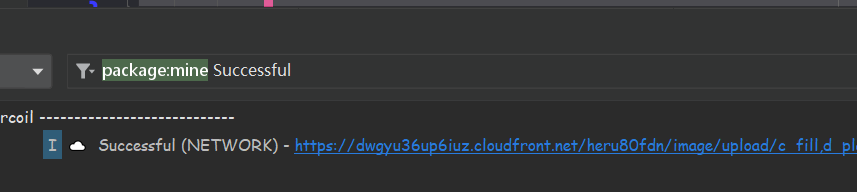
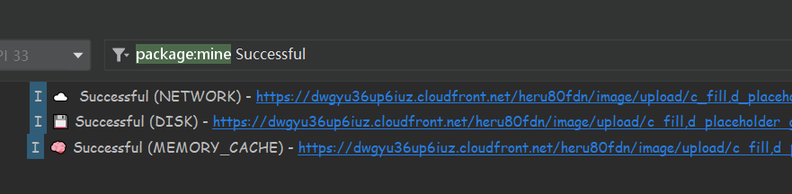
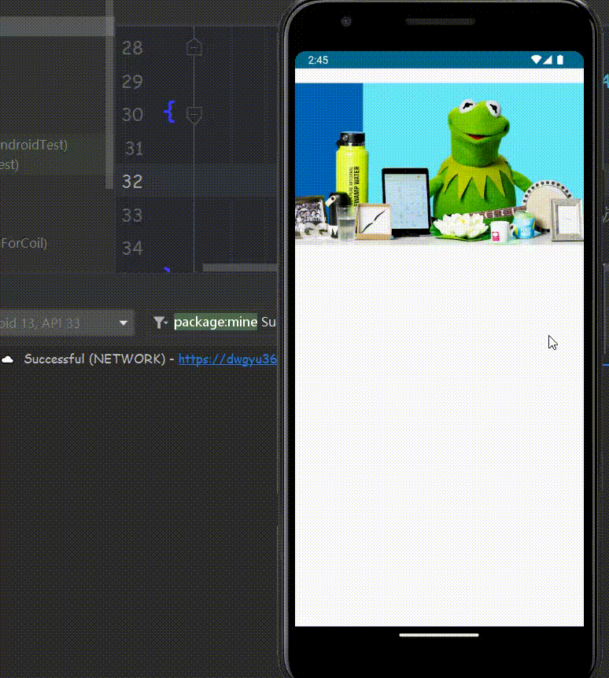
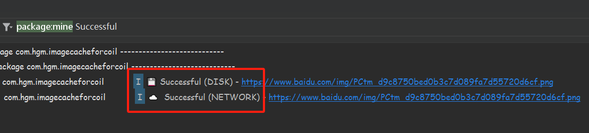
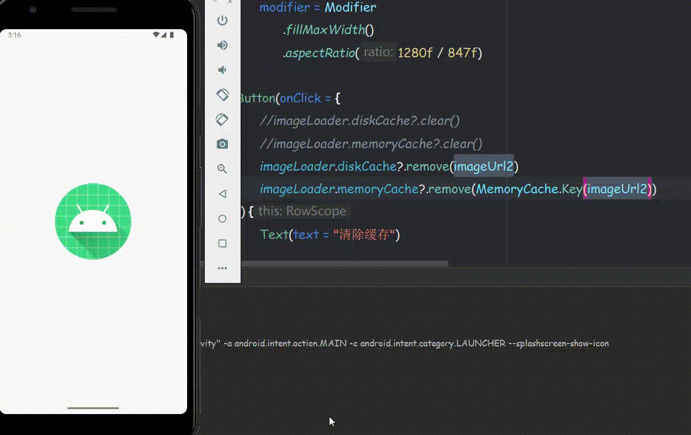
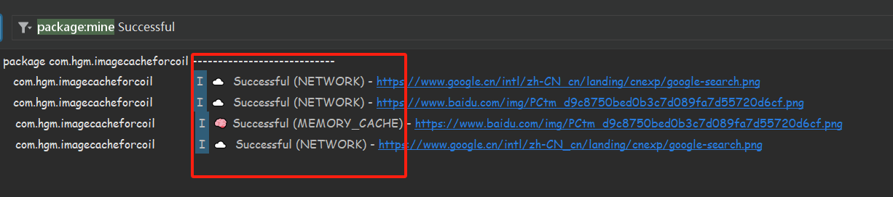

# Coil

## 介绍

**Coil** 是Android上的一个全新的图片加载框架（协程图片加载库）

与传统的图片加载库Glide，Picasso或Fresco等相比。该具有==轻量（只有大约1500个方法）、快、易于使用、更现代的API==等优势

它支持GIF和SVG，并且可以执行四个默认转换：模糊，圆形裁剪，灰度和圆角。并且是全用[Kotlin](https://so.csdn.net/so/search?q=Kotlin&spm=1001.2101.3001.7020)编写，如果你是纯Kotlin项目的话，那么这个库应该是你的首选。


## 使用

github地址为：[https://github.com/coil-kt/coil/](https://links.jianshu.com/go?to=https%3A%2F%2Fgithub.com%2Fcoil-kt%2Fcoil%2F)

### 添加依赖

```kotlin
implementation("io.coil-kt:coil:1.1.1")
```

### 在 Compose 中使用

```kotlin
class MainActivity : ComponentActivity() {
	override fun onCreate(savedInstanceState: Bundle?) {
	    super.onCreate(savedInstanceState)
	    setContent {
	        CoilTheme {
	            val painter =
	                rememberImagePainter(
	                    data = "https://img2.baidu.com/it/u=3911260078,1816999265&fm=253&fmt=auto&app=138&f=PNG?w=1080&h=459",
                        builder = {
                            transformations(CircleCropTransformation())
                        }
                    )

                Image(
                    modifier = Modifier
                        .size(100.dp),
                    painter = painter,
                    contentDescription = null
                )
            }
        }
    }
}
```

### 在传统代码中使用

```kotlin
imageView.load("https://www.example.com/image.jpg") {
    crossfade(true)
    placeholder(R.drawable.image)
    transformations(CircleCropTransformation())
}
```


### 基本变化

Coil默认提供了四种变换：

* 模糊变换（BlurTransformation）
* 圆形变换（CircleCropTransformation）
* 灰度变换（GrayscaleTransformation）
* 圆角变换（RoundedCornersTransformation）


### Gif加载

Coil基础包中是不支持Gif加载的，需要添加extend包：

```kotlin
implementation("io.coil-kt:coil-gif:0.9.5")
```

此时需要更改一下代码的方式，在imageLoader中注册Gif组件：

```kotlin
val gifImageLoader = ImageLoader(this) {
		componentRegistry {
		    if (Build.VERSION.SDK_INT >= Build.VERSION_CODES.P) {
		        add(ImageDecoderDecoder())
		    } else {
		        add(GifDecoder())
		    }
		}
}
```

使用本组件之后，ImageView可直接使用：

```kotlin
image_gif
	.load(GIF_IMAGE_URL, gifImageLoader)
```


### SVG加载

Coil也可以进行SVG加载的，同gif一样，也是需要添加extend包的：

```kotlin
implementation("io.coil-kt:coil-svg:0.9.5")
```

```kotlin
val svgImageLoader = ImageLoader(this){
	componentRegistry {
	    add(SvgDecoder(this@MainActivity))
	}
}
 
image_svg
.load(R.drawable.ic_directions_bus_black_24dp, svgImageLoader)
```


## Compose 图像缓存

------

### 分析

**需求**：

当图片第一次加载时，需要把图像永久的保存在设备当中，但通常我们不想将这些图片保留在设备中，我们只想捕获他们暂时保存，在需要用的时候能快速的加载而无需发起http请求。

**模拟场景**：

假设我们我们的应用中需要显示某些图像URL，我们需要做的是有效地进行http请求，一般这种请求会比普通的http请求要大。如果现在有一个图像列表（LazyColumn）以惰性的方式实现，当用户滚动时就会显示新条目并且会发出网络请求加载新的图片，这会导致性能非常的低，所以就解决方案就是：图像缓存。

**缓存分类**：

* 磁盘缓存
* 内存缓存

------

### 使用Coil加载网络图片

首先给我们的应用开启网络权限，防止后面忘记！！！

```xml
<uses-permission android:name="android.permission.INTERNET"/>
```

在百度随便找一张图片即可，通过 `Coil` 的 `AsyncImage` 加载网络图片，虽然以前的 `Image` 也可以通过 `rememberImagePainter` 加载网络图片但是已经被废弃掉了，这里就不考虑。

> 注意：`AsyncImage` 的 `model` 虽然是 `Any` 类型，但其实并不是可以接收所有的类型，只不过它支持很多种图片格式，所以才使用 `Any`！！！

```kotlin
setContent {
	ImageCacheForCoilTheme {
        val imageUrl="https://xxxx.jpg"
        
        AsyncImage(
		      model = imageUrl,
		      contentDescription = null,
		      modifier = Modifier
				.fillMaxWidth()
				.aspectRatio(1280f / 847f)//图片比例
		)
    }
}
```

运行后图片就能完美的显示，打开飞行模式重新启动，图片依然可以正常显示，那到底 Coil 是如何帮助我们加载网络图片以及进行缓存呢？不急接着往下看


------

### 自定义ImageLoder

其实 `coil` 是通过 `imageLoader` 对 `url` 进行图片加载的，并且在幕后也进行了缓存工作。在 `MainActivity` 中可以直接调用 `ImageLoader` ，这是 `Coil` 默认的图片加载器。下面我们将自定义自己的图片加载器以满足我们开发中的各种需求。

创建 `MyApplication` 继承 `Application` 并实现 `ImageLoaderFactory` 的接口，在 `newImageLoader` 方法中重写我们自己的图片加载器覆盖掉默认的。从代码看出提供的类型还是很多的，可以根据需求自定义。

```kotlin
class MyApplication : Application(), ImageLoaderFactory {

	override fun newImageLoader(): ImageLoader {
		//在这里可以自定义我们的ImageLoader
		return ImageLoader(this).newBuilder()
		      .memoryCachePolicy(CachePolicy.ENABLED)//开启内存缓存策略
		      .memoryCache {//构建内存缓存
		            MemoryCache.Builder(this)
		                  .maxSizePercent(0.1)//最大只能使用剩余内存空间的10%
		                  .strongReferencesEnabled(true)//开启强引用
		                  .build()
		      }
		      .diskCachePolicy(CachePolicy.ENABLED)//开启磁盘缓存策略
		      .diskCache { //构建磁盘缓存
		            DiskCache.Builder()
		                  .maxSizePercent(0.03)//最大只能使用剩余内存空间的3%
		                  .directory(cacheDir)//存放在缓存目录
		                  .build()
		      }
		      //.callFactory {
		      //      //允许你拦截Coil发出的请求，假设你请求一张需要身份验证的图片
		      //      //因此你只需要附加token到http请求的标头即可，默认情况下Coil是不会拦截的
		      //      Call.Factory{
		      //            it.newBuilder()
		      //                  .addHeader("Authorization", "")
		      //                  .build()
		      //      }
		      //}
		      .logger(DebugLogger())//开启调试记录
		      .build()
	}
}
```

配置完成后在清单文件声明即可

```xml
<application
        android:name=".MyApplication"
        ...
</application>
```

运行后查看Log，会自动记录我们的图片<u>加载状态</u>、<u>从哪里加载</u>。



Coil 默认是==内存缓存和磁盘缓存的混合使用==，如果涉及到较大的图片那么 Coil 会将它缓存到磁盘，如果只是比较小的图片，它会使用内存缓存。从下图中就看出 Coil 智能的帮助我们该缓存到哪个位置。



从动态图中看出，旋转屏幕后并没有再次从网络加载图片而是从<u>Disk缓存</u>中加载出来。



### 清除缓存

当然如果你想对缓存进行更多的控制，比如说想清除缓存数据，这是我们经常做的事情。假设有一个社交类型的应用，用户登录之后会显示很多推荐类型的图片并且缓存它们，但是用户退出之后，我们不想把这些图片保留到缓存中并让它们占用内存，在这种情况下就需要完全清除缓存。

下面就举一个例子，图片从缓存中加载后，用户点击清除缓存按钮然后旋转屏幕，检查Log你会发现旋转后的图片是从网络中加载来的，说明我们的缓存清除成功了。

```kotlin
setContent {
	ImageCacheForCoilTheme {
		val imageUrl ="https://xxx.jpg"
		Column(
			modifier = Modifier.fillMaxSize()
		) {
		    AsyncImage(
				model = imageUrl,
				contentDescription = null,
				modifier = Modifier
				      .fillMaxWidth()
				      .aspectRatio(1280f / 847f)
		      )
			Button(
			    onClick = {
                  //清除掉所有内存、磁盘缓存
			      imageLoader.diskCache?.clear()
			      imageLoader.memoryCache?.clear()
				}
			) {
			    Text(text = "清除缓存")
			}
		}
    }
}
```



当然如果你不想清除所有的缓存，只清除特定的图片缓存，Coil也是支持的。接下来演示一下：

为了更清楚的看出效果，我使用百度和谷歌的两张图片作为演示，首先两张图片都已经从网络加载成功显示，按下清除按钮，把第二张谷歌的照片缓存清除掉，然后旋转屏幕，结果应该为：百度的照片从缓存中加载，而谷歌照片从网络上加载。

```kotlin
setContent {
	ImageCacheForCoilTheme {
		val baiduUrl="https://www.baidu.com/....png"
		val googleUrl="https://www.google.cn/....png"
        
        Column(
			modifier = Modifier.fillMaxSize()
		) {
			AsyncImage(
			      model = baiduUrl,
			      contentDescription = null,
			      modifier = Modifier
			            .fillMaxWidth()
			            .aspectRatio(1280f / 847f)
			)
			AsyncImage(
			      model = googleUrl,
			      contentDescription = null,
			      modifier = Modifier
			            .fillMaxWidth()
			            .aspectRatio(1280f / 847f)
			)
			Button(
                onClick = {
                    //清除谷歌照片缓存
					imageLoader.diskCache?.remove(googleUrl)
					imageLoader.memoryCache?.remove(MemoryCache.Key(googleUrl))
		      	}
            ){
				Text(text = "清除缓存")
			}
		}
    }
}
```

如图所示，跟我说明效果是一致的，谷歌照片的确重新发起网络请求加载，而且从缓存中加载数据是比网络要快很多，所以Log中是先打印百度加载成功，然后再是谷歌。





> 注意：
>
> * 清除所有缓存使用：clear()
> * 清除特定缓存使用：remove()
>
> 从调用 remove() 方法得出，移除特定缓存只需要传入一个 key 值（单一），而 ImageLoader 里面的机制就是通过这个 key 来判断该图片是否已经缓存了，如果没有则发起请求，反之从缓存中加载，移除缓存也是通过这个 key 来搜索。
