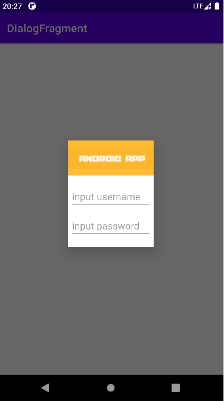
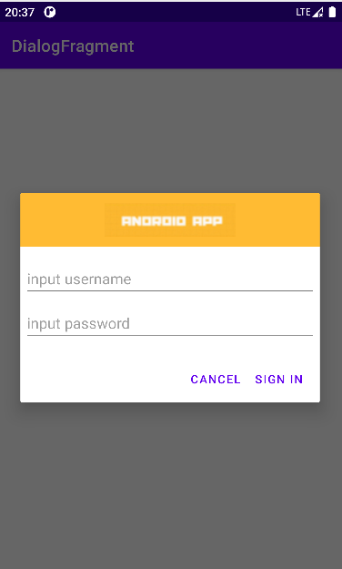

## DialogFragment

### 概述

DialogFragment在android 3.0时被引入。是一种特殊的Fragment，用于在Activity的内容之上展示一个模态的对话框。典型的用于：展示警告框，输入框，确认框等等。
在DialogFragment产生之前，我们创建对话框：一般采用AlertDialog和Dialog。==注：官方不推荐直接使用Dialog创建对话框。== 


### 好处

* 使用DialogFragment来管理对话框，当旋转屏幕和按下后退键时可以更好的管理其声明周期，它和Fragment有着基本一致的声明周期。且DialogFragment也允许开发者把Dialog作为内嵌的组件进行重用，类似Fragment（可以在大屏幕和小屏幕显示出不同的效果）。
* 使用DialogFragment至少需要实现onCreateView或者onCreateDIalog方法。==onCreateView即使用定义的xml布局文件展示Dialog==。==onCreateDialog即利用AlertDialog或者Dialog创建出Dialog==。


### 使用

#### 1、 重写onCreateView创建Dialog：

***编写xml布局***

```xml
<?xml version="1.0" encoding="utf-8"?>
<LinearLayout xmlns:android="http://schemas.android.com/apk/res/android"
    android:layout_width="wrap_content"
    android:layout_height="wrap_content"
    android:orientation="vertical">

    <ImageView
        android:layout_width="match_parent"
        android:layout_height="64dp"
        android:background="#FFFFBB33"
        android:contentDescription="@string/app_name"
        android:scaleType="center"
        android:src="@drawable/img"/>

    <EditText
        android:id="@+id/id_txt_username"
        android:layout_width="match_parent"
        android:layout_height="wrap_content"
        android:layout_marginLeft="4dp"
        android:layout_marginTop="16dp"
        android:layout_marginRight="4dp"
        android:layout_marginBottom="4dp"
        android:hint="input username"
        android:inputType="textEmailAddress" />

    <EditText
        android:id="@+id/id_txt_password"
        android:layout_width="match_parent"
        android:layout_height="wrap_content"
        android:layout_marginLeft="4dp"
        android:layout_marginTop="4dp"
        android:layout_marginRight="4dp"
        android:layout_marginBottom="16dp"
        android:fontFamily="sans-serif"
        android:hint="input password"
        android:inputType="textPassword" />
</LinearLayout>
```

***创建类继承自DialogFragment，实现onCreateView方法***

```java
public class LoginDialogFragment extends DialogFragment {

	@Nullable
	@Override
	public View onCreateView(@NonNull LayoutInflater inflater, @Nullable ViewGroup container, @Nullable Bundle savedInstanceState) {
		View view = inflater.inflate(R.layout.login_dialog_fragment, container, false);
		return view;
	}
}
```

***MainActivity里调用创建***

```java
public void show(View view) {
	LoginDialogFragment dialog = new LoginDialogFragment();
	dialog.show(getSupportFragmentManager(),"LoginDialogFragment");
}
```



#### 2、重写onCreateDialog创建Dialog：

在onCreateDialog中一般可以使用AlertDialog或者Dialog创建对话框，不过既然google不推荐直接使用Dialog，我们就使用AlertDialog来创建一个登录的对话框。

***创建类继承自DialogFragment，实现onCreateDialog***

```java
public class LoginDialogFragment2 extends DialogFragment {

	@NonNull
	@Override
	public Dialog onCreateDialog(@Nullable Bundle savedInstanceState) {
	      AlertDialog.Builder builder = new AlertDialog.Builder(getActivity());
	      LayoutInflater inflater = getActivity().getLayoutInflater();
	      View view = inflater.inflate(R.layout.login_dialog_fragment, null);
	      builder.setView(view)
	              .setPositiveButton("Sign in", new DialogInterface.OnClickListener() 					{
                      @Override
                      public void onClick(DialogInterface dialog, int which) {}
                }).setNegativeButton("Cancel",null);
        return builder.create();
  }
}
```

***在MainActivity里调用***

```java
public void show2(View view) {
      LoginDialogFragment2 dialog = new LoginDialogFragment2();
      dialog.show(getSupportFragmentManager(), "LoginDialogFragment2");
}
```




### 传递数据给Activity

从dialog传递数据给Activity，可以使用[fragment](https://so.csdn.net/so/search?q=fragment&spm=1001.2101.3001.7020) interface pattern”的方式，下面通过一个改造上面的登录框来展示这种模式。改动比较小，直接贴代码了：

```java
public class LoginDialogFragment2 extends DialogFragment {

	private EditText mUsername;
	private EditText mPassword;
	
	public interface LoginInputListener {
	      void onLoginInputComplete(String username, String password);
	}

      @NonNull
      @Override
      public Dialog onCreateDialog(@Nullable Bundle savedInstanceState) {
            AlertDialog.Builder builder = new AlertDialog.Builder(getActivity());
            LayoutInflater inflater = getActivity().getLayoutInflater();
            View view = inflater.inflate(R.layout.login_dialog_fragment, null);
            mUsername = view.findViewById(R.id.id_txt_username);
            mPassword = view.findViewById(R.id.id_txt_password);
            builder.setView(view)
                    .setPositiveButton("Sign in", new DialogInterface.OnClickListener() {
                          @Override
                          public void onClick(DialogInterface dialog, int which) {
                                LoginInputListener listener = (LoginInputListener) getActivity();
                                listener.onLoginInputComplete(mUsername.getText().toString(), mPassword.getText().toString());
                          }
                    }).setNegativeButton("Cancel", null);
            return builder.create();
      }
}
```

拿到username和password的引用，在点击登录的时候，把activity强转为我们自定义的接口：LoginInputListener，然后将用户输入的数据返回。

MainActivity中需要实现我们的接口LoginInputListener，实现我们的方法，就可以实现当用户点击登陆时，获得我们的帐号密码了：

```java
@Override
public void onLoginInputComplete(String username, String password) {
      Toast.makeText(this, username+" "+password, Toast.LENGTH_SHORT).show();
}
```


### DialogFragment屏幕适配

我们希望，一个对话框在大屏幕上以对话框的形式展示，而小屏幕上则直接嵌入当前的Actvity中。这种效果的对话框，只能通过重写onCreateView实现。下面我们利用上面的LoginDialogFragment来显示。

LoginDialogFragment我们已经编写好了，直接在MainActivity中写调用

```java
public void show(View view)
{
	FragmentManager fragmentManager = getFragmentManager();
	EditNameDialogFragment newFragment = new EditNameDialogFragment();

	boolean mIsLargeLayout = getResources().getBoolean(R.bool.large_layout) ;
	Log.e("TAG", mIsLargeLayout+"");
	if (mIsLargeLayout )
	{
		// The device is using a large layout, so show the fragment as a
		// dialog
		newFragment.show(fragmentManager, "dialog");
	} else
	{
		// The device is smaller, so show the fragment fullscreen
		FragmentTransaction transaction = fragmentManager
				.beginTransaction();
		// For a little polish, specify a transition animation
		transaction
				.setTransition(FragmentTransaction.TRANSIT_FRAGMENT_OPEN);
		// To make it fullscreen, use the 'content' root view as the
		// container
		// for the fragment, which is always the root view for the activity
		transaction.replace(R.id.id_ly, newFragment)
				.commit();
	}
}
```

可以看到，我们通过读取R.bool.large_layout，然后根据得到的布尔值，如果是大屏幕则直接以对话框显示，如果是小屏幕则嵌入我们的Activity布局中。

这个R.bool.large_layout是我们定义的资源文件：在默认的values下新建一个bools.xml

```xml
<?xml version="1.0" encoding="utf-8"?>
<resources>
    <bool name="large_layout">false</bool>
</resources>
```

然后在res下新建一个values-large，在values-large下再新建一个bools.xml

```xml
<?xml version="1.0" encoding="utf-8"?>
<resources>
    <bool name="large_layout">true</bool>
</resources>
```


### 屏幕旋转

传统的new AlertDialog在屏幕旋转时，第一不会保存用户输入的值，第二还会报异常，因为Activity销毁前不允许对话框未关闭。而通过DialogFragment实现的对话框则可以完全不必考虑旋转的问题。

***我们直接把上面登录使用AlertDialog创建的登录框，拷贝到MainActivity中直接调用：***

```java
public void showLoginDialogWithoutFragment(View view)
{
	AlertDialog.Builder builder = new AlertDialog.Builder(this);
	LayoutInflater inflater = this.getLayoutInflater();

	// Inflate and set the layout for the dialog
	// Pass null as the parent view because its going in the dialog layout
	builder.setView(inflater.inflate(R.layout.fragment_login_dialog, null))
			// Add action buttons
			.setPositiveButton("Sign in",
					new DialogInterface.OnClickListener()
					{
						@Override
						public void onClick(DialogInterface dialog, int id)
						{
							// sign in the user ...
						}
					}).setNegativeButton("Cancel", null).show();
}
```

