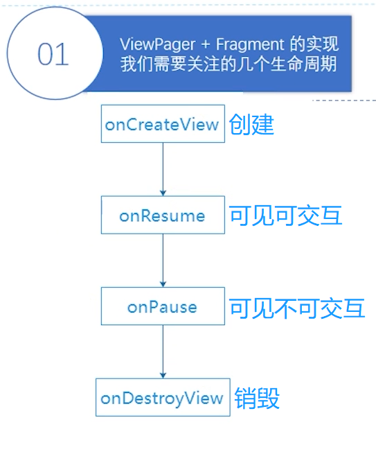

# Fragment

## 简介


## Fragment的生命周期


## 静态创建Fragment

***1.创建一个Fragment***

***2.布局代码中用一个容器承接并绑定  fragment、FragmentContainerView（标签）***

==***注意：***==
【fragment标签】
必须声明`android:id`或者`android:tag`属性，否则会有错
`android:name="com.example.fragmenttest.fragment.StaticFragment1"`<!--找到那个fragment-->
`tools:layout="@layout/example_fragment"`					<!--可在预览视图中看到fragment预览界面-->
【FragmentContainerView标签】
fragment标签内必须声明`androidtid`属性，否则会有错
`android:name` 属性也可以用class代替，`class=“com.example.fragmenttest2.ExampleFragment”`


## 动态创建Fragment

***1.创建一个Fragment***

***2.布局代码用容器承接，但不直接绑定***

***3.代码中，使用FragmentManager、FragmentTransaction添加Fragment到容器中***

```java
//这里防止手机转向的时候，重复添加fragment
if (savedInstanceState == null) {
	Bundle bundle = new Bundle();
    //传信息给fragment
	bundle.putString(ExampleFragment.ARG_PARAM1,"这是动态Fragment");
	//1.先获取 FragmentManager
	FragmentManager fragmentManager = getSupportFragmentManager();
	//2.然后再获取 beginTransaction（事务）相当于一次事务操作
	FragmentTransaction fragmentTransaction = fragmentManager.beginTransaction();
	fragmentTransaction.add(R.id.fcv, ExampleFragment.class, bundle)
        .setReorderingAllowed(true)
        //.addToBackStack(null) 
        .commit();//事务结束
}
```


## Fragment的增删替查

### 添加

一个容器里可以添加多个Fragment,依次盖在上面。类比FrameLayout
***注意：***由于事件分发机制，同时添加多个Fragment时，在空白处点击，会产生穿透的效果，也就是作用到下层的Fragment。[解决方法：在Fragment里拦截onTouch事件](https://blog.csdn.net/alex440681/article/details/102240699)
因此,最好不要用add方式,而用replace添加fragment,保证容器中里只有一个Fragment

```java
//方式一：
FragmentManager fragmentManager = getSupportFragmentManager();
FragmentTransaction fragmentTransaction = fragmentManager.begin Transaction();
fragmentTransaction.add(R.id.fragment, ExampleFragment.class, null)
.commit();
//方式二：
FragmentManager fragmentManager = getSupportFragmentManager();
FragmentTransaction fragmentTransaction = fragmentManager.begin Transaction();
fragmentTransaction.add(R.id.fragment, ExampleFragment.class, null)
.setReorderingAllowed(true)
.addToBackStack("myFragment2")
.commit();
//方式三：
FragmentManager fragmentManager = getSupportFragmentManager();
FragmentTransaction fragmentTransaction = fragmentManager.begin Transaction();
ExampleFragment fragment = new ExampleFragment();
fragmentTransaction.add(R.id.fragment, fragment)
.commit();
```

### 查找

根据id/tag查找fragment,返回找到的最上面的一个，如果没有，则从BackStack里找，并返回最先添加的一个，如果没有BackStack,则返回null。

```java
fragmentManager.findFragmentByld(R.id.fragment)
fragmentManager.findFragmentByTag("fragment")
```

### 删除

删除是以查找为前提的，依次移除当前容器最上面的一个Fragment，类比栈的退出。

```java
FragmentManager fragmentManager = getSupportFragmentManager();
FragmentTransaction fragmentTransaction = fragmentManager.beginTransaction();
Fragment fragment = fragmentManager.findFragmentByld(R.id.fragment);
if (fragment != null) {
	fragmentTransaction.remove(fragment).commit();
}
```

### 替换

***不带addToBackStack***
1.将当前容器上的Fragment全部移除
2.添加新的Fragment
BackStack里的Fragment仍然存在。按返回键依然会响应到BackStack,也就是弹出BackStack里的Fragment。而此时前台看到的是ReplaceFragment,所以看起来的效果是好像什么也没发生一样。

```java
FnagmentManager fragmentManager = getSupportFragmentManager();
FragmentTransaction fragmentTransaction = fragmentManager.begin Transaction();
fragmentTransaction
.replace(R.id.ffagment, ReplaceFragment.class, null)
.commit();
```

### 显示和隐藏

只是把Fragment显示/隐藏，Fragment生命周期不发生变化,相当于View的显示/隐藏。

```java
//显示show
FragmentManager fragmentManager = getSupportFragmentManager();
FragmentTransaction fragmentTransaction = fragmentManager.beginTransaction();
Fragment fragment = fragmentManager.findFragmentByld(R.id.fragment_container);
fragmentTransaction.show(fragment).commit();
//隐藏hide
FragmentManager fragmentManager = getSupportFragmentManager();
FragmentTransaction fragmentTransaction = fragmentManager.begin Transaction();
Fragment fragment = fragmentManager.findFragmentByld(R.id.fragment_container);
fragmentTransaction.hide(fragment).commit();
```

把Fragment从容器中移除/装载，Fragment生命周期发生变化，执行到onDestroyView,其View被销毁,
但Fragment仍存在。

```java
//显示attach
FragmentManager fragmentManager = getSupportFragmentManager();
FragmentTransaction fragmentTransaction = fragmentManager.begin Transaction();
Fragment fragment = fragmentManager.findFragmentByld(R.id.fragment_container);
fragmentTransaction.attach(fragment).commit();
//隐藏detach
FragmentManager fragmentManager = getSupportFragmentManager();
FragmentTransaction fragmentTransaction = fragmentManager.begin Transaction();
Fragment fragment = fragmentManager.findFragmentByld(R.id.fragment_container);
fragmentTransaction.detach(fragment).commit();
```


## Activity传递数据给Fragment

### 实现步骤

1. Activity中创建Fragment对象，调用setArguments(bundle)方法存储值

2. Fragment中调用getArguments()获取传递的Bundle对象解析获取具体值

***Activity代码如下：***

```java
@Override    
protected void onCreate(Bundle savedInstanceState) {
    super.onCreate(savedInstanceState);
    setContentView(R.layout.activity_main);

    //获取自定义的fragment对象
    DynamicFragment dynamicFragment = new DynamicFragment();

    //使用Bundle对象传递数据
    Bundle bundle = new Bundle();
    //绑定对象
    bundle.putString("name", "hgm");
    dynamicFragment.setArguments(bundle);

    FragmentManager supportFragmentManager = getSupportFragmentManager();
    //获取事务对象
    FragmentTransaction fragmentTransaction = supportFragmentManager.beginTransaction();
    //在容器中添加Fragment
    fragmentTransaction.add(R.id.rl_fragment, dynamicFragment);
    //提交事务
    fragmentTransaction.commit();
}
```

***Fragemnt的代码如下：***

```java
@Nullable
@Override
public View onCreateView(@NonNull @NotNull LayoutInflater inflater, @Nullable @Nullable ViewGroup container, @Nullable @Nullable Bundle savedInstanceState) {
    View view = inflater.inflate(R.layout.dynamicfragment_layout, container, false);
    //获取绑定的值
    String name = (String) getArguments().get("name");
    System.out.println("name:" + name);
    return view;
}
```


## Fragment传递数据给Activity

### 实现步骤

***1、定义一个接口，定义传递的方法***

```java
//定义一个接口，定义要向Activity传递的方法
public interface OnNewItemAddedListener{
    public void newItemAdd(String content);
}
```

***2、声明接口的引用变量***

```java
//声明接口引用变量
private OnNewItemAddedListener onNewItemAddedListener;
```

***3、重写onAttach***

```java
@Override
public void onAttach(@NonNull @NotNull Context context) {
    super.onAttach(context);
    //要求该Fragment 所附着的Activity 必须实现这个方法
    onNewItemAddedListener = (OnNewItemAddedListener) context;
}
```

***4、fragment中使用该方法***

```java
@Nullable
@Override
public View onCreateView(@NonNull LayoutInflater inflater, @Nullable  ViewGroup container, @Nullable  Bundle savedInstanceState) {
    View view = inflater.inflate(R.layout.new_item_fragment, container, false);
    String content = "这是传给Activity的数据";
    //调用接口的方法
    onNewItemAddedListener.newItemAdd(content);
    return view;
}
```

***5、在Activity中继承该Fragment***

```java
public class MainActivity extends AppCompatActivity implements NewItemFragment.OnNewItemAddedListener {
    @Override
    protected void onCreate(Bundle savedInstanceState) {
        super.onCreate(savedInstanceState);
        setContentView(R.layout.activity_main);
    }

    @Override //实现接口的方法，可以获取从Fragment传送过来的内容, 对该内容就行操作
    public void newItemAdd(String content) {
        //实现的操作...
    }
}
```


## Fragment懒加载

***使用 onHiddenChanged***

```java
public class Fragment1 extends Fragment {

    //判断是否已经进行懒加载，避免重复加载
    private boolean isLoad = false;
    //判断当前Fragment是否可见
    private boolean isHidden = true;

    
    @Override
    public View onCreateView(LayoutInflater inflater, ViewGroup container, Bundle savedInstanceState) {
        return inflater.inflate(R.layout.fragment, container, false);
    }

    @Override
    public void onHiddenChanged(boolean hidden) {
        super.onHiddenChanged(hidden);
        Log.e("TAG", "onHiddenChanged: " + hidden);
        isHidden = hidden;
        lazyLoad();
    }

    @Override
    public void onResume() {
        super.onResume();
        lazyLoad();
    }

    @Override
    public void onDestroyView() {
        super.onDestroyView();
        isLoad = false;
    }

    private void lazyLoad(){
        if (!isLoad && !isHidden){
            isLoad = true;
        }
    }
}
```




## onCreateView和onActivityCreate的区别

***onCreateView（）：***
这个方法就相当于Activity onCreate（）方法中的 setContentView（）是进行XML视图填充的，这也是为什么setContentView（）这个方法几乎要写在onCreate（）方法的第一行的原因，因为如果XML视图还没填充，我们就没有办法对每个View进行操作，所以我们在每个Fragment中对每个View进行操作的时候都必须在onCreateView（）后面执行。

***onActivityCreate（）：***
这个相当于Activity中 onCreate（）中 setContentView（）这句话后面的代码。这里可能就有人会想了： 那我完全可以把 对每个View操作的代码放在onCreateView（）代码块结尾处写啊，完全没必要分开到onActivityCreate（）中写啊，分开写反而让人更容易模糊。

***个人理解：***

一个是单一原则，能引起一个方法改变的原因只能有一个，==onCreateView（）只负责视图填充==，==onActivityCreate（）负责对视图修改==，如果你的视图不需要修改那就放在onCreateView（）中写吧。 当然这个说法不是特别站得住脚。不过还是能帮助记忆的。
