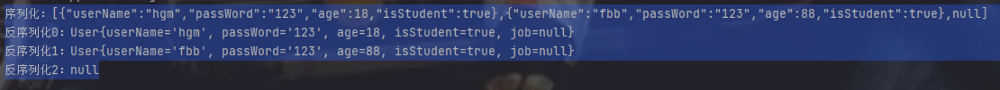

## Gson

### 简介

JSONJavaScript object Notation是一种==轻量级的数据交换格式==。易于人阅读和编写。同时也易于机器解析和生成。Gson是Google提供的用来在Java对象和JSON数据之间进行映射的Java类库。可以将一个JSON字符串转成一个Java对象（反序列化），或者反过来（序列化）。是json解析的一个框架

***GSON官网：***https://github.com/google/gson

### 依赖

```java
implementation 'com.google.code.gson:gson:2.8.6'
```

### 对象序列化、反序列化

User类，拥有name,password,age,jsstudent四个属性,对user类型对象进行序列化与反序列化：使用new Gsono.to)son/fromJson即可完成序列化与反序列化。

```java
//java对象
Usen ul = new User( userName: "hgm", password: "123", age: 18, isStudent: true);
//Gson提供的Gson对象
Gson gson = new Gson();
//序列化
String json = gson.toJson(ul);
System.out.print1n(json);

User u2 = gson.fromJson(json, User.class);
System.out.print1n(u2);
```

### List序列化和反序列化

```java
//创建集合
List<User> list1 = new ArrayListo(;
list1.add(new User("hgm", "123", 18, false));
list1.add(new User("fbb", "123", 88, false));
list1.add(null);
//创建Gson对象
Gson gson = new Gson();
//序列化
String json = gson.toJson(list1);
System.out.printIn("序列化："+json);
//反序列化
Type type=new TypeToken<List<User>>(){
}.getType();
                                  
List<User> list2 = gson.fromJson(json, type);
System.out.print1n("反序列化0:"+1ist2.get(0).getUserName());
System.out.println("反序列化1:"+1ist2.get(1)）;
System.out.print1n("反序列化2:"+1ist2.get(2));
```

### Array数组序列化、反序列化

```java
//创建User数组
User [] users1 = new User [3];
//java对象
users1[0] = new User("hgm", "123", 18, true);
users1[1] = new User("fbb", "123", 88, true);
//创建Gson对象
Gson gson = new Gson(O;
//序列化
String json = gson.toJson(users1);
System.out.println("序列化："+json)；
//反序列化
User [] users2 = gson.fromJson(json, User [].class);
System.out.println("反序列化0："+users2[0]);
System.out.printIn("反序列化1："+users2[1]);
System.out.printIn("反序列化2:"+users2[2]);
```

