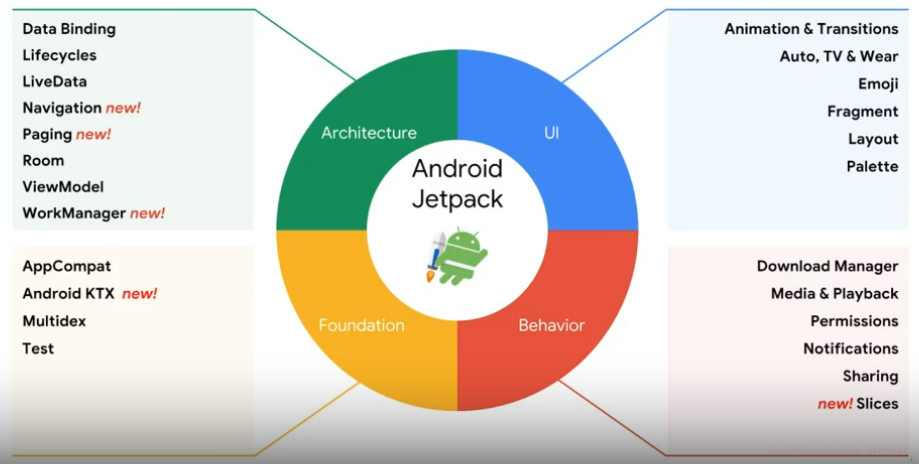
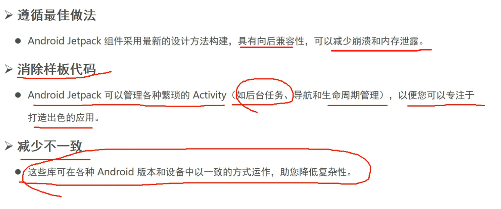

# Jetpack

## 什么是Jetpack

Jetpack是一个丰富的组件库，它的组件库按类别分为4类，分别是==架构（Architecture）==、==界面（UI）==、==行为（behavior）==和==基础（foundation）==。 像通知、权限、Fragment都属于Jetpack。由此可见，Jetpack并不全是些新东西，只要是能够帮助开发者更好更方便地构建应用程序的组件，Google都将其纳入了Jetpack。

## 为什么使用它
