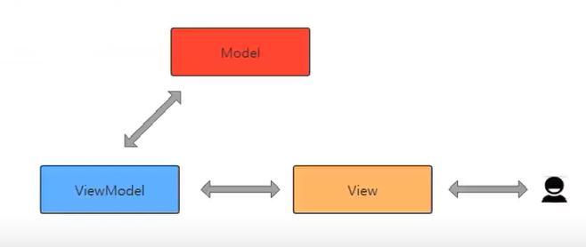
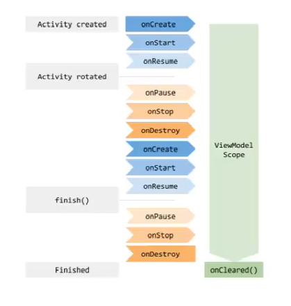
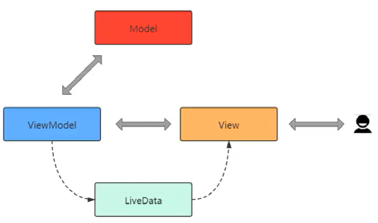
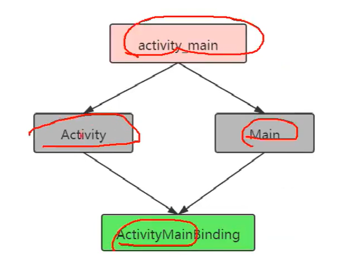
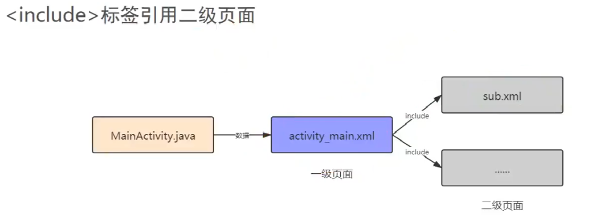
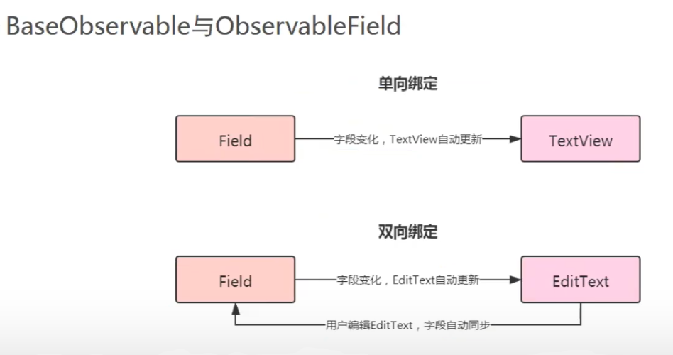

# Jetpack之架构

## LifeCycle

### 简介

Lifecycle是一个Android"生命周期管理的组件"，Lifecycle组件包括LifecycleOwner、LifecycleObserver。LifeCyclerObserver是我们要实现的具有生命周期感知的类的需要实现的接口，这个接口没有任何方法。在这个类中我们通过注解来表明函数在LifeCycleOwner的哪个生命周期的时候执行。实现了LifecycleObserver 接口的类，可以在方法上添加注解来监视其组件以来的UI界面的生命周期，可以通过调用Lifecycle类的addObserver（）方法传递观察者实例来添加观察者。

### 好处

* 帮助开发者建立可感知生命周期的组件
* 组件在其内部管理自己的生命周期，从而降低模块耦合度
* 降低内存泄漏发生的可能性
* Activity、Fragment、Service、Application均有LifeCycle支持


### 解耦页面与组件

### LifrcycleService解耦Service组价

### ProcessLifecycleOwner监听应用程序生命周期

#### ProcessLifecycleOwner

针对整个应用程序的监听，与Activity数量无关。
Lifecycle.Event.ON CREATE只会被调用一次,Lifecycle.Event.ON DESTROY永远不会被调用。


## ViewModel

### 诞生解决的问题

* 重新创建、旋转屏幕导致的数据丢失
* 异步调用的内存泄漏 
* 类膨胀提高维护难度和测试难度

### 作用

它是介于View（视图）和Model（数据模型）之间的==桥梁==
==使视图和数据能够分离，也能保持通信==


### 生命周期特性

独立于配置变化
无论Activity在哪个阶段的生命周期，viewmodel的数据仍然存在可以访问




### 使用

***新建MyViewModel类，继承ViewModel***

```java
public int number;

//控制器绑定ViewModel
viewModel = new ViewModelProvider(this, new ViewModelProvider.AndroidViewModelFactory(getApplication())).get(MyViewModel.class);

 // 屏幕旋转后用户操作数据仍然存在
textView.setText(String.valueOf(viewModel.number));
```


### 注意

不要向ViewModel中传入Context，会导致内存泄漏
如果要使用Context,请使用AndroidViewModel中的Application


## LiveData

### 与ViewModel的关系 

在ViewModel中的数据发生变化时通知页面，感知数据变化，自动刷新




### 优势

* 确保界面符合数据状态
* 不会发生内存泄漏
* 不会因Activity停止而导致崩溃
* 不再需要手动处理生命周期
* 数据始终保持最新状态
* 适当的配置更改
* 共享资源

### 使用

```java
// 绑定ViewModel
viewModel = new ViewModelProvider(this, new ViewModelProvider.AndroidViewModelFactory(getApplication())).get(MyViewModel.class);

// LiveData监听到数据变化时，执行下面方法刷新ui
viewModel.getCurrentSecond().observe(this, new Observer<Integer>() {
    @Override
    public void onChanged(Integer i) {
        textview.setText(String.valueOf(i));
    }
});
```


## DataBinding

### 意义

让文件布局承担了部分原本属于页面的工作，=="使页面和布局耦合度进一步降低"==
不需要再使用findviewById，项目简洁，可读性高
布局文件可以包含简单的业务逻辑

### ActivityMainBinding的由来




### 使用步骤

***第一步：build.gradle里配置***

```java
dataBinding {
    enabled=true
}
```

***第二步：xml里的配置***

```xml
根布局必须是layout
<data>
    <variable
        name="idol"
        type="com.example.databinding.Idol" />
    <variable
        name="eventHandle"
        type="com.example.databinding.EventHandleListener" />
    <import type="com.example.databinding.StarUtils" />
</data>

android:text="@{idol.name}" //对应到bean类的字段
android:text="@{StarUtils.getStar(idol.star)}"//调用类里的方法
```

***第三步：Java代码部分***

```java
ActivityMainBinding binding = DataBindingUtil.setContentView(this, R.layout.activity_main);

Idol idol = new Idol("Jisoo", 4);
binding.setIdol(idol);
```

***二级页面使用方式***



***第一步:***
新建二级页面sub.xml

***第二步：使用<include>加载二级页面***

把数据从一级页面传到二级页面
app:idol="@{idol}"


### 自定义BindingAdapter

加载网络图片
方法重载，加载本地图片
多参数重载

案例：dataBinding3

### 添加依赖

```java
implementation 'com.squareup.picasso:picasso:2.71828'
```

【拓展DataBinding中@BindingAdapter注解的用法】
可以认为这一个注解就是生成一个全局的控件属性，这一个注解面向一个public static方法，方法名自己定义。它注解的方法的第一个形参就是我们想要对其创建属性的"控件类"，第二个形参是赋给这一个"自定义属性的值"


### 双向绑定

***java代码：***

```java
binding = DataBindingUtil.setContentView(this, R.layout.activity_main);
binding.setUserViewModel(new UserViewModel());
```

***xml的配置有所改变，多了：***

```xml
android:text="@={userViewModel.userName}"
```

***UserViewModel代码如下：***

```java
private User user;
private ObservableField<User> observableField;

public UserViewModel() {
    user = new User("hgm");
    observableField = new ObservableField<>();
    observableField.set(user);// 相当于两者关联起来
}

public String getUserName() {
    return observableField.get().userName;
}

public void setUserName(String userName) {
    Log.d("hgm", "setUserName: "+userName);
    observableField.get().userName = userName;
}
```


### Recyclerview的绑定

***MainActivity代码如下：***（案例查看databinding 6）

```java
adapter = new RecyclerViewAdapter(IdolUtils.get());// 创建适配器
binding.recyclerView.setLayoutManager(new LinearLayoutManager(this));// 设置RecyclerView布局
binding.recyclerView.setAdapter(adapter);// 设置适配器
```

***adapter代码如下：***

```java
//RecyclerView适配器
public class RecyclerViewAdapter extends RecyclerView.Adapter<RecyclerViewAdapter.MyViewHolder> {

    private List<Idol> idolList;

    public RecyclerViewAdapter(List<Idol> idolList) {
        this.idolList = idolList;
    }

    @NonNull
    @Override
    public MyViewHolder onCreateViewHolder(@NonNull ViewGroup parent, int viewType) {
        // 加载布局
        ItemBinding itemBinding = DataBindingUtil.inflate(LayoutInflater.from(parent.getContext()), 		R.layout.item, parent, false);
        return new MyViewHolder(itemBinding);
    }

    @Override
    public void onBindViewHolder(@NonNull MyViewHolder holder, int position) {
        Idol idol = idolList.get(position);
        holder.itemBinding.setIdol(idol);
    }

    @Override
    public int getItemCount() {
        return idolList == null ? 0 : idolList.size();
    }

    public class MyViewHolder extends RecyclerView.ViewHolder {
        private ItemBinding itemBinding;

        public MyViewHolder(ItemBinding itemBinding) {
            super(itemBinding.getRoot());
            this.itemBinding = itemBinding;
        }
    }
}
```


## Navigation

#### 使用步骤

***1.新建Navigation文件***


***2.新建两个Fragment***


***3.添加host，把两个fragment页面添加进去***


***4.在main.xml添加容器***


***5.设置action的参数***


***6.可自定义动画***


***7.在Fragment代码添加业务***

```java
// 绑定控件
Button button = getActivity().findViewById(R.id.button);

// 传递参数
Bundle bundle = new Bundle();
bundle.putString("myName", str);

// 设置跟踪导航图中当前位置的对象
NavController controller = Navigation.findNavController(view);
// 跳转使用方式：目标id、动作导航都行
controller.navigate(R.id.action_homeFragment_to_detailFragment, bundle);
controller.navigate(R.id.detailFragment);
```


## Room

### 重要概念与关系


### Room应用

### 简介

Room是一个持久性数据库，Room持久层库在SQLite上提供了一个抽象层，以便充分利用SQLite的强大功能同时，能够流畅地访问数据库。Room=SQLite的抽象 ，相当于再次封装，功能：简洁流畅易用的访问数据库

### 优点

- 针对SQL查询的编译时验证
- 可最大限度减少重复和容易出错的样板代码的方便注解
- 简化了数据库迁移路径

### 三角色说明


### 依赖

```java
//Room依赖
def room_version = "2.2.0-alpha01"
implementation "androidx.room:room-runtime:$room_version"//Room的api支持
annotationProcessor "androidx.room:room-compiler:$room_version"//Room的注解处理器
implementation 'androidx.room:room-runtime:2.2.5'
annotationProcessor 'androidx.room:room-compiler:2.2.5'
```


***注意：***getInstance() 方法中需要使用同步锁 synchronized (Singleton.class) 防止多线程同时进入造成 instance 被多次实例化。


### Room+LiveData+ViewModel

进一步优化：
***问题：***每当数据库数据发生变化时，都需要"开启一个工作线程去重新获取数据库中的数据"。
***解决：***当数据发生变化时，通过LiveData通知View层，实现数据"自动更新"。
查看项目Jetpack里的Room2


## DeepLink

查看项目Jetpack-DeepLink


## WorkManager

### 作用 


### 重要特点 


### 兼容方案


### 定义任务

### WorkManager依赖

```java
implementation 'androidx.work:work-runtime:2.4.0-alpha03'
```


## Paging组件

### 工作原理


### DataSource


### BoundaryCallback