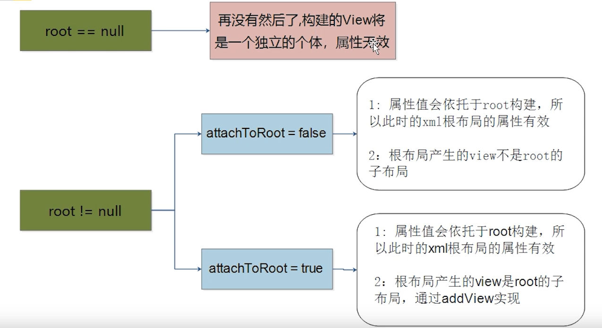
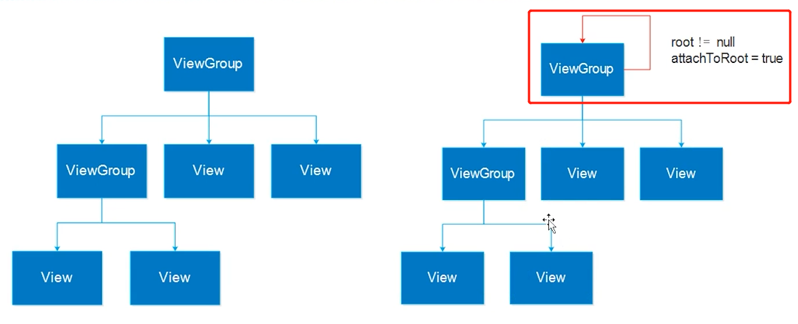

## LayoutInflate

### 简介

LayoutInflate就是传说中的==布局泵==，是用来找res/layout/下的xml布局文件，并且实例化；而findViewById()是找xml布局文件下的具体widget控件。

***源码解析：***https://blog.csdn.net/lmj623565791/article/details/38171465

------

### inflate解析过程

------

### inflate参数传递不当

使用第三种方法时，addView会让view变成root子布局，从而导致迭代异常报错

