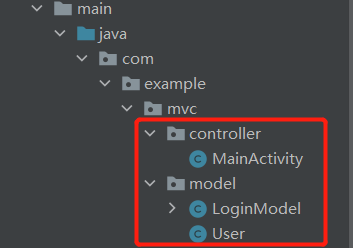

## MVC

### 简介


全名：Model View Controller，属于一种框架开发模式。

***Model：***模型层，用于负责处理数据的加载或存储

***View：***视图层，用于负责界面数据的展示，和用户进行交互

***Controller：***控制器层，用于负责逻辑业务的处理


### 优缺点

***优点：***1.Model与View分离，降低了代码的耦合性 

​			2.可扩展性好，模块职责划分明确

***缺点：***1.View层和Model层是相互可知的，这意味着两层之间存在耦合

​			2.造成了Activity既是Controller层，又是view层这样一个窘境

​			3.Activity类的职责不断增加，以致变得庞大而臃肿

***适用场景：***适用于功能较少、业务逻辑简单、界面不复杂的小型项目。


### 一般流程


### Demo实战

案例MVC：根据用户输入，判断是否登录成功

***项目结构：***



***xml代码如下：***

```xml
<?xml version="1.0" encoding="utf-8"?>
<LinearLayout xmlns:android="http://schemas.android.com/apk/res/android"
    xmlns:app="http://schemas.android.com/apk/res-auto"
    xmlns:tools="http://schemas.android.com/tools"
    android:layout_width="match_parent"
    android:layout_height="match_parent"
    android:orientation="vertical"
    android:gravity="center_horizontal"
    tools:context=".controller.MainActivity">

    <ImageView
        android:layout_width="wrap_content"
        android:layout_height="wrap_content"
        android:layout_marginBottom="40dp"
        android:layout_marginTop="40dp"
        android:src="@mipmap/ic_launcher_round"/>

    <EditText
        android:id="@+id/et_phone_number"
        android:layout_width="match_parent"
        android:layout_height="wrap_content"
        android:layout_marginLeft="40dp"
        android:layout_marginRight="40dp"
        android:hint="请输入手机号"
        android:inputType="number"
        android:textColor="#333"
        android:textSize="14sp"/>

    <EditText
        android:id="@+id/et_password"
        android:layout_width="match_parent"
        android:layout_height="wrap_content"
        android:layout_marginLeft="40dp"
        android:layout_marginRight="40dp"
        android:layout_marginTop="20dp"
        android:hint="请输入密码"
        android:inputType="textPassword"
        android:textColor="#333"
        android:textSize="14sp"/>

    <Button
        android:id="@+id/btn_login"
        android:layout_width="match_parent"
        android:layout_height="wrap_content"
        android:layout_marginLeft="40dp"
        android:layout_marginRight="40dp"
        android:layout_marginTop="20dp"
        android:text="登陆"
        android:textColor="#fff"
        android:textSize="20sp"/>

    <ProgressBar
        android:id="@+id/progressbar"
        android:layout_width="wrap_content"
        android:layout_height="wrap_content"
        android:layout_centerInParent="true"
        android:visibility="gone"/>

</LinearLayout>
```

***Model代码如下：***

```java
public class LoginModel {

    private static final String TAG = "hgm";

    // 登录的逻辑从原本的提取到Model层
    public void login(String phoneNumber, String password, OnResponseListener listener) {
        if (phoneNumber.equals("13652220661") && password.equals("123")) {
            User user = new User();
            user.setId(1);
            user.setName("hgm");
            user.setAge(18);

            listener.onSuccess(user);
        }else {
            listener.OnError("登录失败");
        }
    }
    

    public interface OnResponseListener {
        void onSuccess(User user);
        void OnError(String msg);
    }
}
```

***Controller代码如下：***

```java
public class MainActivity extends AppCompatActivity implements View.OnClickListener {

    private static final String TAG = "hgm";
    private EditText etPhoneNumber;
    private EditText etPassword;
    private Button btnLogin;
    private ProgressBar progressBar;

    @Override
    protected void onCreate(Bundle savedInstanceState) {
        super.onCreate(savedInstanceState);
        setContentView(R.layout.activity_main);

        initView();
    }

    private void initView() {
        etPassword = findViewById(R.id.et_password);
        etPhoneNumber = findViewById(R.id.et_phone_number);
        btnLogin = findViewById(R.id.btn_login);
        progressBar = findViewById(R.id.progressbar);
        btnLogin.setOnClickListener(this);
    }

    @Override
    public void onClick(View v) {
        switch (v.getId()) {
            case R.id.btn_login:
                // 获取输入框的信息
                String phoneNumber = etPhoneNumber.getText().toString().trim();
                String password = etPassword.getText().toString().trim();
                // 调用登录方法
                login(phoneNumber, password);
                break;
            default:
                break;
        }
    }

    /**
     * 登录方法
     * @param phoneNumber
     * @param password
     */
    private void login(String phoneNumber, String password) {
        // 判断输入是否正确
        boolean isValidate = validateInput(phoneNumber, password);
        if (isValidate) {
            progressBar.setVisibility(View.VISIBLE);

            LoginModel model = new LoginModel();
            model.login(phoneNumber, password, new LoginModel.OnResponseListener() {
                @Override
                public void onSuccess(User user) {
                    progressBar.setVisibility(View.GONE);
                    Log.d(TAG, "id: " + user.getId());
                    Log.d(TAG, "name: " + user.getName());
                    Log.d(TAG, "age: " + user.getAge());
                }

                @Override
                public void OnError(String msg) {
                    progressBar.setVisibility(View.GONE);
                    Log.e(TAG, "onError: " + msg);
                }
            });
        }
    }

    
    /**
     * 验证输入
     * @param phoneNumber
     * @param password
     * @return
     */
    private boolean validateInput(String phoneNumber, String password) {
        if (isEmpty(phoneNumber)) {
            Toast.makeText(this, "手机号码不能为空", Toast.LENGTH_SHORT).show();
            return false;
        }
        if (isEmpty(password)) {
            Toast.makeText(this, "密码不能为空", Toast.LENGTH_SHORT).show();
            return false;
        }
        return true;
    }

    /**
     * 判空
     * @param value
     * @return
     */
    private boolean isEmpty(String value) {
        if (value == null || value.equals("")) {
            return true;
        }
        return false;
    }
```

