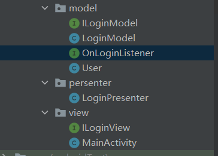
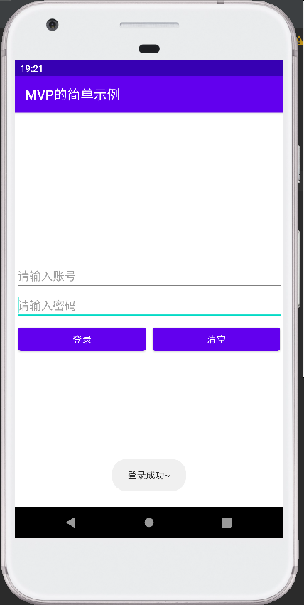
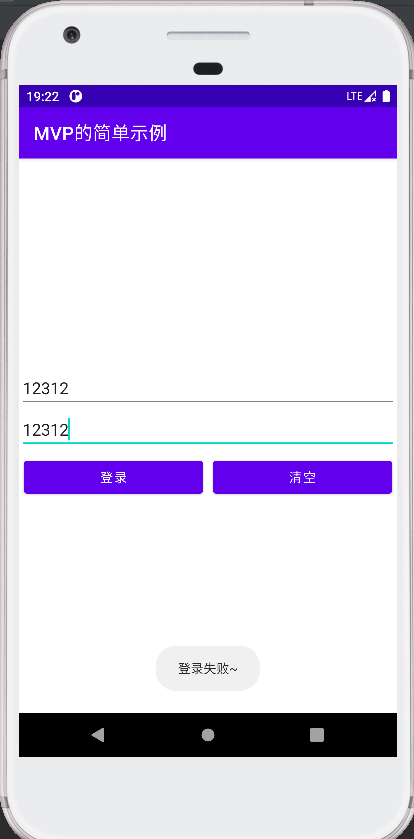

## MVP

### 简介

全名：Model View Presenter，一种框架开发模式，为了解决MVC中View层和Model层之间的强耦合，Controller是基于行为的并被多个View共享，从而演变MVP


### MVP各层的职责

- ***View：***负责绘制UI元素，与用户进行交互
- ***Model：***负责存储、检索、操纵数据
- ***Presenter：***作为View和Model交互的中间纽带，处理两者之间的业务逻辑

***Android应用程序中，MVP框架是如何实现的？都充当什么角色？***

1. View接受用户的交互请求；
2. View通过Presenter暴露接口将请求转交给Presenter来进行处理；
3. Presenter通过Model暴露接口对Model进行操作和更新；
4. Model改变后，可以将改变的信息发送至Presenter；
5. Presenter通过View暴露接口对View进行视图更新；


### MVP优缺点

***优点：***1.通过P层的转接能避免业务逻辑被塞进View中，有效的降低View的复杂性

​			2.View层和Model层完全解耦，保证了系统的灵活性和整洁性

​			3.View层及Model层大大提高复用性

​			4.由于各层分工明确，极便于单元测试

***缺点：***1.MVP是以UI为驱动的模型，更新UI时需要保证能获取到控件的引用以及当前是否是UI线程

​			2.复杂的业务同时也可能会导致P层太大，代码臃肿的问题依然不能解决


### MVC和MVP的区别

MVC：

- View可以直接与Model交互
- Controller是基于行为的，并且可以被多个View共享
- 可以负责决定显示哪个View

MVP：

- View不直接与Model交互，而是通过Presenter来与Model交互
- Presenter与View的交互通过接口来进行，有利于单元测试
- 通过View和Presenter是一对一的，但是复杂的View可能会绑定多个Presenter来处理不同的业务逻辑


### MVP实现需要注意的点

* 更新UI时要考虑当前执行的线程是否是UI线程，也要考虑Activity的生命周期，做好Activity已被摧毁的处理；
* P层需要执行耗时操作，而P层持有Activity、Fragment的强引用，在耗时操作结束前Activity、Fragment已被摧毁了，但由于P层一直持有Activity、Fragment对象，导致Activity、Fragment无法被回收引起内存泄露；这里建议使用弱引用和Activity、Fragment的声明周期来处理。


### 简单示例

利用MVP实现一个简单的登录

***项目结构：***



***xml布局，代码如下：***

```xml
<?xml version="1.0" encoding="utf-8"?>
<LinearLayout xmlns:android="http://schemas.android.com/apk/res/android"
    xmlns:app="http://schemas.android.com/apk/res-auto"
    xmlns:tools="http://schemas.android.com/tools"
    android:layout_width="match_parent"
    android:layout_height="match_parent"
    android:gravity="center"
    android:orientation="vertical"
    tools:context=".view.MainActivity">

    <EditText
        android:id="@+id/etUserName"
        android:layout_width="match_parent"
        android:layout_height="wrap_content"
        android:hint="请输入账号" />

    <EditText
        android:id="@+id/etPassWord"
        android:layout_width="match_parent"
        android:layout_height="wrap_content"
        android:hint="请输入密码" />

    <LinearLayout
        android:layout_width="match_parent"
        android:layout_height="wrap_content">

        <Button
            android:id="@+id/btnLogin"
            android:layout_width="wrap_content"
            android:layout_height="wrap_content"
            android:layout_margin="5dp"
            android:layout_weight="1"
            android:text="登录" />

        <Button
            android:id="@+id/btnClear"
            android:layout_width="wrap_content"
            android:layout_height="wrap_content"
            android:layout_margin="5dp"
            android:layout_weight="1"
            android:text="清空" />
    </LinearLayout>

    <ProgressBar
        android:id="@+id/progress"
        android:layout_width="wrap_content"
        android:layout_height="wrap_content"
        android:visibility="gone" />
</LinearLayout>
```

***创建 user类，代码如下：***

```java
public class User
{
      private String username ;
      private String password ;

      public String getUsername()
      {
            return username;
      }

      public void setUsername(String username)
      {
            this.username = username;
      }

      public String getPassword()
      {
            return password;
      }

      public void setPassword(String password)
      {
            this.password = password;
      }
}
```

***Model层***

1、创建接口OnLoginListener，代码如下：

```java
public interface OnLoginListener {
      void loginSuccess(User user);
      void loginFailed();
}
```

2、创建ILoginModel，代码如下：

```java
public interface ILoginModel{
      void login(String userName,String passWord,OnLoginListener loginListener);
}
```

3、创建LoginModel，并实现ILoginModel接口，代码如下：

```java
public class LoginModel implements ILoginModel {

      @Override
      public void login(String userName, String passWord, OnLoginListener loginListener) {
            //模拟子线程耗时场景
            new Thread(new Runnable() {
                  @Override
                  public void run() {
                        try {
                              Thread.sleep(2000);
                            } catch (InterruptedException e) {
                                  e.printStackTrace();
                            }
                        //业务逻辑
                        if ("hgm".equals(userName) && "123456".equals(passWord)) {
                              User user = new User();
                              user.setUsername(userName);
                              user.setPassword(passWord);
                              loginListener.loginSuccess(user);//登录成功
                        } else {
                              loginListener.loginFailed();//登录失败
                        }
                  }
            }).start();
      }
}
```

***View层：***

1、创建接口ILoginView，代码如下：

```java
/**
 * IUserView中定义了可以从View中获取数据的方法以及 View添加数据的方法
 */
public interface ILoginView {
	//login说明需要 UserName和PassWord
	String getUserName();
	String getPassWord();
	void clearUserName();
	void clearPassWord();
	
	//用户的提示
	void showProgress();
	void hideProgress();
	
	//登录结果
	void showSuccessToast();
	void showFailedToast();
}
```

2、MainActivity实现接口ILoginView，代码如下：

```java
public class MainActivity extends AppCompatActivity implements ILoginView{

	private EditText etUserName,etPassWord;
	private Button btnLogin,btnClear;
	private ProgressBar progress;
	private LoginPresenter loginPresenter;
	
	@Override
	protected void onCreate(Bundle savedInstanceState) {
	      super.onCreate(savedInstanceState);
	      setContentView(R.layout.activity_main);
	      setTitle("MVP的简单示例");
	      initView();
	      initListener();
	}

	private void initListener() {
	      btnLogin.setOnClickListener(new View.OnClickListener() {
	            @Override
	            public void onClick(View v) {
	                  loginPresenter.login();
	            }
	      });
	      btnClear.setOnClickListener(new View.OnClickListener() {
	            @Override
	            public void onClick(View v) {
	                  loginPresenter.clear();
	            }
	      });
	}
	
	private void initView() {
	      etUserName=findViewById(R.id.etUserName);
	      etPassWord=findViewById(R.id.etPassWord);
	      btnLogin=findViewById(R.id.btnLogin);
	      btnClear=findViewById(R.id.btnClear);
	      progress=findViewById(R.id.progress);
	
	      //把 view传进去P层绑定
	      loginPresenter=new LoginPresenter(this);
	}
	
	
	  @Override
	  public String getUserName() {
	        return etUserName.getText().toString().trim();
	  }
	
	  @Override
	  public String getPassWord() {
	        return etPassWord.getText().toString().trim();
	  }
	
	  @Override
	  public void clearUserName() {
	        etUserName.setText("");
	  }
	
	  @Override
	  public void clearPassWord() {
	        etPassWord.setText("");
	  }
	
	  @Override
	  public void showProgress() {
	        progress.setVisibility(View.VISIBLE);
	  }
	
	  @Override
	  public void hideProgress() {
	        progress.setVisibility(View.GONE);
	  }
	
	  @Override
	  public void showSuccessToast() {
	        Toast.makeText(this, "登录成功~", Toast.LENGTH_SHORT).show();
	  }
	
	  @Override
	  public void showFailedToast() {
	        Toast.makeText(this, "登录失败~", Toast.LENGTH_SHORT).show();
	  }
}
```

***Presenter层：***

1、创建LoginPresenter，代码如下：

```java
public class LoginPresenter {
	//P层持有M、V层的引用
	private LoginModel loginModel;
	private ILoginView loginView;
	private Handler handler=new Handler();
	
	//在构造P层时，与传进来的V层进行绑定
	public LoginPresenter(ILoginView loginView) {
	      this.loginView = loginView;
	      loginModel=new LoginModel();
	}
	
	//登录方法
	public void login(){
	      loginView.showProgress();//登录时显示进度
	      loginModel.login(loginView.getUserName(), loginView.getPassWord(), new OnLoginListener() {
	            @Override
	            public void loginSuccess(User user) {
	                  //登录成功，更新UI操作
	                  handler.post(new Runnable() {
	                        @Override
	                        public void run() {
	                              loginView.hideProgress();
	                              loginView.clearUserName();
	                              loginView.clearPassWord();
	                              loginView.showSuccessToast();
	                        }
	                  });
	            }
	
	            @Override
	            public void loginFailed() {
	                  //登录失败
	                  handler.post(new Runnable() {
	                        @Override
	                        public void run() {
	                              loginView.hideProgress();
	                              loginView.showFailedToast();
	                        }
	                  });
	            }
	      });
	}

    //清空方法
    public void clear(){
          loginView.clearUserName();
          loginView.clearPassWord();
    }
}
```


