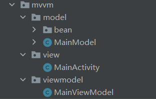

## MVVM

### 简介

全名：Model-View-ViewModel，它将View的状态和行为完全抽象化，把逻辑与界面的控制完全交给ViewModel处理，MVVM是一种架构模式。

**View: **对应于Activity和XML，负责View的绘制以及与用户交互。 **Model: **实体模型。 **ViewModel: **负责完成View与Model间的交互，负责业务逻辑。

***Model：***

Model主要是==封装数据存储或操作的一些逻辑==，还会提供一系列的实体类用于UI绑定，ViewModel 则会在修改这些数据后将数据改变告诉View层并使UI更新。

***View：***

View用于==处理界面==的逻辑且==不参与业务逻辑相关的操作==，只负责显示由ViewModel提供的数据，View层不做任何业务逻辑、不涉及操作数据、不处理数据，UI和数据严格的分开,对应于Activity和XML。

***ViewModel：***

ViewModel层做的事情刚好和View层相反，ViewModel==只做和业务逻辑和业务数据相关的事==，不做任何和UI相关的事情，ViewModel层==不持有任何控件的引用==。ViewModel就是==专注于业务的逻辑处理==，做的事情也都只是==对数据的操作==（这些数据绑定在相应的控件上会自动去更改UI）。同时DataBinding框架已经支持双向绑定，让我们可以通过双向绑定获取View层反馈给ViewModel层的数据，并对这些数据进行操作。


### 优点

* ***低耦合：***数据处理逻辑独立于UI层，ViewModel只负责提供数据和处理数据，View层只负责对数据变化的监听
* ***数据驱动：***UI的展现是依赖于数据的，数据的变化会使UI发生变化，而UI的改变也会使数据Model进行对应的更新，ViewModel只需要处理数据，而View层只需要监听并使数据进行UI更新
* ***异步线程更新Model：***Model数据可以在异步线程中发送变化，此时调用者不需要做额外的处理，数据绑定框架会将异步线程中数据的变化通知到UI线程中交给View更新
* ***方便协作，易于单元测试：***View层和逻辑层几乎没有耦合，方便开发，只需要输入指定格式的数据即可进行测试，而且两者相互独立，不会互相影响
* ***数据复用：***ViewModel对数据的获取和处理逻辑，是完全可以复用的，开发者可以在不同的模块中，多次方便的获取同一份来源的数据，同一份数据，在版本功能的迭代时，逻辑不需要改变，只需要改变View即可


### 简单示例

***项目结构：***



***1.添加依赖***

```java
dataBinding{
    enabled=true
}
```

***2.创建实体类***

```java
public class User {
    private int id;
    private String name;
    private int age;

    public User() { }

    public int getId() {
        return id;
    }

    public void setId(int id) {
        this.id = id;
    }

    public String getName() {
        return name;
    }

    public void setName(String name) {
        this.name = name;
    }

    public int getAge() {
        return age;
    }

    public void setAge(int age) {
        this.age = age;
    }
}
```

***3.xml布局：***

```xml
<?xml version="1.0" encoding="utf-8"?>
<layout xmlns:android="http://schemas.android.com/apk/res/android"
    xmlns:app="http://schemas.android.com/apk/res-auto"
    xmlns:tools="http://schemas.android.com/tools">

    <data>
        <variable
            name="viewModel"
            type="com.example.mvvm.viewmodel.MainViewModel" />
    </data>

    <LinearLayout
        android:layout_width="match_parent"
        android:layout_height="match_parent"
        tools:context=".view.MainActivity"
        android:orientation="vertical"
        android:gravity="center_horizontal">

        <EditText
            android:id="@+id/input"
            android:layout_width="match_parent"
            android:layout_height="wrap_content"
            android:hint="请输入账号" />

        <Button
            android:layout_width="match_parent"
            android:layout_height="wrap_content"
            android:text="查询账号信息"
            android:textSize="18sp"
            android:onClick="@{() -> viewModel.selectUserInfo()}"/>

        <TextView
            android:layout_width="wrap_content"
            android:layout_height="wrap_content"
            android:text="@={viewModel.result}"/>

    </LinearLayout>
</layout>
```

***4.实现Model***

```java
/**
 * 获取本地或者网络上的数据
 */
public class MainModel {
    //这里模拟获取数据，将成功的数据返回到onSuccess()方法中，失败的信息返回到onFailure()方法中
    public void getAccountInfo(String userId, Callback callback) {
        Random random = new Random();
        boolean isBoolean = random.nextBoolean();
        if (isBoolean) {
            User user = new User();
            user.setId(1);
            user.setAge(18);
            user.setName("hgm");
            callback.onSuccess(user);
        } else {
            callback.onFail(userId);
        }
    }

    /**
     * 定义接口给外部使用
     */
    public interface Callback {
        void onSuccess(User user);

        void onFail(String userId);
    }
}
```

***5.实现ViewModel***

```java
public class MainViewModel extends BaseObservable {

    private ActivityMainBinding binding;
    private MainModel mainModel;
    private String result;

    public MainViewModel(ActivityMainBinding binding) {
        this.binding = binding;
        mainModel = new MainModel();
    }

    @Bindable
    public String getResult() {
        return result;
    }

    public void setResult(String result) {
        this.result = result;
        notifyPropertyChanged(BR.result);//通知
    }

    /**
     *  vm层只做业务逻辑操作
     */
    public void selectUserInfo() {
        // 拿到用户输入ID
        String inputId = binding.input.getText().toString();
        mainModel.getAccountInfo(inputId, new MainModel.Callback() {
            @Override
            public void onSuccess(User user) {
                setResult("查询到的结果为：用户id：" + user.getId() + ", 用户名：" + user.getName() + ", 年龄：" + user.getAge());
            }

            @Override
            public void onFail(String userId) {
                setResult("找不到用户id为" + userId + "的数据");
            }
        });
    }
}
```

***6.实现View***

```java
public class MainActivity extends AppCompatActivity {

    private ActivityMainBinding binding;

    @Override
    protected void onCreate(Bundle savedInstanceState) {
        super.onCreate(savedInstanceState);
        binding = DataBindingUtil.setContentView(this, R.layout.activity_main);
        binding.setViewModel(new MainViewModel(binding));
    }
}
```

