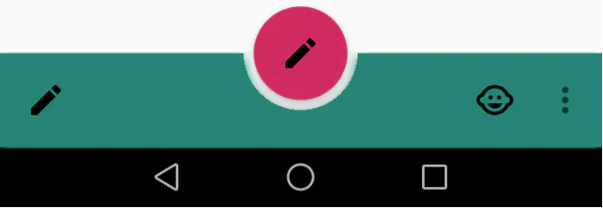

# Material Design系列

## 1、FloatingActionButton

### 简介

FloatingActionButton是==悬浮动作按钮==，一般用于一个页面中最主要的操作。继承ImageView

### 使用

```xml
<android.support.design.widget.FloatingActionButton
        android:layout_width="wrap_content"
        android:layout_height="wrap_content"
        app:backgroundTint="#7CBFFD"
        android:elevation="10dp"
		app:layout_anchor="@+id/bottom_app_bar"
		app:layout_anchorGravity="center_horizontal"/>
```

### 属性

| 属性名                   | 说明                                                         |
| :----------------------- | :----------------------------------------------------------- |
| app:backgroundTint       | 修改背景颜色                                                 |
| android:elevation        | 阴影                                                         |
| app:fabSize              | 尺寸                                                         |
| app:rippleColor          | 设置FAB点击时的背景颜色                                      |
| app:layout_anchor        | 嵌入在哪个控件（一般结合BottomAppBar）                       |
| app:layout_anchorGravity | 排版方式                                                     |
| app:pressedTranslationZ  | 设置FAB按下时的阴影,建议数值大于elevation                    |
| app:borderWidth          | 设置FAB的边框宽度，==如果不设置0dp，那么在4.1的sdk前FAB会显示为正方形，而且在5.0以后的sdk没有阴影效果== |

### 特性

***阴影以及点击按钮阴影加深效果：***设置pressedTranslationZ属性值
***水波纹效果：***设置app:rippleColor和android:clickable=”true”属性


## 2、FloatingActionMenu

### 使用

***添加依赖***

```java
implementation 'com.getbase:floatingactionbutton:1.10.1'
```

```xml
<com.getbase.floatingactionbutton.FloatingActionsMenu
       android:layout_width="wrap_content"
       android:layout_height="wrap_content"
       app:fab_addButtonSize="mini"
       app:fab_expandDirection="left"
       android:layout_alignParentEnd="true">
      <com.getbase.floatingactionbutton.FloatingActionButton
          android:layout_width="wrap_content"
          android:layout_height="wrap_content"
          app:fab_colorNormal="#FFF"
          app:fab_colorPressed="@color/purple_500"/>
</com.getbase.floatingactionbutton.FloatingActionsMenu>
```

### 属性

| 属性名              | 说明                                                         |
| ------------------- | ------------------------------------------------------------ |
| fab_colorNormal     | 不点击样式                                                   |
| fab_colorPressed    | 点击后样式                                                   |
| fab_icon            | 图标                                                         |
| fab_title           | 标题（这里必须在父控件声明label样式，因为是使用label放置的，不声明title没有样式不会显示） |
| fab_size            | 设置大小为mini或者normal                                     |
| fab_expandDirection | 子按钮弹出的方向                                             |


## 3、BottomAppBar

### 基本使用

### 

```xml
<androidx.coordinatorlayout.widget.CoordinatorLayout xmlns:android="http://schemas.android.com/apk/res/android"
    xmlns:app="http://schemas.android.com/apk/res-auto"
    xmlns:tools="http://schemas.android.com/tools"
    android:layout_width="match_parent"
    android:layout_height="match_parent"
    tools:context=".MainActivity">

    <com.google.android.material.bottomappbar.BottomAppBar
        android:id="@+id/bottom_app_bar"
        style="@style/Widget.MaterialComponents.BottomAppBar.Colored"
        android:layout_width="match_parent"
        android:layout_height="wrap_content"
        android:layout_gravity="bottom"
        android:elevation="6dp"
        app:fabAlignmentMode="center"
        app:fabCradleMargin="6dp"
        app:fabCradleRoundedCornerRadius="0dp"
        app:menu="@menu/menu"
        app:navigationIcon="@drawable/ic_edit_black_24dp">

    </com.google.android.material.bottomappbar.BottomAppBar>

    <com.google.android.material.floatingactionbutton.FloatingActionButton
        android:layout_width="wrap_content"
        android:layout_height="wrap_content"
        android:elevation="8dp"
        android:src="@drawable/ic_edit_black_24dp"
        app:layout_anchor="@+id/bottom_app_bar"
        app:layout_anchorGravity="center_horizontal" />

</androidx.coordinatorlayout.widget.CoordinatorLayout>
```

### 属性

| 属性名                           | 说明                           |
| -------------------------------- | ------------------------------ |
| app:fabAlignmentMode="center"    | 按钮位于中间                   |
| app:fabCradleMargin              | 与FloatingActionButton的外边距 |
| app:fabCradleRoundedCornerRadius | BottomAppBar嵌入位置圆角半径   |

### 适配

***结合RecyclerView实现滚动消失：***添加app:hideOnScroll="true"就可以了


## 4、Tablayout

### 简介

一般这个控件是结合viewpager和fragment使用。

### 使用

```xml
<com.google.android.material.tabs.TabLayout
	android:id="@+id/home_tab_layout"
	android:layout_width="match_parent"
	android:layout_height="wrap_content"
	app:tabMode="auto" />
```

### 重要属性详解

| 属性名                   | 说明                                                         |
| ------------------------ | ------------------------------------------------------------ |
| app:tabSelectedTextColor | 选中字体的颜色                                               |
| app:tabTextColor         | 未选中字体的颜色                                             |
| app:tabIndicatorColor    | 指示器下标的颜色                                             |
| app:tabIndicatorHeight   | 指示器下标的高度（0dp去除）                                  |
| app:tabGravity           | tab中布局位置，有两种模式center和fill                        |
| app:tabTextAppearance    | 字体大小                                                     |
| app:tabBackground        | 设置背景                                                     |
| app:tabMode              | 设置排列模式，有两种scrollable和fixed；默认是fixed。fixed是固定的，适用于标签较少，scrollable是可滚动的，适用于标签较多的情况下 |

### 使用方式一

==***动态添加tab标题***==

```xml
<android.support.design.widget.TabLayout
    android:id="@+id/tablayout"
    android:layout_width="match_parent"
    android:layout_height="wrap_content"/>
<android.support.v4.view.ViewPager
    android:id="@+id/viewpager"
    android:layout_width="match_parent"
    android:layout_height="match_parent"/>
```

```java
//activity的设置
String[] tabTitles={"","",""};
//传入一个标题数组or集合到adapter里面
MyPagerAdapter pagerAdapter = new MyPagerAdapter(getSupportFragmentManager(),tabTitles);
viewPager.setAdapter(pagerAdapter);
tablayout.setupWithViewPager(viewPager);//关联viewpager

//adapter里的设置（关键）重写下面这个方法
@Override
public CharSequence getPageTitle(int position) {
    return tabTitles[position];
}
```

### 使用方式二

==**直接在布局中使用TabItem定死tab**==

```xml
<com.google.android.material.tabs.TabLayout
    android:id="@+id/tabLayout"
    android:layout_width="150dp"
    android:layout_height="wrap_content"
    app:tabIndicatorColor="#7CBFFD"
    app:tabIndicatorFullWidth="false"
    app:tabSelectedTextColor="#7CBFFD"
    app:tabTextColor="@color/black">

    <com.google.android.material.tabs.TabItem
        android:layout_width="wrap_content"
        android:layout_height="wrap_content"
        android:text="推荐" />

    <com.google.android.material.tabs.TabItem
        android:layout_width="wrap_content"
        android:layout_height="wrap_content"
        android:text="热榜" />
</com.google.android.material.tabs.TabLayout>
```

### 添加Tab分割线

通过源码可以看到内部实现`TabView`继承至`LinearLayout`，我们知道LinearLayout是可以给子view设置分割线的，那我们就可以通过遍历来添加分割线

### 

```java
//设置分割线
for (index in 0..mBinding.tabLayout4.tabCount) {
	val linearLayout = mBinding.tabLayout4.getChildAt(index) as? LinearLayout
	linearLayout?.let {
		it.showDividers = LinearLayout.SHOW_DIVIDER_MIDDLE
		it.dividerDrawable = ContextCompat.getDrawable(this, R.drawable.shape_tab_divider)
		it.dividerPadding = 30
	}
}
```


## 5、CardView

### 简介

主要用来设置布局的边框为圆角、z轴的偏移量（这个是5.0以后才有的概念，也就是阴影的效果）可以包含其他的布局容器和控件，使得控件具有立体性。

### 使用

```xml
<android.support.v7.widget.CardView
    android:layout_width="wrap_content"
    android:layout_height="wrap_content">

</android.support.v7.widget.CardView>
```

### 属性

| 属性名                       | 说明                         |
| ---------------------------- | ---------------------------- |
| app:cardBackgroundColor      | 设置背景颜色                 |
| app:cardCornerRadius         | 设置圆角大小                 |
| app:cardElevation            | 设置z轴的阴影                |
| app:cardMaxElevation         | 设置z轴的最大高度值          |
| app:cardUseCompatPadding     | 是否使用CompatPadding        |
| app:cardPreventCornerOverlap | 是否使用PreventCornerOverlap |
| app:contentPadding           | 设置内容的padding            |

***Ripple水波纹效果：***在5.0以上才会有效果。5.0以下需要自己去实现。实现水波纹效果CardView需要设置==android:foreground==和==clickable==属性。


## 6、Palette

Palette是一个可以从==图片(Bitmap)中提取颜色的帮助类==，可以使UI更加美观，根据图片动态的显示相应的颜色。在Android5.0（API22）引入的。

### 使用步骤

***添加依赖***

```java
implementation 'com.android.support:palette-v7:23.4.0'
```

***主要方法***

```java
Palette.from(bitmap).generate(new Palette.PaletteAsyncListener() {
    @Override
    public void onGenerated(Palette palette) {
        //获取样本
        Palette.Swatch vibrant = palette.getVibrantSwatch();
        //判空
        if (vibrant == null) {
            for (Palette.Swatch swatch : palette.getSwatches()) {
                vibrant = swatch;
                break;
            }
        }
        //从样本中获取颜色的RGB值
        int rgb = vibrant.getRgb();
        
        //接下里可以设置控件的颜色.....
    }
});

/**
 * 对获取到的RGB颜色进行修改。（涉及到位运算，我也不是很懂这块）
 * （这个方法是给状态栏的颜色用的）
 * @param rgb
 * @return
 */
private int changeColor(int rgb) {
    int red = rgb >> 16 & 0xFF;
    int green = rgb >> 8 & 0xFF;
    int blue = rgb & 0xFF;
    red = (int) Math.floor(red * (1 - 0.2));
    green = (int) Math.floor(green * (1 - 0.2));
    blue = (int) Math.floor(blue * (1 - 0.2));
    return Color.rgb(red, green, blue);
}
```

***通过Palette 可以获取到一些颜色值***


```java
// 获取到柔和的深色的颜色（可传默认值）
palette.getDarkMutedColor(Color.BLUE);
// 获取到活跃的深色的颜色（可传默认值）
palette.getDarkVibrantColor(Color.BLUE);
// 获取到柔和的明亮的颜色（可传默认值）
palette.getLightMutedColor(Color.BLUE);
// 获取到活跃的明亮的颜色（可传默认值）
palette.getLightVibrantColor(Color.BLUE);
// 获取图片中最活跃的颜色（也可以说整个图片出现最多的颜色）（可传默认值）
palette.getVibrantColor(Color.BLUE);
// 获取图片中一个最柔和的颜色（可传默认值）
palette.getMutedColor(Color.BLUE);
// ...  这里省略其他的方法。
```

***具体代码查看案例：***Palette

***运行效果：***


## 7、TextInputLayout

### 简介

在用户输入的时候能将原来的提示文字浮动在控件上边，相比传统的EditText，在用户输入信息的时，hint（提示）会自动上移，并且输入框的下划线会高亮，并能够把输入校验的错误能够在控件下面展示，不用Toast弹出提示，并且自带设置密码框的显示与隐藏，效果如下图所示。


### 使用

```xml
<com.google.android.material.textfield.TextInputLayout
    android:id="@+id/textInputLayout"
    android:layout_width="match_parent"
    android:layout_height="wrap_content"
    android:layout_gravity="center"
    app:errorEnabled="true"
    app:passwordToggleEnabled="true"
    app:passwordToggleTint="#FF5722"
    app:passwordToggleTintMode="src_in"
    app:counterEnabled="true"
    app:counterMaxLength="9">
		<com.google.android.material.textfield.TextInputEditText
		    android:id="@+id/editText"
		    android:layout_width="match_parent"
		    android:layout_height="match_parent"
		    android:hint="请输入密码"/>
</com.google.android.material.textfield.TextInputLayout>
```

| 属性                              | 说明                                                         |
| --------------------------------- | ------------------------------------------------------------ |
| app:errorEnabled                  | 是否显示错误信息                                             |
| app:errorTextAppearance           | 错误信息的字体样式                                           |
| app:hintEnabled                   | 是否使用hint属性,默认true                                    |
| app:hintAnimationEnabled          | 是否显示hint的动画,默认true                                  |
| app:counterEnabled                | 是否显示输入长度计数器                                       |
| app:counterMaxLength              | 设置计数器的最大值                                           |
| app:counterTextAppearance         | 计数器的字体样式                                             |
| app:counterOverflowTextAppearance | 输入字符大于限定个数字符时计数器的字体样式                   |
| app:passwordToggleTint            | 设置密码开关图片颜色                                         |
| app:passwordToggleEnabled         | 是否显示==密码开关==图片，需设置inputType为password          |
| app:passwordToggleDrawable        | 设置密码可见开关的图标。通常我们会在不同的情况下设定不同的图标，可通过自定义一个selector，根据state_checked属性来控制图标的切换 |
| app:passwordToggleTintMode        | 控制密码可见开关图标的背景颜色混合模式                       |

***注意：***1.在TextInputLayout下最好使用TextInputEditText，如果使用EditText，会有一些bug

​			2.一个TextInputLayout里只能有一个TextInputEditText


## 8、CoordinatorLayout

### 简介

通过==协调并调度里面的子控件或者布局==来实现触摸（一般是指滑动）产生一些相关的==动画效果==
 可以通过设置view的Behavior来实现触摸的动画调度。

### CoordinatorLayout与FAB

<u>实现列表滑动时FAB显示和隐藏，还有Snackbar显示时FAB上移效果</u>

前提是FloatingActionButton要使用FloatingActionButton.Behavior。FloatingActionButton是默认使用这个Behavior,但是如果FloatingActionButton和列表一起使用，并且需要自定义Behavior时，需继承FloatingActionButton.Behavior,如果是继承CoordinatorLayout.Behavior,Snackbar会遮住FloatingActionButton。

## 9、BottomSheet

### BottomSheetBehavior

是==底部动作条==的意思 , 可以设置最小高度和最大高度 ,执行进入/退出动画，响应拖动/滑动手势等。
想要使用BottomSheetBehavior , 其直接父View必须是CoordinatorLayout，这是个功能强大的View, 可以协调子View的各种嵌套滑动

### 使用

***添加依赖***

```java
implementation 'com.android.support:design:27.1.0'
```

```java
//这个就是底部弹窗的id
View bottomSheet = findViewById(R.id.ll_content_bottom_sheet);
//BottomSheetBehavior控制content_bottom_sheet布局的显示和隐藏
BottomSheetBehavior behavior=BottomSheetBehavior.from(bottomSheet);
```

### BottomSheet共有5种状态

| 状态名          | 说明                                                         |
| --------------- | ------------------------------------------------------------ |
| STATE_COLLAPSED | 折叠状态,就是peekHeight 设置的窥视高度                       |
| STATE_EXPANDED  | 完全展开                                                     |
| STATE_DRAGGING  | 拖动中                                                       |
| STATE_HIDDEN    | 隐藏                                                         |
| STATE_SETTLING  | 拖动/滑动手势后，将稳定到特定高度。如果用户操作导致底部页面隐藏，则这将是峰值高度，扩展高度或0。 |

### 重点属性

| 属性名                     | 说明                                                         |
| -------------------------- | ------------------------------------------------------------ |
| app:behavior_hideable      | 设置底部弹出框能否隐藏                                       |
| app:behavior_peekHeight    | 窥视高度，就是BottomSheet折叠后显示的高度                    |
| app:behavior_skipCollapsed | 如果app:behavior_hideable设置为true，并且		          behavior_skipCollapsed设置为true，则它没有折叠状态。 |


## 10、NavigationView


## 11、BottomNavigationView

### 使用

```xml
<com.google.android.material.bottomnavigation.BottomNavigationView
        android:id="@+id/bottom"
        android:layout_width="match_parent"
        android:layout_height="wrap_content"
        app:menu="@menu/menu"	
        app:labelVisibilityMode="labeled"/>            
```

### 属性详解

| 属性名              | 说明           |
| ------------------- | -------------- |
| labelVisibilityMode | 设置文字的属性 |
| itemIconTint        | icon图片的颜色 |
| itemTextColor       | 文本的颜色     |

### 图标问题

当我们选择图标后，并没有显示check为true的图标，而是被系统主题色给覆盖了，这种时候在activity页面加上下面代码：

```java
bottom.setItemIconTintList(null)//清空
```

### 设置图标新消息红点

```java
BadgeDrawable badge = bottomNavigationView.getOrCreateBadge(R.id.menu_mine);
badge.setNumber(100);//消息的数量
badge.setMaxCharacterCount(3);//最大显示长度
```


## 12、沉浸式状态栏


```java
if (Build.VERSION.SDK_INT >= 21) {
	View decorView = getWindow().getDecorView();
	decorView.setSystemUiVisibility(View.SYSTEM_UI_FLAG_LAYOUT_FULLSCREEN | View.SYSTEM_UI_FLAG_LAYOUT_STABLE);
	getWindow().setStatusBarColor(Color.TRANSPARENT);
}

//改变状态栏颜色
//getWindow().setStatusBarColor(color);
```


## 13、SnackBar

***类似于Toast的提示控件，相比之下能和用户进行交互*** 

### 使用

```java
SnackBar.make(view,"这是message",SnackBar.LENGTH_SHORT)
    .setAction("这是ACTION",new View.OnClickListener(){
        @Override
        public void onClick(View v){
			//这里执行逻辑
        }
    })
    .setActionTextColor(Color.WHITE)
    .addCallback(new Snackbar.Callback(){
		@Override
		public void onShown(Snackbar sb) {
			//这里执行逻辑
		}
		@Override
		public void onDismissed(Snackbar transientBottomBar, int event) {
			//这里执行逻辑
		}
	})
	.show();
```

### 属性

| 属性名             | 说明                 |
| ------------------ | -------------------- |
| setAction          | 设置动作             |
| setActionTextColor | 设置动作文本的颜色   |
| addCallback        | 添加消失和显示的监听 |


## 14、MaterialButton

### 简介

**MaterialButton** 是Google于SDK28推出的新控件，当遇到按钮需要**圆角**、或者**描边**等，就不必使用xml文件或者Github上找第三方库实现。


### 常用属性

| 属性                   | 描述                 | 参数                                         |
| ---------------------- | -------------------- | -------------------------------------------- |
| app:backgroundTint     | 背景着色             | 默认为?attr/colorPrimary                     |
| app:backgroundTintMode | 着色模式             | add,multiply,screen,src_atop,src_in,src_over |
| app:strokeColor        | 描边颜色             |                                              |
| app:strokeWidth        | 描边宽度             |                                              |
| app:cornerRadius       | 圆角大小             |                                              |
| app:rippleColor        | 按压水波纹颜色       |                                              |
| app:icon               | 图标icon             |                                              |
| app:iconSize           | 图标大小             |                                              |
| app:iconGravity        | 图标重心             | start,end.textStart,textEnd                  |
| app:iconTint           | 图标着色             |                                              |
| app:iconTintMode       | 图标着色模式         | add,multiply,screen,src_atop,src_in,src_over |
| app:iconPadding        | 图标和文本之间的间距 |                                              |

### 注意事项

* 不可以使用`android:background`设置按钮背景，会破坏MaterialButton本身的绘制，而设置背景则推荐使用`app:backgroundTint`
* MaterialButton创建后，按钮实际长度并不是设定值，因为它上下有留空，可以使用android:insetBottom="0dp"`和`android:insetTop="0dp"去除
* 去除阴影，MD控件默认有阴影效果，但是有时候我们并不想要按钮有阴影，那么这时候可以指定style为`style="@style/Widget.MaterialComponents.Button.UnelevatedButton"` 这样就能去掉阴影，让视图看起来扁平化
* 闪退，修改APP主题

```java
android:theme="@style/Theme.MaterialComponents.Light.NoActionBar"
```


## 15、MaterialButtonToggleGroup


### 使用s

`MaterialButtonToggleGroup`内部的`MaterialButton`加上`style="attr/materialButtonOutlinedStyle"`的样式。

```xml
<com.google.android.material.button.MaterialButtonToggleGroup
        android:layout_width="match_parent"
        android:layout_height="wrap_content">
        <com.google.android.material.button.MaterialButton
            style="?attr/materialButtonOutlinedStyle"
            android:layout_width="wrap_content"
            android:layout_height="wrap_content"
            android:layout_weight="1"
            android:text="1"/>
        <com.google.android.material.button.MaterialButton
            style="?attr/materialButtonOutlinedStyle"
            android:layout_width="wrap_content"
            android:layout_height="wrap_content"
            android:layout_weight="1"
            android:text="2"/>
    </com.google.android.material.button.MaterialButtonToggleGroup>
```

### 常用属性

| 属性                  | 描述                           | 参数       |
| --------------------- | ------------------------------ | ---------- |
| app:checkedButton     | 默认选中                       | 按钮ID     |
| app:singleSelection   | 是否单项选择                   | true/false |
| app:selectionRequired | 设置为true后，强制至少选中一个 | true/false |

### tab切换监听

```java
MaterialButtonToggleGroup toggleGroup = findViewById(R.id.toggleGroup);
toggleGroup.addOnButtonCheckedListener(new MaterialButtonToggleGroup.OnButtonCheckedListener() {
    @Override
    public void onButtonChecked(MaterialButtonToggleGroup group, int checkedId, boolean isChecked) {
        //监听
        Toast.makeText(MainActivity.this, "ID：" + checkedId + ", checked：" + isChecked, Toast.LENGTH_SHORT).show();
    }
});
```

