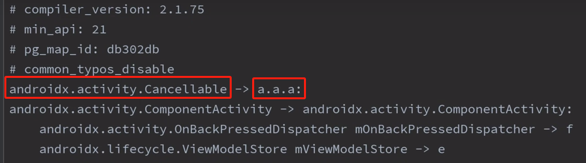

### 什么是R8？

首先它是一个工具，可以在发布应用之前优化你的应用程序，因此它实际上会以多种方式做到这一点。

优化手段：

* 删除未使用的类、方法、字段
* 删除第三方库中未使用到的内容
* 删除未使用的资源（res目录下）
* 混淆代码，所有代码重命名为简短不可读的名字


### 使用

首先打开应用级的 `build.gradle` 文件，找到构建类型块中的 `release` 块中进行配置。

```kotlin
buildTypes {
	//debug：调试版本，默认使用此模式
	//release：发布版本，这里的配置不会应用到debug版本
	release {
	    //开启优化代码，移除未使用的东西以及混淆代码
	    minifyEnabled true
	    //收缩资源，移除未使用的资源
	    shrinkResources true
	    //此文件定义了Proguard规则，可以定义不想被混淆的东西
	    proguardFiles getDefaultProguardFile('proguard-android-optimize.txt'), 'proguard-rules.pro'
    }
}
```

配置完成后还需要前往 `proguard-rules.pro` 文件中定义需要被保留的类不被混淆。例如：数据模型一般都进行保留，因为数据模型中的字段与json的字段必须相同，否则无法进行解析。

```kotlin
-keep class com.hgm.proguardr8.model.*
-keep class com.hgm.proguardr8.model.* { *; }
-keep class com.hgm.proguardr8.model.NewsResponse
```

如果想查看混淆后的名字可以检查文件：`app->.build->outputs->mapping->release->mapping.txt` ，里面会列出所有的类名被映射成不可读的名字。

