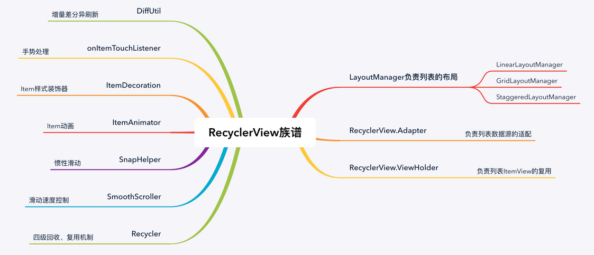

### 简介




### 简单使用

***1、xml代码如下：***

```xml
<?xml version="1.0" encoding="utf-8"?>
<LinearLayout xmlns:android="http://schemas.android.com/apk/res/android"
    xmlns:app="http://schemas.android.com/apk/res-auto"
    xmlns:tools="http://schemas.android.com/tools"
    android:layout_width="match_parent"
    android:layout_height="match_parent"
    tools:context=".MainActivity">

    <androidx.recyclerview.widget.RecyclerView
        android:id="@+id/recyclerView"
        android:layout_width="match_parent"
        android:layout_height="match_parent"/>

</LinearLayout>
```

***2、创建item子布局：***

```xml
<?xml version="1.0" encoding="utf-8"?>
<LinearLayout xmlns:android="http://schemas.android.com/apk/res/android"
    android:orientation="horizontal"
    android:layout_width="match_parent"
    android:gravity="center_vertical"
    android:padding="10dp"
    android:layout_height="wrap_content">

    <ImageView
        android:layout_width="wrap_content"
        android:layout_height="wrap_content"
        android:src="@mipmap/ic_launcher"/>


    <TextView
        android:id="@+id/text"
        android:layout_width="wrap_content"
        android:layout_height="wrap_content"
        android:text="123"
        android:layout_marginLeft="10dp"
        android:textColor="@color/black"
        android:textSize="20sp"/>

</LinearLayout>
```

***3、创建Adapter适配器：***

```kotlin
class MyAdapter :RecyclerView.Adapter<MyAdapter.MyViewHolder>(){
		
  	//复用
    inner class MyViewHolder(view:View) :RecyclerView.ViewHolder(view){
				...
    }

    //加载布局
    override fun onCreateViewHolder(parent: ViewGroup, viewType: Int): MyViewHolder {     
        val view = LayoutInflater.from(parent.context).inflate(R.layout.item_list, parent, false)
        return MyViewHolder(view)
    }

  	//数据与控件绑定
    override fun onBindViewHolder(holder: MyViewHolder, position: Int) {
        Log.e("hgm", "onBindViewHolder: ")
				....
    }

  	//一般为集合的size()
    override fun getItemCount(): Int {
        return 50
    }
}
```

***4、MainActivity里配置RecyclerView***

```kotlin
//初始化
binding.recyclerView.apply {
    adapter = MyAdapter()
    layoutManager =
        LinearLayoutManager(this@MainActivity, LinearLayoutManager.VERTICAL, false)
}
```


### 惯性滑动

==SnapHelper== 是 RecyclerView 官方实现的处理惯性滑动（Fling）的帮助类，目前有 ==LinearSnapHelper== 和 ==PagerSnapHelper== 两个官方实现。它们各自提供的功能略有不同。 两者都支持水平和垂直方向。

***LinearSnapHelper：***

适用于较小的项目，并将目标子视图的中心对齐到 RecyclerView 的中心：

```kotlin
//直接在Activity配置
val snapHelper = LinearSnapHelper()
snapHelper.attachToRecyclerView(binding.recyclerView)
```


***PagerSnapHelper：***

适用于全屏项目，其行为类似于ViewPager：

注意： 需要将放入 RecyclerView 的子视图设置为宽高 `MATCH_PARENT`

```kotlin
//直接在Activity配置
val snapHelper2 = PagerSnapHelper()
snapHelper2.attachToRecyclerView(binding.recyclerView)
```


