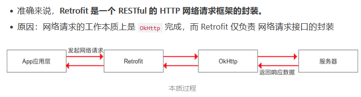

## Retrofit

### 简介



retrofit底层封装了Okhttp，网络请求工作本质上是由okhttp来完成，而Retrofit负责网络请求接口的封装。
本质过程：App应用程序通过Retrofit请求网络，实质上是使用Retrofit接口层封装请求参数、Header、Url等信息，之后由okhttp来完成后续的请求工作。在服务端返回数据后，okhttp将原始数据交给Retrofit，Retrofit根据用户需求解析

***官网：***https://github.com/square/retrofit


### 优点

==超级解耦== ，接口定义、接口参数、接口回调不在耦合在一起，可以配置不同的httpClient来实现网络请求，如okhttp、httpclient，支持同步、异步、Rxjava，可以配置不同反序列化工具类来解析不同的数据，如json、xml，==请求速度快，使用方便灵活简洁。==


### 使用步骤

***1.添加依赖***

```java
implementation 'com.squareup.retrofit2:retrofit:2.9.0'//Retrofit
implementation 'com.squareup.retrofit2:converter-gson:2.9.0'//Gson
```

***2.创建接口***

```java
public interface HttpService {
    @GET("get")
	Call<ResponseBody> get(@Query("userName") String username, @Query("password") String pwd);

	@POST("post")
	@FormUrlEncoded
	Call<ResponseBody> postForm(@Field("userName") String username, @Field("password") String pwd);
}
```

***3.创建Retrofit对象***

```java
Retrofit retrofit = new Retrofit.Builder()
    .addConverterFactory(GsonConverterFactory.create())
    .baseUrl("https://www.httpbin.org/")
    .build();
HttpService httpService = build.create(HttpService.class);
```

***4.调用接口里的方法***

```java
retrofit.Call<ResponseBody> call = httpService.post("hgm", "123");
call.enqueue(new Callback<ResponseBody>() {
    @Override
    public void onResponse(Call<ResponseBody> call, Response<ResponseBody> response) {
       response.body().toString()//响应体
    }

    @Override
    public void onFailure(Call<ResponseBody> call, Throwable t) {

    }
});
```


### get请求

***1.同步执行execute()，代码如下：***

```java
new Thread(){
    @Override
    public void run() {
        try {
            Response<ResponseBody> getData = httpService.getData(100).execute();
        } catch (IOException e) {
            e.printStackTrace();
        }
    }
}.start();
```

***2.异步执行enqueue()，代码如下：***

```java
httpService.getData(100).enqueue(new Callback<ResponseBody>() {
    @Override
    public void onResponse(Call<ResponseBody> call, Response<ResponseBody> response) {
        try {
            
        } catch (IOException e) {
            e.printStackTrace();
        }
    }

    @Override
    public void onFailure(Call<ResponseBody> call, Throwable t) {

    }
});
```


### post请求

***1.同步执行execute()，代码如下：***

```java
new Thread(){
    @Override
    public void run() {
        try {
            Response<ResponseBody> register = httpService.register("hgm", "123", "123").execute();

        } catch (IOException e) {
            e.printStackTrace();
        }
    }
}.start();
```

***2.异步执行enqueue()，代码如下：***

```java
httpService.register("hgm", "123", "123").enqueue(new Callback<ResponseBody>() {
    @Override
    public void onResponse(Call<ResponseBody> call, Response<ResponseBody> response) {
        try {

        } catch (IOException e) {
            e.printStackTrace();
        }
    }

    @Override
    public void onFailure(Call<ResponseBody> call, Throwable t) {

    }
});
```


### Retrofit的注解


***常用注解的使用方法：***

***GET请求***

###### @Query 仅带查询参数：http://192.168.0.1/weather?city=北京

```java
@GET("weather")
Observable<WeatherEntity> getWeather(@Query("city") String city);
```

###### @Path 请求参数直接跟在请求路径下：http://192.168.0.1/weather/北京

```java
@GET("weather/{city}")
Observable<Object> getWeather(@Path("city") String city);
```

***POST请求***

###### 1、body参数：{"comment_id":"1","content":"我是评论","user_id":"1001"}

###### @Filed 方式处理 

```java
@FormUrlEncoded //使用@Field时记得添加@FormUrlEncoded
@POST("comment")
void doComments(@Field("comment_id")String comment_id, @Field("content")String content, @Field("user_id") String user_id);
```

###### @FieldMap 方式处理

```java
@FormUrlEncoded
@POST("comment")
void doComments(@FieldMap Map<String, String> paramsMap);
```

###### @通过键值对，以表单的形式提交

```java
HashMap<String, String> hashMap = new HashMap<>();
hashMap.put("comment_id","1");
hashMap.put("content","我是评论");
hashMap.put("user_id","1001");
```

###### @Body方式处理

```java
@POST("comment")
void doComments(@Body Object reqBean);
```

```java
@POST("comment")
void doComments(@Body List<Object> requestList);
```


### Retrofit的转换器

使用Gson库把网络请求回来的字符串数据，将其解析成一个Java Bean对象

### Retroft适配器

Retrofit的接口方法返回类型必须是Call，如果能将Call改为RxJava中的Flowable，对于嵌套的情况，可以得到非常方便优雅的解决，这就是适配器的功能

```java
implementation 'com.squareup.retrofit2:adapter-rxjava3:2.9.0'//rxJava
implementation 'io.reactivex.rxjava3:rxandroid:3.0.0'//rxJava
```

