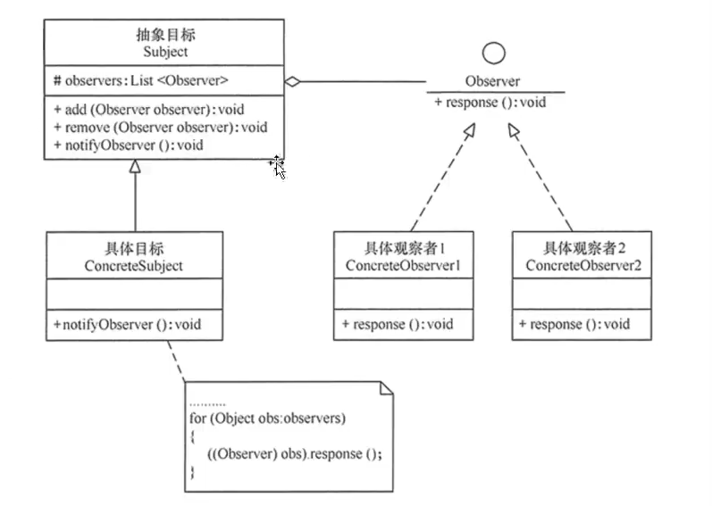
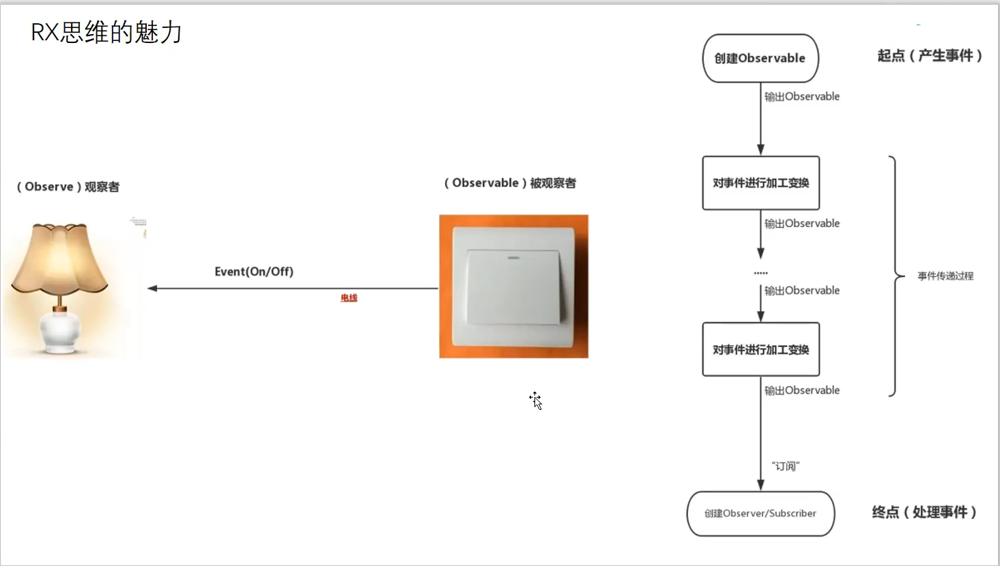
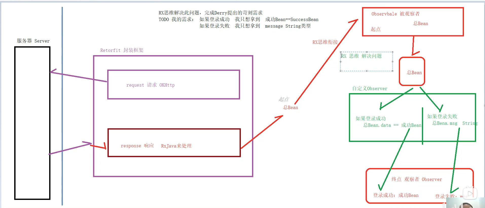

## RxJava

### 简介

RXJava的核心就是==异步数据流==和==响应式编程==：<br>把所有的事件（数据）看成一条河流，它可以被观察、过滤或操作，也可以和另外一条河流汇合成一条新的河流。一旦事件产生或发生变化，就可以触发观察这些事件的角色（观察者/订阅者）做出响应处理

***Github：*** https://github.com/ReactiveX/RxJava

***官网：***http://reactivex.io/#


### 优势及适用场景

* 具备响应式编程的特性
* 为异步而生，无需手动创建线程，并具备线程切换能力
* 支持链式调用，保证代码的简洁性
* 各种操作符，功能非常强大，满足各种业务
* 简化了异常处理

***适用场景：***网络请求、数据库读写、文件读写、定时任务等等，==各种耗时操作需要通过异步来完成的操作都可以使用RxJava==


### 重要概念

观察者(Observer)：==观察事件变化并处理的主要角色==。消费者（Consumer）也可以理解成一种特殊的观察者。

被观察者：==触发事件并决定什么时候发送事件的主要角色==。（异常和完成也是一种事件）

* Observable、Flowable、Single、Completeable、Maybe都是被观察者
* Flowable是支持背压的一种被观察者
* Single、Completeable、Maybe都是简化版的Observable
* 几种被观察者通过toObservable/toFlowable/toSingle/toCompletable/toMaybe相互转换。

订阅(subscribe)：==观察者和被观察者建立关联的操作==。


### 基本使用

***添加依赖：***

```java
implementation 'io.reactivex.rxjava2:rxjava:2.0.7'
implementation 'io.reactivex.rxjava2:rxandroid:2.0.1'
```


***1、创建被观察者 （`Observable` ）& 生产事件***

```java
//1.创建被观察者 Observable 对象
Observable<Integer> observable = Observable.create(new ObservableOnSubscribe<Integer>() {
	//create()是 RxJava 最基本的创造事件序列的方法，此处传入了一个 OnSubscribe 对象参数
	//当 Observable 被订阅时，OnSubscribe 的 call() 方法会自动被调用，即事件序列就会依照设定依		次被触发
	//即观察者会依次调用对应事件的复写方法从而响应事件
	//从而实现被观察者调用了观察者的回调方法 & 由被观察者向观察者的事件传递，即观察者模式

	//2.在复写的subscribe()里定义需要发送的事件
	@Override
	public void subscribe(ObservableEmitter<Integer> emitter) throws Exception {
		//通过ObservableEmitter类对象产生事件并通知观察者
		//ObservableEmitter类介绍
		//a. 定义：事件发射器
		//b. 作用：定义需要发送的事件 & 向观察者发送事件
		emitter.onNext(1);
		emitter.onNext(2);
		emitter.onNext(3);
		emitter.onComplete();
	}
});


----------- 另外两种创建被观察者的方法 ----------------
//方法1：just(T...)：直接将传入的参数依次发送出来
Observable.just("A", "B", "C");
//将会依次调用：
//onNext("A");
//onNext("B");
//onNext("C");
//onCompleted();


//方法2：from(T[]) / from(Iterable<? extends T>) : 将传入的数组 / Iterable 拆分成具体对象后，依次发送出来
String[] words = {"A", "B", "C"};
Observable observable = Observable.from(words);
//将会依次调用：
//onNext("A");
//onNext("B");
//onNext("C");
//onCompleted();
```

***2、创建观察者 （`Observer` ）并 定义响应事件的行为***


方式1：采用Observer 接口

```java
//1.创建观察者（Observer）对象
Observer<Integer> observer = new Observer<Integer>() {
//2.创建对象时通过对应复写对应事件方法 从而 响应对应事件

    // 观察者接收事件前，默认最先调用复写 onSubscribe（）
    @Override
    public void onSubscribe(Disposable d) {
        Log.d(TAG, "开始采用subscribe连接");
    }

    // 当被观察者生产Next事件 & 观察者接收到时，会调用该复写方法 进行响应
    @Override
    public void onNext(Integer value) {
        Log.d(TAG, "对Next事件作出响应" + value);
    }

    // 当被观察者生产Error事件& 观察者接收到时，会调用该复写方法 进行响应
    @Override
    public void onError(Throwable e) {
        Log.d(TAG, "对Error事件作出响应");
    }

    // 当被观察者生产Complete事件& 观察者接收到时，会调用该复写方法 进行响应
    @Override
    public void onComplete() {
        Log.d(TAG, "对Complete事件作出响应");
    }
};
```

方式二：采用Subscriber 抽象类

```java
//说明：Subscriber类 = RxJava 内置的一个实现了 Observer 的抽象类，对 Observer 接口进行了扩展
//1.创建观察者（Observer）对象
Subscriber<Integer> subscriber = new Subscriber<Integer>() {

//2.创建对象时通过对应复写对应事件方法 从而 响应对应事件
    // 观察者接收事件前，默认最先调用复写 onSubscribe（）
    @Override
    public void onSubscribe(Subscription s) {
        Log.d(TAG, "开始采用subscribe连接");
    }

    // 当被观察者生产Next事件 & 观察者接收到时，会调用该复写方法 进行响应
    @Override
    public void onNext(Integer value) {
        Log.d(TAG, "对Next事件作出响应" + value);
    }

    // 当被观察者生产Error事件& 观察者接收到时，会调用该复写方法 进行响应
    @Override
    public void onError(Throwable e) {
        Log.d(TAG, "对Error事件作出响应");
    }

    // 当被观察者生产Complete事件& 观察者接收到时，会调用该复写方法 进行响应
    @Override
    public void onComplete() {
        Log.d(TAG, "对Complete事件作出响应");
    }
};
```


***两种方式的区别：***

* 相同点：二者基本使用方式完全一致（实质上，在RxJava的 subscribe 过程中，Observer总是会先被转换成Subscriber再使用）

* 不同点：Subscriber抽象类对 Observer 接口进行了扩展，新增了两个方法：
      1\. onStart()：在还未响应事件前调用，用于做一些初始化工作
      2\. unsubscribe()：用于取消订阅。在该方法被调用后，观察者将不再接收 & 响应事件调用该方法前，先使    用 isUnsubscribed() 判断状态，确定被观察者Observable是否还持有观察者Subscriber的引用，如果引用不能及时释放，就会出现内存泄露

***3、通过订阅（`Subscribe`）连接观察者和被观察者***

```java
observable.subscribe(observer);
//或者observable.subscribe(subscriber)；
```


### 主要操作符


### 观察者模式

简单来说，就是被观察者被多个观察者的引用，当其状态发生改变时调用这些观察者执行更新的方法。




### RX思维的魅力



***RX思维的好处：***当我们添加需求时，不需要一块一块的添加，只需要找到起点和终点之间，添加你想要的需求即可，删除也一样，好像一条链式的，只需在其中添加以及删除即可。

==当前层可以获取到上一层的对象，根据上一层的变化而响应//思维链条没有断开==

### 自定义Observer



起点--需求--终点。subscribe()是将被观察者(Observable)和观察者(Observer)连接起来的"桥梁"。

***具体查看项目：***RXJava
