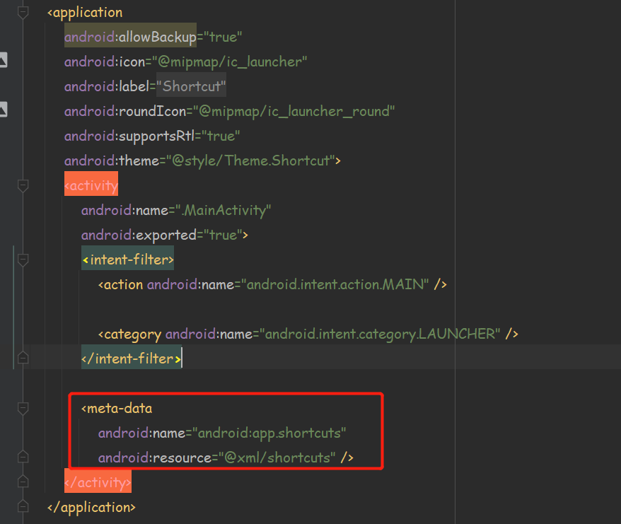

## Shortcut

### 简介

其中App Shortcuts是指在桌面长按app图标而出现的快捷方式, 可以为你的app的关键功能添加更快速的入口而不用先打开app,点击快捷方式可以访问应用功能, 并且这种快捷方式也可以被拖拽到桌面单独放置, 变成单独的桌面快捷方式。


------

### 两种shortcuts

- ***静态的:*** 此种创建方式是会直接打包到apk中，只要用户安装完应用便会存在快捷方式入口。可是这种创建方式会导致如果要更新快捷方式的时候都必须重新发布APP，在xml中定义, 适用于一些通用的动作。
- ***动态的:*** 在APP运行时，通过安卓提供的ShortcutManager API进行动态注册。此种创建方式可以通过用户的操作动态的新建，更新，删除对应的快捷方式。由ShortcutManager发布, 可以根据用户的行为或者偏好添加, 可以动态更新。

------


### 静态创建

***1.在res/xml文件夹下创建一个shortcuts.xml文件：***

```xml
<?xml version="1.0" encoding="utf-8"?>
<shortcuts xmlns:android="http://schemas.android.com/apk/res/android">
    <shortcut
        android:icon="@drawable/ic_launcher_foreground"
        android:shortcutId="add_website"
        android:shortcutLongLabel="@string/shortcut_long_label"
        android:shortcutShortLabel="@string/shortcut_short_label">
        <intent
            android:action="android.intent.action.VIEW"
            android:targetClass="com.hgming.shortcut.MainActivity"
            android:targetPackage="com.hgming.shortcut" />
    </shortcut>
</shortcuts>
```

| 属性名                         | 说明                                       |
| ------------------------------ | ------------------------------------------ |
| ==shortcut==                   |                                            |
| android:icon                   | 最左侧或者添加桌面后显示的图标             |
| android:shortcutId             | id标识                                     |
| android:shortcutLongLabel      | 长按显示的文字                             |
| android:shortcutShortLabel     | 添加到桌面显示的文字                       |
| android:shortcutDisableMessage | 如果快捷方式被禁用，点击按键时会弹出此提示 |
| android:enabled                | 快捷方式是否被禁用                         |
| ==intent==                     |                                            |
| android:action                 | 第一个是意图标识                           |
| android:targetClass            | 第二个参数是希望打开的界面                 |
| android:targetPackage          | 希望打开界面的包名                         |
| android:name                   | 固定配置android.shortcut.conversation      |

***2.在AndroidManifest.xml文件中配置第一步创建的xml文件：***



------


### 动态创建

```java
ShortcutManager shortcutManager = null;
if (android.os.Build.VERSION.SDK_INT >= android.os.Build.VERSION_CODES.N_MR1) {
	shortcutManager = getSystemService(ShortcutManager.class);
    
	Intent intent = new Intent(this, MainActivity.class);
	intent.setAction(Intent.ACTION_VIEW);
    
	ShortcutInfo shortcutInfo = new ShortcutInfo.Builder(this, "testId2")
	        .setLongLabel("LongLabel....")
	        .setShortLabel("ShortLabel...")
	        .setIcon(Icon.createWithResource(this, R.drawable.ic_launcher_foreground))
			.setIntent(intent)
			.build();
    
	shortcutManager.setDynamicShortcuts(Arrays.asList(shortcutInfo));
    }
}
```

