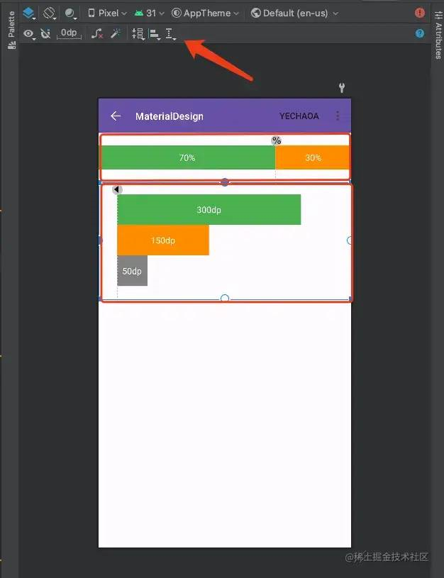
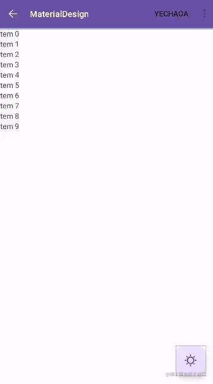
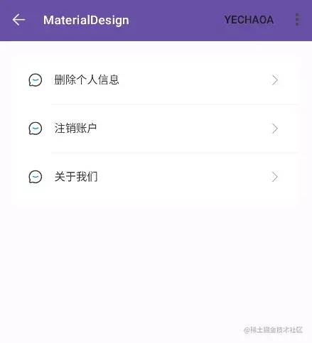

### 简介

我们在开发中，接触最多的无疑是 `xml` 布局，虽然xml布局平时写的很多，也没有技术难点，但是也是我们开发中往往忽略的一个地方。

优秀的 `xml` 布局具有以下特点：

* 提升开发效率
* 提升App性能 

------


### Space

Space 是一个==轻量级==的 View 子类，可==用于在通用布局中创建组件之间的间距==。<br>为什么是轻量级呢，因为Space的 `draw` 方法是空的，也就是什么都不绘制，只有 `onMeasure` 方法测量宽高。

***源码*** ：

```java
public final class Space extends View {

    /**
     * Draw nothing.
     *
     * @param canvas an unused parameter.
     */
    @Override
    public void draw(Canvas canvas) {
    }

    //...

    @Override
    protected void onMeasure(int widthMeasureSpec, int heightMeasureSpec) {
        setMeasuredDimension(
                getDefaultSize2(getSuggestedMinimumWidth(), widthMeasureSpec),
                getDefaultSize2(getSuggestedMinimumHeight(), heightMeasureSpec));
    }
}
```

所以Space作用于组件之间的间距时，绘制效率更高，特别是在需要动态修改间距时，这点尤为体现。<br>比如你要动态修改组件的 `margin` ，如果用Space来当间距，只需要修改Space的宽度或高度即可，因为减少了绘制流程，所以比重绘其他组件更高效。

***使用方法*** ：

```xml
<Space
	android:id="@+id/space"
	android:layout_width="20dp"
	android:layout_height="20dp"/>
```

```java
Space space = new Space(this);
space.setMinimumWidth(..);
space.setMinimumHeight(..);
```

Space完全可以替代 `margin` ，但是不一定能替代 `padding` ，因为 `padding` 是内边距，假如padding有背景色的话，就不能用Space代替了，因为Space的draw方法什么都不绘制的原因，所以也不会有背景色，除非背景色是在父view里设置的。

***参考博客*** ：

http://t.zoukankan.com/hehe520-p-6329860.html<br>http://t.zoukankan.com/hehe520-p-6329860.html

------


### GuideLine

ConstraintLayout已经非常好用了，但是有些布局仍然显得有些「笨拙」。而如果你能妙用GuideLine，你会发现，布局越来越简单，适配也越来越方便。

GuideLine是ConstraintLayout布局的辅助对象，仅用于布局定位使用，它被标记了 `View.GONE` ，并不会显示在设备上。相当于辅助线

***源码*** ：

```java
public class Guideline extends View {
    public Guideline(Context context) {
        super(context);
        super.setVisibility(View.GONE);
    }

    public Guideline(Context context, AttributeSet attrs) {
        super(context, attrs);
        super.setVisibility(View.GONE);
    }

    public Guideline(Context context, AttributeSet attrs, int defStyleAttr) {
        super(context, attrs, defStyleAttr);
        super.setVisibility(View.GONE);
    }

    public Guideline(Context context, AttributeSet attrs, int defStyleAttr, int defStyleRes) {
        super(context, attrs, defStyleAttr);
        super.setVisibility(View.GONE);
    }

    //...
    @SuppressLint("MissingSuperCall")
    @Override
    public void draw(Canvas canvas) {

    }

    @Override
    protected void onMeasure(int widthMeasureSpec, int heightMeasureSpec) {
        setMeasuredDimension(0, 0);
    }
    //...
}
```

***GuideLine可以通过3种不同的方式来辅助定位*** ：

- layout_constraintGuide_begin——指定距布局左侧或顶部的固定距离
- layout_constraintGuide_end——指定距布局右侧或底部的固定距离
- layout_constraintGuide_percent——指定布局宽度或高度的百分比

***同时也可以指定不同的方向*** ：

- horizontal——垂直参考线
- vertical——水平参考线

***效果*** ：



* 第一个红框里是水平参考线，70%定位，==用百分比能很好的解决适配问题==，而我们常规的做法是使用LinearLayout嵌套然后设置子view的weight，虽然嵌套一层不多，但那也是嵌套，就像怀孕一样，你不能说只怀了一点点...
* 第二个红框里是垂直参考线，距离左边30dp，这种情况==适合多个子view向一个目标距离对齐==，同样==减少了层级嵌套问题==，省得再嵌套一层设置padding，或者多个子view分别设置margin。

------


### include

当我们在写一个复杂的页面时，xml代码可能有几百行甚至几千行，如果又有很多的RelativeLayout嵌套的话，各个组件之间依赖关系错综复杂，这时候就可以考虑抽取一波，==用总分总的模式分为header、content、footer，进一步把内容区抽成一个一个的独立的子layout==，然后==使用include标签把它们分别引进根布局==，这就跟我们项目架构设计一个意思，一个壳工程加n个子模块。子layout只需要负责处理好自己内部的布局，统筹交给父layout。

***属性*** ：

* tools:showIn：用于显示子布局在父布局里面的效果

即在子布局的根添加：tools:showIn="@父布局的名字"。

------


### ViewStub

ViewStub是一个轻量级的条件视图组件。在做类似==页面秒开==这类性能优化时，是比较常见的==延迟加载==手段。<br>轻量级是因为ViewStub跟Space一样draw方法为空。

***使用场景*** ：

条件视图的场景比如，当我们需要==根据条件判断来显示哪个view==的时候，一般都会把每个场景的view都写在页面中，然后根据条件分别设置view的visibility，这样做的缺点：==即使view是View.GONE，但是在页面渲染加载的时候仍会实例化创建对象，并初始化它的属性，很明显这是浪费资源的==，所以需要 ViewSub 优化手段了。

当我们明确知道显示哪个view的时候，通过ViewStub把实际视图 `inflate` 进来，这样就避免了资源浪费。<br>只有调用了ViewStub.inflate()的时候布局才会加载，才会创建对象实例化。

***使用方法*** ：

```xml
 <ViewStub
	android:id="@+id/emptyView"
	android:layout_width="match_parent"
	android:layout_height="match_parent"
	android:inflatedId="@+id/inflate_id_view"
	android:layout="@layout/none_data" />
```

| 属性                           | 功能                         |
| ------------------------------ | ---------------------------- |
| android:inflatedId="@+id/text" | 为我们要加载的布局提供一个id |
| android:layout                 | 我们需要加载的布局           |

```xml
<?xml version="1.0" encoding="utf-8"?>
<LinearLayout xmlns:android="http://schemas.android.com/apk/res/android"
    xmlns:app="http://schemas.android.com/apk/res-auto"
    xmlns:tools="http://schemas.android.com/tools"
    android:layout_width="match_parent"
    android:layout_height="match_parent"
    android:orientation="vertical"
    tools:context=".MainActivity">

    <TextView
        android:id="@+id/text"
        android:layout_width="wrap_content"
        android:layout_height="wrap_content"
        android:layout_gravity="center"
        android:text="数据展示!"
        android:textColor="@color/black"
        android:textSize="20sp" />

    <androidx.recyclerview.widget.RecyclerView
        android:id="@+id/recyclerView"
        android:layout_width="match_parent"
        android:layout_height="match_parent"
        tools:itemCount="5"
        tools:listitem="@layout/item_data" />

    <ViewStub
        android:id="@+id/emptyView"
        android:layout_width="match_parent"
        android:layout_height="match_parent"
        android:inflatedId="@+id/inflate_id_view"
        android:layout="@layout/none_data" />

</LinearLayout>
```

```java
class MainActivity : AppCompatActivity() {

	private val binding: ActivityMainBinding by lazy {
	      ActivityMainBinding.inflate(layoutInflater)
	}
	private var viewStub: View? = null
	
	override fun onCreate(savedInstanceState: Bundle?) {
	      super.onCreate(savedInstanceState)
	      setContentView(binding.root)
	
	      //初始化列表
	      val data = arrayListOf<Int>()
	      binding.recyclerView.apply {
	            adapter = MyAdapter()
	            layoutManager =
	                  LinearLayoutManager(this@MainActivity, LinearLayoutManager.VERTICAL, false)
	      }
	      //模拟是否有数据
	      if (data.isEmpty()) {
	            showEmptyView()
	      } else {
	            hideEmptyView()
	      }
	}
	
	//TODO 显示数据为空显示的效果
	private fun showEmptyView() {
	      if (viewStub == null) {
	            //ViewStub只能加载一次，否则报错
	            viewStub = binding.emptyView.inflate()
	      } else {
	            viewStub?.visibility = View.VISIBLE
	      }
	      binding.apply {
	            recyclerView.visibility = View.GONE
	            text.visibility = View.GONE
	      }
	}
	
	
	//TODO 显示数据不为空显示的效果
	private fun hideEmptyView() {
	      if (viewStub != null) {
	            viewStub?.visibility = View.GONE
	      }
	      binding.apply {
	            recyclerView.visibility = View.VISIBLE
	            text.visibility = View.VISIBLE
	      }
	}
}
```

***注意事项*** ：

`inflate` 方法只能调用一次，再次调用会出异常
我们看下inflate方法的源码，一旦第二次调用inflate方法，我们的到viewParent将等于null，会报 throw new IllegalStateException(“ViewStub must have a non-null ViewGroup viewParent”);异常，所以总之一句话，这个==懒加载只能加载一次==。
***相关博客*** ：

https://www.jianshu.com/p/d7fd6f633a60/

------


### Recyclerview

RecyclerView也是我们使用非常高频的一个组件了，一般会在xml中这么定义RecyclerView，效果如下：

```xml
<androidx.recyclerview.widget.RecyclerView
	android:id="@+id/recycleView"
	android:layout_width="match_parent"
	android:layout_height="wrap_content" />
```



这样其实完全看不出RecyclerView在页面中显示的效果，只能每次编译运行看效果，而每次编译运行无疑会花费我们很多宝贵的时间，下面就介绍几个可以帮助大家==提升效率的属性==。

***属性*** ：

* tools:listitem：通过设置tools:listitem属性来预览item的显示效果，tools:listitem属性指定为一个layout文件
* tools:itemCount：预览item在RecyclerView中显示设置数量的效果
* tools:listheader：效果同tools:listitem
* tools:listfooter：效果同tools:listitem
* app:layoutManager：设置Recyclerview的layoutManager，通常在代码中实现，也可以在xml中写

```xml
app:layoutManager="androidx.recyclerview.widget.LinearLayoutManager"
```

* android:orientation：设置layoutManager的方向
* app:spanCount：给网格布局设置数量

------


### 分割线

相信很多人都用View写过分割线的效果，类似这样：

```xml
<View
	android:layout_width="match_parent"
	android:layout_height="1dp"
	android:background="#EEEEEE" />
```

当有多个TextView之间需要添加分割线的时候，就只能一个一个复制，复制其实也没什么，就是代码看起来不优雅。

其实有个比较优雅的办法，LinearLayout可以通过 `android:divider` 属性添加分割线，结合`android:showDividers` 属性即可达到效果。

```xml
<LinearLayout
	android:layout_width="match_parent"
	android:layout_height="wrap_content"
	android:layout_margin="20dp"
	android:background="@drawable/shape_radius5_white"
	android:orientation="vertical"
	android:divider="@drawable/shape_divider_linear"
	android:showDividers="middle">
		
    <TextView>...
</LinearLayout>
```

***分割线的样式*** ：

```xml
<?xml version="1.0" encoding="utf-8"?>
<layer-list xmlns:android="http://schemas.android.com/apk/res/android">
    <item
        android:left="50dp" >
        <shape android:shape="rectangle">
            <solid android:color="#F6F6F6" />
            <size android:height="1dp" />
        </shape>
    </item>
</layer-list>
```



***showDividers有4个选项*** ：

- middle：每两个组件间显示分隔线
- beginning：开始处显示分隔线
- end：结尾处显示分隔线
- none：不显示

其实举一反三，除了分割线，View之间的间隔也可以这么实现，省得每个子view都要写margin。

***android:animateLayoutChanges*** ：

`animateLayoutChanges` 属性是ViewGroup里面的，主要是在子view的添加和移除时，添加一个默认300ms的渐变动画。

```xml
android:animateLayoutChanges="true"
```
