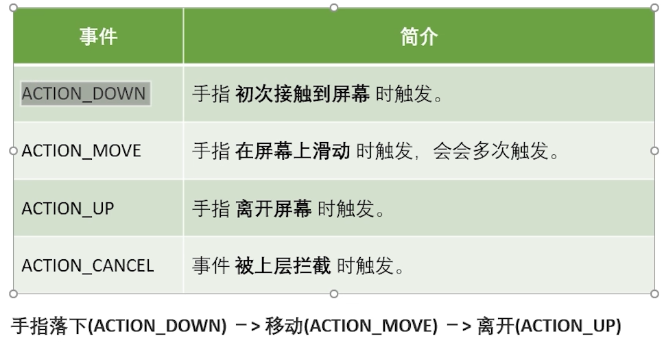
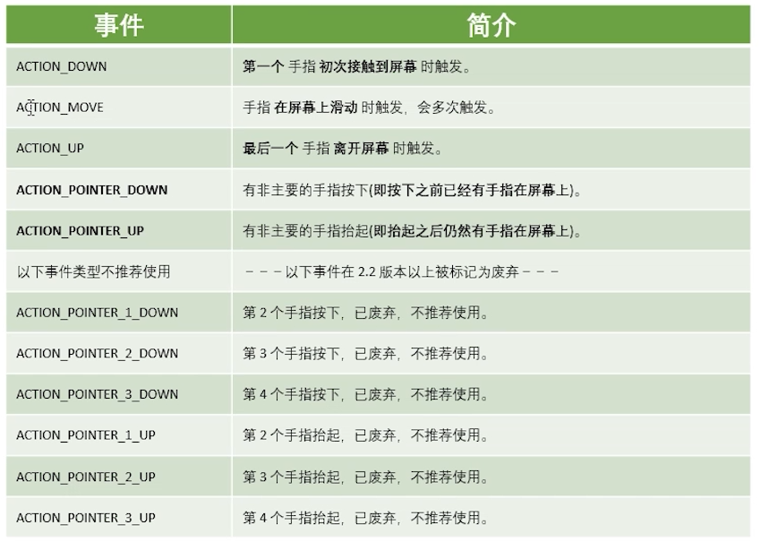

## 事件分发

### 事件传递功能的类

* Activity：拥有dispathTouchEvent和onTouchEvent方法
* View：拥有dispathTouchEvent和onTouchEvent方法
* ViewGroup：拥有dispatchTouchEvent、onTouchEvent、onInterceptTouchEvent

------

### 触摸事件类型

***1.单点触摸：***

***2.多点触摸：***

------

### 事件传递

***1.按事件划分：***

***2.按View划分：***

***结论：***无论是View还是ViewGroup，不管他是`DispatchTouchEvent`还是`onTouchEvent`方法，方法返回true、返回false的处理逻辑都是一样的，只是调用父类的同名方法的时候处理的逻辑有所不同，

==View偏重消费、ViewGourp偏重分发==