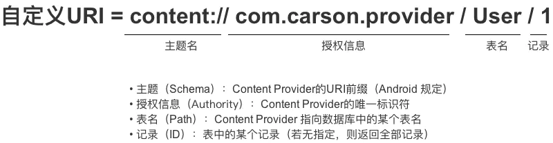

# 四大组件

## Activity（活动）

### Activity的启动模式

通过在AndroidManifest.xml文件中通过给标签指定**android:lanuchMode**属性来选择启动模式，

默认未standard模式。

==***Standard模式：***==Activity默认的启动模式，由于Activity都是使用返回栈来管理Activity。

在standard模式下，每当启动一个新的Activity，就会在返回栈中入栈，并且处于栈顶的位置

系统不会在乎这个Activity是否已经处于返回栈中，每次启动都会创建一个新的Activity


==***singleTop模式：***==

在启动启动时如果发现返回栈的栈顶已经是该活动，则认为可以直接使用它，不会再创建新的活动示例

但是如果该活动并未处于栈顶，这时再启动该活动，还是会创建一个新的活动


==***singleTask模式：***==

每次启动该活动首先再返回栈中检查是否存在该活动的实例，如果发现已经存在则直接使用，并把这个活动之上的所有活动全部出栈


==***singleInstance模式：***==

启动一个新的返回栈来管理该活动，我们程序中有一个活动允许其他程序进行调用，这个使用前面三种模式是无法完成的，因为每个程序都有自己的返回栈，同一个活动在不同的返回栈中入栈必定会创建一个新的实例，这时使用singleInstance这个模式，会有一个单独的返回栈来管理这个活动，不管哪个应用程序来访问这个活动，都会共用同一个返回栈。


## Service（服务)

### 生命周期


### 开启和停止服务

在使用Service服务前，必须在Manifest.xml中声明
<service android:name=".MyService" android:enabled="true" />

***MainActivity.class，代码如下：***

```java
//开始服务
public void startService(View view) {
    startService(new Intent(MainActivity.this,MyService.class));
}
//停止服务
public void stopService(View view) {
    stopService(new Intent(MainActivity.this,MyService.class));
}
```

***MyService.class，代码如下：***

```java
private static final String TAG = "test";

@Override
public void onCreate() {
    super.onCreate();
    Log.d(TAG, "onCreate()被调用");
}

@Override
public void onDestroy() {
    super.onDestroy();
    Log.d(TAG, "onDestroy()被调用");
}

@Override
public int onStartCommand(Intent intent, int flags, int startId) {
    Log.d(TAG, "onStartCommand()被调用");
    return super.onStartCommand(intent, flags, startId);
}

@Nullable
@Override
public IBinder onBind(Intent intent) {
    Log.d(TAG, "onBind()被调用");
    return null;
}
```


## BroadcastReceiver（⼴播）

广播：系统广播、用户自定义广播


### 静态注册广播

***第一步：在Manifest.xml添加以下代码***

```xml
<!-- 注册静态广播接收者 -->
<receiver android:name=".MyReceiver">
    <intent-filter>
        <action android:name="com.example.static_receiver" />//设置一个标记
    </intent-filter>
</receiver>
```

***第二步：在MainActivity.java里添加以下代码***

```java
//静态发送广播 给 接收者
public void sendAction1(View view) {
    Intent intent = new Intent();
    //与注册时的标记保持一致 com.hgm.static_receiver
    intent.setAction(ActionUtils.ACTION_STATIC_RECEIVER);
    sendBroadcast(intent);
}
```

***第三步：在MyReceiver.class添加以下代码***

```java
/**
 *  接收者
 */
public class MyReceiver extends BroadcastReceiver {
    private static final String TAG = "123";

    @Override
    public void onReceive(Context context, Intent intent) {
        Log.d(TAG, "onReceive:()  广播接收者");
    }
}
```

***第四步：在ActionUtils.java添加以下代码***

```java
public interface ActionUtils {
	//广播注册时 与 发送广播时 的 唯一标识，必须保持一致
	//给静态注册用
	String ACTION_STATIC_RECEIVER="com.example.static_receiver";
	//给动态注册用
	String ACTION_DYNAMIC_RECEIVER="com.example.dynamic_receiver";
}
```


### 动态注册广播

***第一步：在MyReceiver添加以下代码***

```java
/**
 *  接收者
 */
public class MyReceiver extends BroadcastReceiver {
    private static final String TAG = "123";

    @Override
    public void onReceive(Context context, Intent intent) {
        Log.d(TAG, "onReceive:()  广播接收者");
    }
}
```

***第二步：在MainActivity.java添加以下代码***

```java
//在onCreate注册广播（订阅）
//动态使用Java代码注册一个广播接收者
MyReceiver myReceiver = new MyReceiver();
IntentFilter filter = new IntentFilter();//过滤器
filter.addAction(ActionUtils.ACTION_DYNAMIC_RECEIVER);//过滤 看一下是哪个标记
registerReceiver(myReceiver,filter);
```

***第三步：***

```java
//发送给 动态注册的接收者
public void sendAction2(View view) {
    Intent intent = new Intent();
    intent.setAction(ActionUtils.ACTION_DYNAMIC_RECEIVER);
    sendBroadcast(intent);
}
```


## ContentProvider（内容提供者）

### 简介

实现将自身应用中的数据提供给外界进行使用，进程间进行数据交互和共享，即跨进程通信。

内容提供器的用法有两种：

- 一种是使用现有的内容提供器来读取和操作相应程序中的数据
- 另一种是创建自己的内容提供者给我们程序的数据提供外部访问接口


### 权限

```xml
<!-- 权限 -->
<uses-permission android:name="android.permission.READ_CONTACTS"/>
<uses-permission android:name="android.permission.WRITE_CONTACTS"/>
```


### 内容Uri

ContentProvider中的唯一标识符，这个类主要是 Android 用来实现应用程序之间数据共享的

主要由authority和path组成：

- authority：用于对不同的应用程序做区分，一般为了避免冲突，会采用包名的方式进行命名
- path：用于对同一应用程序中不同的表做区分的




### 访问其他程序中的数据

对于每个程序来说，想要访问内容提供者中共享的数据，需要借助`ContentResolver类`，可以通过`Context`中的`getContentResolver`获取实例

`ContentResolver`类中提供了用于对数据进行增删改查的操作

- insert()：添加数据
- update()：更新数据
- delete()：删除数据
- query()：查询数据

`ContentResolver`中的增删改查操作接收一个Uri参数，这个参数称为内容Uri


***增删改查：***

**查询**

```java
Cursor query = getContentResolver().query(
    uri,
    projection,
    selection,
    selectionArgs,
    sortOrder);
```

这些参数和SQLiteDatabase中的query()方法类似

**query()方法的参数说明**

| query()方法参数 | 对应SQL部分               | 描述                             |
| --------------- | ------------------------- | -------------------------------- |
| uri             | from table_name           | 指定查询某个应用程序下的某一张表 |
| projection      | select column1, column2   | 指定查询的列名                   |
| selection       | where column = value      | 指定where的约束条件              |
| selectionArgs   | -                         | 为where中的占位符提供具体的值    |
| sortOrder       | order by column1, column2 | 指定查询结果的排序方式           |

查询完成后返回的仍然是一个Cursor对象，这时可以将数据从Cursor对象中逐个读取出来

```java
if(cursor != null){
    while(cursor.moveToNext()){
        String column1 = cursor.getString(cursor.getColumnIndex("column1"));
        int column2 = cursor.getInt(cursor.getColumnIndex("column2"));
    }
    cursor.close();
}
```


**增加**

先将需要添加的数据放入`ContentValues`中，接着调用`ContentResolver`的`insert()`方法，将`Uri`和`ContentValues`作为参数传入

```java
ContentValues values = new ContentValues();
values.put("column1", "text");
values.put("column2", 1);
getContentResolver.insert(uri, values);
```


**更新**

先将需要将更新的数据放入`ContentValues`中，使用`ContentResolver`的`update()`方法，将`uri`、`ContentValues`作为参数放入，`update()`方法的第三、第四个参数使用了`selection`、`selectionArgs`来对数据进行约束

```java
ContentValues values = new ContentValues();
values.put("column1", "");
getContentResolver.update(uri, values, "column1 = ? and column2 = ?", new String[]{
    "text", "1"
});
```


**删除**

使用`ContentResolver`的`delete()`方法，将`uri`作为参数放入，第二、第三个参数使用了`selection`、`selectionArgs`来对数据进行约束

```java
getContentResolver.delete(uri, "column2 = ?", new String[]{
    ""
});
```


**实例-读取联系人**

```java
public class MainActivity extends AppCompatActivity {

    private ArrayAdapter<String> adapter;
    private List<String> contactsList = new ArrayList<>();

    @Override
    protected void onCreate(Bundle savedInstanceState) {
        super.onCreate(savedInstanceState);
        setContentView(R.layout.activity_main);

        //获取Listview控件
        ListView contactsView = findViewById(R.id.contacts_view);
        //设置ListView控件的适配器
        adapter = new ArrayAdapter<String>(this, android.R.layout.simple_list_item_1, contactsList);
        contactsView.setAdapter(adapter);

        //动态申请权限
        if (ContextCompat.checkSelfPermission(this, Manifest.permission.READ_CONTACTS) != PackageManager.PERMISSION_GRANTED){
            ActivityCompat.requestPermissions(this, new String[]{Manifest.permission.READ_CONTACTS}, 1);
        }else {
            readContacts();
        }
    }

    @Override
    public void onRequestPermissionsResult(int requestCode, @NonNull String[] permissions, @NonNull int[] grantResults) {
        if (requestCode == 1){
            if (grantResults[0] == 0){
                readContacts();
            }else {
                Toast.makeText(this, "You denied the permission", Toast.LENGTH_SHORT).show();
            }
        }
    }

    /**
     * 读取联系人
     */
    private void readContacts(){
        Cursor cursor = null;
        try {
            cursor = getContentResolver().query(ContactsContract.CommonDataKinds.Phone.CONTENT_URI, null, null, null, null);
            if (cursor != null){
                while (cursor.moveToNext()){
                    String displayName = cursor.getString(cursor.getColumnIndex(ContactsContract.CommonDataKinds.Phone.DISPLAY_NAME));
                    String number = cursor.getString(cursor.getColumnIndex(ContactsContract.CommonDataKinds.Phone.NUMBER));
                    contactsList.add(displayName + ":\t" + number);
                }
                adapter.notifyDataSetChanged();
            }
        }catch (Exception e){
            e.printStackTrace();
        }finally {
            if (cursor != null){
                cursor.close();
            }
        }
    }
}
```


### 创建自己的内容提供器

可以通过新建一个类去继承`ContentProvider`的方式创建一个自己的内容提供器，`ContentProvider`类中有6个抽象方法

```java
public class MyProvider extends ContentProvider {
    @Override
    public boolean onCreate() {
        return false;
    }

    @Nullable
    @Override
    public Cursor query(@NonNull Uri uri, @Nullable String[] projection, @Nullable String selection, @Nullable String[] selectionArgs, @Nullable String sortOrder) {
        return null;
    }

    @Nullable
    @Override
    public String getType(@NonNull Uri uri) {
        return null;
    }

    @Nullable
    @Override
    public Uri insert(@NonNull Uri uri, @Nullable ContentValues values) {
        return null;
    }

    @Override
    public int delete(@NonNull Uri uri, @Nullable String selection, @Nullable String[] selectionArgs) {
        return 0;
    }

    @Override
    public int update(@NonNull Uri uri, @Nullable ContentValues values, @Nullable String selection, @Nullable String[] selectionArgs) {
        return 0;
    }
}
```

- onCreate()：初始化内容提供器的时候调用。通常会在这里完成对数据库的创建和升级操作，返回`true`则表示内容提供器创建成功，返回`false`表示失败。注意：只有当`ContentResolver`尝试访问我们程序的数据时，内容提供器才会被初始化
- query()：从内容提供器中查询数据。使用`uri`参数确定查询哪张表，`projection`参数用于确定查询哪些列，`selection`和`selectionArgs`参数用于约束查询哪些行，`sortOrder`参数用于对结果进行排序，查询的结果存放在`Cursor`对象中并返回
- insert()：向内容提供器中插入数据。使用`uri`参数确定添加到哪张表，待添加的数据保存在values参数中。待完成后，返回一个用于表示这条数据的`uri`
- update()：更新内容提供器中的数据。使用`uri`参数确定更新哪张表的数据，新数据保存到values参数中，`selection`和`selectionArgs`参数用于约束更新哪些行，受影响的行数作为返回值返回
- delete()：从内容提供器中删除数据。使用`uri`参数确定删除哪张表的数据，`selection`和`selectionArgs`参数用于约束删除哪些行，被删除的行数作为返回值返回
- getType()：根据传入的内容URI来返回相应的MIME类型。一个内容URI所对应的MIME字符串主要由3个部分组成：
  - 必须以vnd开头
  - 如果内容URI以路径结尾，则后面接android.cursor.dir/，如果内容URI以id结尾，则后面接android.cursor.item/
  - 最后接上vnd.<authority>.<path>
  - 所以对于`content://com.lcxuan.app.provider/table1`这个内容URI，对应的MIME类型可以写成：`vnd.android.cursor.dir/vnd.com.lcxuan.app.provider.table1`
  - 对于`content://com.lcxuan.app.provider/table1/1`这个内容URI，对应的MIME类型可以写成：`vnd.android.cursor.item/vnd.com.lcxuan.app.provider.table1`


我们需要对传入的`Uri`进行解析，从中分析出调用方希望获取的表和数据

一个标准的`uri`写法：

```java
content://com.lcxuan.app.provider/table/1
```

这就表示调用放希望访问的是com.lcxuan.app.provider这个应用的table表中id为1的数据

内容URI的格式主要有以下两种：

- 以路径结尾，表示希望访问该表中所有的数据
- 以id结尾，表示希望访问该表中相应id的数据

我们可以使用通配符的方式来分别匹配这两种格式的内容URI，规则如下：

- *：表示匹配任意长度的任意字符
- #：表示匹配任意长度的数字

所以，一个能匹配任意表的内容URI格式可以写成：

```java
content://com.lcxuan.app.provider/*
```

一个能够匹配table表中任意一行数据的内容URI格式可以写成：

```java
content://com.lcxuan.app.provider/table/#
```

借助`UriMatcher`这个类可以轻松实现匹配内容URI的功能

`UriMatcher`这个类提供了一个addURI()方法，接收三个参数：分别将authority和path和一个自定义代码放入

当调用`urimathcher.match()`方法时，将Uri对象传入，返回值是某个能够匹配这个Uri对象所对应的自定义代码，利用这个自定义代码就可以判断出调用哪个表的数据，代码如下：

```java
package com.lcxuan.contentprovidertest;

public class MyProvider extends ContentProvider {

    public static final int TABLE1_DIR = 0;
    public static final int TABLE1_ITEM = 1;
    public static final int TABLE2_DIR = 2;
    public static final int TABLE2_ITEM = 3;

    private static UriMatcher uriMatcher;

    static {
        uriMatcher = new UriMatcher(UriMatcher.NO_MATCH);
        uriMatcher.addURI("com.lcxuan.contentprovidertest.MyProvider", "table1", TABLE1_DIR);
        uriMatcher.addURI("com.lcxuan.contentprovidertest.MyProvider", "table1/#", TABLE1_ITEM);
        uriMatcher.addURI("com.lcxuan.contentprovidertest.MyProvider", "table2", TABLE2_DIR);
        uriMatcher.addURI("com.lcxuan.contentprovidertest.MyProvider", "table2/#", TABLE2_ITEM);
    }

    @Nullable
    @Override
    public Cursor query(@NonNull Uri uri, @Nullable String[] projection, @Nullable String selection, @Nullable String[] selectionArgs, @Nullable String sortOrder) {

        switch (uriMatcher.match(uri)){
            case TABLE1_DIR:
                //查询table1表中所有数据
                break;
            case TABLE1_ITEM:
                //查询table1表中单条数据
                break;
            case TABLE2_DIR:
                //查询table2表中所有数据
                break;
            case TABLE2_ITEM:
                //查询table2表中单条数据
                break;
        }
        return null;
    }

    @Override
    public boolean onCreate() {
        return false;
    }

    @Nullable
    @Override
    public String getType(@NonNull Uri uri) {
        switch (uriMatcher.match(uri)){
            case TABLE1_DIR:
                return "vnd.android.cursor.dir/vnd.com.lcxuan.contentprovidertest.MyProvider.table1";
            case TABLE1_ITEM:
                return "vnd.android.cursor.item/vnd.com.lcxuan.contentprovidertest.MyProvider.table1";
            case TABLE2_DIR:
                return "vnd.android.cursor.dir/vnd.com.lcxuan.contentprovidertest.MyProvider.table2";
            case TABLE2_ITEM:
                return "vnd.android.cursor.item/vnd.com.lcxuan.contentprovidertest.MyProvider.table2";
        }
        return null;
    }

    @Nullable
    @Override
    public Uri insert(@NonNull Uri uri, @Nullable ContentValues values) {
        return null;
    }

    @Override
    public int delete(@NonNull Uri uri, @Nullable String selection, @Nullable String[] selectionArgs) {
        return 0;
    }

    @Override
    public int update(@NonNull Uri uri, @Nullable ContentValues values, @Nullable String selection, @Nullable String[] selectionArgs) {
        return 0;
    }
}
```

**另外一点需要注意：内容提供器需要在`AndroidManifest.xml`文件中注册才可以使用**

```xml
<?xml version="1.0" encoding="utf-8"?>
<manifest xmlns:android="http://schemas.android.com/apk/res/android"
    package="com.lcxuan.contentprovidertest">

    <application
        android:allowBackup="true"
        android:icon="@mipmap/ic_launcher"
        android:label="@string/app_name"
        android:roundIcon="@mipmap/ic_launcher_round"
        android:supportsRtl="true"
        android:theme="@style/Theme.ContentProviderTest">
        <activity android:name=".MainActivity">
            <intent-filter>
                <action android:name="android.intent.action.MAIN" />

                <category android:name="android.intent.category.LAUNCHER" />
            </intent-filter>
        </activity>
        
        <provider
            android:authorities="com.lcxuan.contentprovidertest.MyProvider"
            android:name=".MyProvider"
            android:enabled="true"
            android:exported="true"/>
    </application>

</manifest>
```

