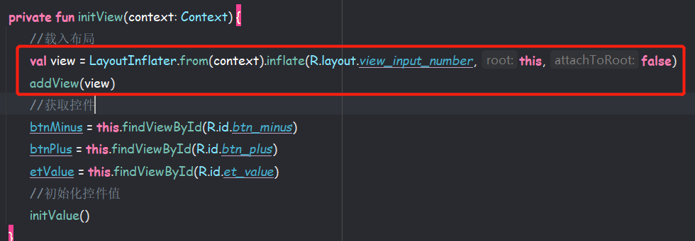

## 自定义View

### View体系

1. `View` 注重的是绘制内容
2. `ViewGroup` 注重子View的摆放


### 分类

* **自定义组合控件：**其实就是把很多个现成的 `View` 组合在一起，把复杂逻辑封装起来，简单操作暴露出去。
* **自定义View：**只需要重写 `onMeasure()` 和 `onDraw()` ，在没有现成的 `View`，需要自己实现的时候，就使用自定义View，一般继承自 `View`，`SurfaceView` 或其他的View。
* **自定义ViewGroup：**只需要重写 `onMeasure()` 和 `onLayout()`，自定义 `ViewGroup` 一般是利用现有的组件根据特定的布局方式来组成新的组件，大多继承自 `ViewGroup` 或各种 `Layout`。

------


### 基本方法

最基本的三个方法是：onMeasure()、onLayout()、onDraw()；

* 测量：`onMeasure()` 决定View的大小
* 布局：`onLayout()` 决定View在ViewGroup中的位置
* 绘制：`onDraw()` 决定绘制这个View

------


### View的绘制过程


* 自定义View：一般是只需要实现 `onMeasure()` 和 `onDraw()`，基本上用不了 `onLayout()`。

* 自定义组件、自定义VIewGroup：一般是只需要实现 `onMeasure()` 和 `onLayout()`，比如：装修房子，每个小房子修好了大房子也随之修好了。


------


### onMeasure()测量流程


------


### LayoutParams

LayoutParams主要保存了一个View的布局参数，因此可以使用LayoutParams来改变布局参数从而达到View位置的效果，一般在自定义View的时候使用。

------


### MeasureSpec

`MeasureSpec` 是 `View` 中的内部类，基本都是二进制运算。由于int是32位的，用==高两位==表示`mode`，==低30位==表示`size`，MODE_SHIFT=30的作用是移位

* ***UNSPECIFIED：***不对View大小做限制，
* ***EXACTLY：***确切的大小，如：100dp
* ***AT_MOST：***大小不可超过某数值，如：matchParent，最大不能超过你爸爸


------


### Android两种坐标系


------


### getMeasurewidth()和getWidth()区别


------


### Canvas

在Android里面，它的意思是==画布==，一般在 `onDraw()` 方法里面进行绘制我们的自定义view。

常用的方法有：drawCircle()、drawRect()、drawPath()、drawBitmap()、drawText()。


paint一般提供绘制使用的颜色和风格信息----->可以理解为**画笔**


------


### 3个构造器

* **第一个构造器：**用于 `new` 对象时，传递上下文
* **第二个构造器：**在 `xml` 转变成 `java` 代码时，会通过反射，调用2个参数的构造器
* **第三个构造器：**当需要切换主题模式时，就必须实现自定义view的模式

一般使用第三个构造器作为==入口==，前面的两个构造器把 `super` 改成 `this` 。


------


### 实现流程 

思维导图网址：https://boardmix.cn/app/editor/TXjJzbrv9TibaXoyuWWvIw


#### 自定义组合控件

1. 编写 `xml` 布局后，需要新建类继承自 `ViewGroup`

   

   

2. 定义相关属性，attrs就是属性的意思（attributes），里面编写定义自己控件的属性

   

   ```xml
   <?xml version="1.0" encoding="utf-8"?>
   <resources>
        <declare-styleable name="InputNumberView">
           <attr name="maxValue" format="integer"/>
           <attr name="minValue" format="integer"/>
           <attr name="step" format="integer"/>
           <attr name="defaultValue" format="integer"/>
           <attr name="disable" format="boolean"/>
           <attr name="btnBackground" format="reference"/>
           <attr name="valueSize" format="dimension"/>
        </declare-styleable>
   </resources>
   ```

   介绍一下各种属性的使用场景：

   - Integer：比如说行数，TextView的maxLine，就是Integer类型
   - enum：枚举类型，比如说gravity，left,top,bottom,center,right这些是枚举类型
   - boolean：布尔类型，比如说layout_alignParentRight
   - dimension：尺寸比如说size,margin_left这些，单位为px,dp,sp这些
   - color：这个大家都清楚了，颜色嘛，比如说background，比如说textColor
   - flags：标记，比如说我们学习activity声明周期时的configChanges
   - float：浮点数，也就是小数，比如说，透明度alpha
   - fraction：百分数，比如说动画的开始位置，fromDx
   - refrence：引用，比如说background，src，有同学可能有疑问了，background可以是color又可以是refrence：怎么整呢？ 其实是可以多个的哈，比如说：name="switch_time" format="integer|float"，可以是Integer类型，或者float类型
   - string：这个最简单了，比如说text，对吧

3. 获取相关属性

   

4. 获取完属性后，需要把子View载入进来，载入后需要初始化控件的值

   

   在 `xml` 布局中使用我们自定的控件

   

   


#### 自定义ViewGroup


#### 自定义View

