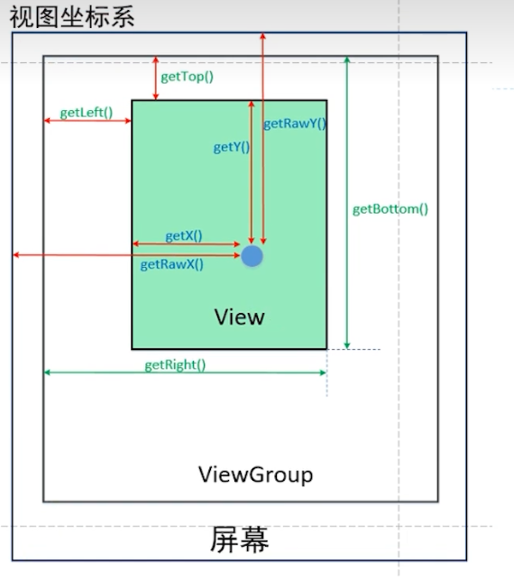

## 自定义View

### 自定义View的分类

***一共分为两种：***

* 自定义View
* 自定义ViewGroup

------

### 自定义View的基本方法

最基本的三个方法是：onMeasure()、onLayout()、onDraw()；

* 测量：onMeasure()决定View的大小
* 布局：onLayout()决定View在ViewGroup中的位置
* 绘制：onDraw()决定绘制这个View

### View体系

View注重的是绘制内容，ViewGropu注重子View的摆放。

------

### 自定义View的绘制过程

***自定义View：***一般是来说只需要实现==onMeasure()==和==onDraw()==，基本上用不了onLayout()

***VIewGroup：***一般是来说只需要实现==onMeasure()==和==onLayout()==，比如：装修房子，每个小房子修好了大房子也随之修好了

------

### onMeasure()是如何测量的

------

### LayoutParams是什么

LayoutParams主要保存了一个View的布局参数，因此可以使用LayoutParams来改变布局参数从而达到View位置的效果，一般在自定义View的时候使用。

### MeasureSpec是什么

`MeasureSpec`是`View`中的内部类，基本都是二进制运算。由于int是32位的，用高两位表示mode,低30位表示size,MODE_SHIFT=30的作用是移位

***UNSPECIFIED：***不对View大小做限制，
***EXACTLY：***确切的大小，如：100dp
***AT_MOST：***大小不可超过某数值，如：matchParent,最大不能超过你爸爸

### Android两种坐标系

------

### getMeasurewidth()和getWidth()区别

### Canvas

在Android里面，它的意思是**画布**，一般在onDraw()方法里面进行绘制我们的自定义view。

***常用的方法有：***drawCircle()、drawRect()、drawPath()、drawBitmap()、drawText()。

paint一般提供绘制使用的颜色和风格信息----->可以理解为**画笔**

### 自定义实现流程

------

### 现3个构造器

***第一个构造器：***用于new对象时，传递上下文

***第二个构造器：***在xml转变成java代码时，会通过反射，调用2个参数的构造器

***第三个构造器：***当需要切换主题模式时，就必须实现自定义view的模式

### 

