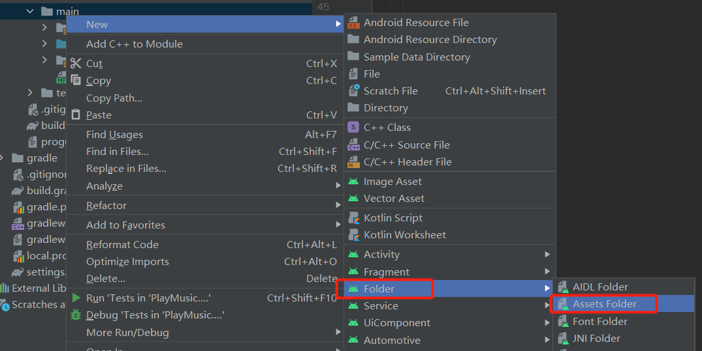

## 音频播放

### 常用方法

| 方法名          | 说明                                                |
| --------------- | --------------------------------------------------- |
| setDataSource() | 设置要播放的音频文件的位置                          |
| prepare()       | 在开始播放之前调用，用于完成准备工作                |
| start()         | 开始或继续播放音频                                  |
| pause()         | 暂停播放音频                                        |
| reset()         | 将MediaPlayer对象重置到刚刚创建的状态               |
| seekTo()        | 从指定的位置开始播放音频                            |
| stop()          | 停止播放音频，调用后的MediaPlayer对象无法再播放音频 |
| release()       | 释放与MediaPlayer对象相关的资源                     |
| isPlaying()     | 判断当前MediaPlayer是否正在播放音频                 |
| getDuration()   | 获取载入的音频文件的时长                            |


### 播放assets目录下的音频

***1.在app -> src -> main 目录下创建assets目录，存入mp3音频***



***2.在xml下的布局代码如下***

```xml
<?xml version="1.0" encoding="utf-8"?>
<LinearLayout xmlns:android="http://schemas.android.com/apk/res/android"
    xmlns:app="http://schemas.android.com/apk/res-auto"
    xmlns:tools="http://schemas.android.com/tools"
    android:layout_width="match_parent"
    android:layout_height="match_parent"
    android:orientation="vertical"
    tools:context=".MainActivity">

    <Button
        android:id="@+id/play"
        android:layout_width="match_parent"
        android:layout_height="wrap_content"
        android:text="Play"
        android:textAllCaps="false"/>

    <Button
        android:id="@+id/pause"
        android:layout_width="match_parent"
        android:layout_height="wrap_content"
        android:text="Pause"
        android:textAllCaps="false"/>

    <Button
        android:id="@+id/stop"
        android:layout_width="match_parent"
        android:layout_height="wrap_content"
        android:text="Stop"
        android:textAllCaps="false"/>

</LinearLayout>
```

***3.activity代码如下：***

```java
public class MainActivity extends AppCompatActivity implements View.OnClickListener{

    private MediaPlayer mediaPlayer;
    private Button play,pause,stop;

    @Override
    protected void onCreate(Bundle savedInstanceState) {
        super.onCreate(savedInstanceState);
        setContentView(R.layout.activity_main);

        play = findViewById(R.id.play);
        pause = findViewById(R.id.pause);
        stop = findViewById(R.id.stop);
        initMediaPlay();

        play.setOnClickListener(this);
        pause.setOnClickListener(this);
        stop.setOnClickListener(this);
    }

    private void initMediaPlay() {
        AssetFileDescriptor fd = null;
        mediaPlayer=new MediaPlayer();
        try {
            //获取assets目录下的文件
            fd = getAssets().openFd("music.mp3");
            //设置播放的文件资源
            mediaPlayer.setDataSource(fd.getFileDescriptor(), fd.getStartOffset(), fd.getLength());
            //完成准备阶段
            mediaPlayer.prepare();
        } catch (IOException e) {
            e.printStackTrace();
        } finally {
            if(fd != null){
                try {
                    fd.close();
                } catch (IOException e) {
                    e.printStackTrace();
                }
            }
        }
    }

    @Override
    protected void onDestroy() {
        super.onDestroy();
        //停止播放音频
        mediaPlayer.stop();
        //释放MediaPlayer资源
        mediaPlayer.release();
    }

    @Override
    public void onClick(View v) {
        switch (v.getId()){
            case R.id.play:
                if (!mediaPlayer.isPlaying()){
                    //开始播放
                    mediaPlayer.start();
                }
                break;
            case R.id.pause:
                if (mediaPlayer.isPlaying()){
                    //暂停播放
                    mediaPlayer.pause();
                }
                break;
            case R.id.stop:
                if (mediaPlayer.isPlaying()){
                    //重置MediaPlayer状态
                    mediaPlayer.reset();
                    initMediaPlay();
                }
                break;
        }
    }
```


### 播放SD卡的音频

***1.添加权限***

```xml
<!--申请读写SD卡的权限-->
<uses-permission android:name="android.permission.WRITE_EXTERNAL_STORAGE"/>

<!-- 这里由于请求SD卡，还需要将android:requestLegacyExternalStorage属性改为true -->
android:requestLegacyExternalStorage="true"
```

***2.权限判断***

```java
//判断是否已经申请读写SD的权限，如果没有则申请权限，否则初始化MediaPlayer
if (ContextCompat.checkSelfPermission(PlayLocalAudioActivity.this, Manifest.permission.WRITE_EXTERNAL_STORAGE) != PackageManager.PERMISSION_GRANTED){
            ActivityCompat.requestPermissions(PlayLocalAudioActivity.this, new String[]{Manifest.permission.WRITE_EXTERNAL_STORAGE}, 1);
}else {
	initMediaPlay();
}
```

***3.初始化音频路径***

```java
private void initMediaPlay(){
        //获取音频的文件对象
        File file = new File(Environment.getExternalStorageDirectory() + "/Music", "music.mp3");
        try {
            //设置播放的文件资源
            mediaPlayer.setDataSource(file.getPath());
            //完成准备阶段
            mediaPlayer.prepare();
        } catch (IOException e) {
            e.printStackTrace();
        }
    }
```

```java
@Override
    public void onRequestPermissionsResult(int requestCode, @NonNull String[] permissions, @NonNull int[] grantResults) {
        switch (requestCode){
            case 1:
                if (grantResults[0] == -1){
                    Toast.makeText(this, "您没有读写SD卡的权限", Toast.LENGTH_SHORT).show();
                }else {
                    initMediaPlay();
                }
                break;
        }
    }
```

